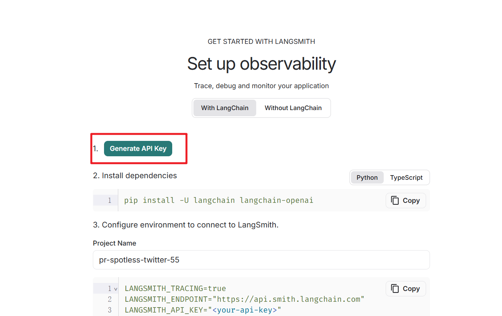
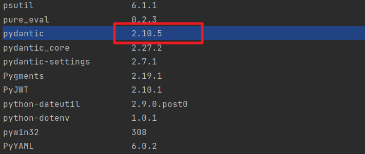
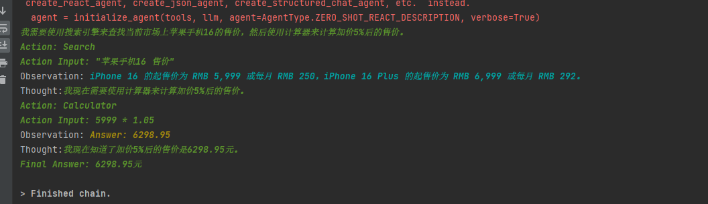

# LangChain


# 一、Python虚拟环境

参考文章：https://blog.csdn.net/lIujunXHU/article/details/135115322

安装模块：

```cmd
pip install virtualenv -i https://pypi.tuna.tsinghua.edu.cn/simple/
```

创建虚拟环境，默认创建的虚拟环境是在C盘

注意：Python的安装需要配置下环境变量信息。不然需要进入到Python的安装目录找到virtualenv这个脚本才能执行下面的命令

virtualenv 虚拟环境的名字

```cmd
virtualenv ragenv
```

修改默认的路径，指定路径

```cmd
virtualenv G:\python_virtualenv\langchainenv
```

进⼊虚拟环境

```cmd
cd 虚拟环境的⽂件夹 
cd Scripts
activate
例⼦： cd ragenv
cd Scripts
activate
```

jupyter中使⽤虚拟环境，要在虚拟环境中安装

```cmd
pip install ipykernel -i https://pypi.tuna.tsinghua.edu.cn/simple/
```

接下来我们就可以将虚拟环境添加到 jupyter内核 中，在虚拟环境中敲下⾯的命令

```cmd
python -m ipykernel install --name 创建的虚拟环境名字
例⼦：python -m ipykernel install --name ragenv
```

PyCharm中使⽤虚拟环境

找到C盘中的虚拟环境⽬录中的python.exe即可


例如：


针对LangChain需要的依赖环境我们一次性导入提供的文件`01-requirements.txt`中的内容，执行如下命令

```cmd
pip install -r requirements.txt -i https://pypi.tuna.tsinghua.edu.cn/simple
```


# 二、初识LangChain


## 1. LangChain介绍

​	LangChain是一个基于大语言模型用于构建端到端语言模型应用的框架，它提供了一系列工具、套件和接口，让开发者使用语言模型来实现各种复杂的任务，如文本到图像的生成、文档问答、聊天机器人等。

>官网地址：https://python.langchain.com/docs/introduction/
>
>中文地址：https://www.langchain.com.cn/docs/introduction/

英文描述

>LangChain is a framework for developing applications powered by large language models (LLMs).
>
>LangChain simplifies every stage of the LLM application lifecycle:
>
>\- Development: Build your applications using LangChain's open-source building blocks, components, and third-party integrations. Use LangGraph to build stateful agents with first-class streaming and human-in-the-loop support.
>
>\- Productionization: Use LangSmith to inspect, monitor and evaluate your chains, so that you can continuously optimize and deploy with confidence.
>
>\- Deployment: Turn your LangGraph applications into production-ready APIs and Assistants with LangGraph Cloud.

LangChain简化了LLM应用程序生命周期的各个阶段：

- 开发阶段：使用LangChain的开源构建块和组件构建应用程序，利用第三方集成和模板快速启动。

- 生产化阶段：使用LangSmith检查、监控和评估您的链，从而可以自信地持续优化和部署。

- 部署阶段：使用LangServe将任何链转化为API。

Langchain的核心组件:

- 模型（Models）：包含各大语言模型的LangChain接口和调用细节，以及输出解析机制。
- 提示模板（Prompts）：使提示工程流线化，进一步激发大语言模型的潜力。
- 数据检索（Indexes）：构建并操作文档的方法，接受用户的查询并返回最相关的文档，轻松搭建本地知识库。
- 记忆（Memory）：通过短时记忆和长时记忆，在对话过程中存储和检索数据，让ChatBot记住你。
- 链（Chains）：LangChain中的核心机制，以特定方式封装各种功能，并通过一系列的组合，自动而灵活地完成任务。
- 代理（Agents）：另一个LangChain中的核心机制，通过“代理”让大模型自主调用外部工具和内部工具，使智能Agent成为可能。


开源库组成:

- langchain-core ：基础抽象和LangChain表达式语言
- langchain-community ：第三方集成。合作伙伴包（如langchain-openai、langchain-anthropic等），一些集成已经进一步拆分为自己的轻量级包，只依赖于langchain-core
- langchain ：构成应用程序认知架构的链、代理和检索策略
- langgraph：通过将步骤建模为图中的边和节点，使用 LLMs 构建健壮且有状态的多参与者应用程序
- langserve：将 LangChain 链部署为 REST API
- LangSmith：一个开发者平台，可让您调试、测试、评估和监控LLM应用程序，并与LangChain无缝集成


**安装LangChain**

安装指定版本的LangChain 

```
pip install langchain==0.3.7  -i https://pypi.tuna.tsinghua.edu.cn/simple
pip install langchain-openai==0.2.3  -i https://pypi.tuna.tsinghua.edu.cn/simple
```


## 2. LangChain基本使用

### 2.1 基本使用

​	LangChain的基本使用，和前面的OpenAI的使用是差不多的。

```python
from dotenv import load_dotenv
load_dotenv()
from langchain_openai import ChatOpenAI


llm = ChatOpenAI()
# llm = ChatOpenAI(model_name="gpt-4")

# 直接提供问题，并调用llm
response = llm.invoke("什么是大模型？还有你的模型版本是多少?")
print(response)
print(response.content)
```


### 2.2 使用提示模板

​	我们在使用LangChain的时候也可以使用提示词模板，具体的简单用法如下:

```python
from dotenv import load_dotenv
load_dotenv()
from langchain_openai import ChatOpenAI


llm = ChatOpenAI()
# llm = ChatOpenAI(model_name="gpt-4")

# 我们也可以创建prompt template, 并引入一些变量到prompt template中，这样在应用的时候更加灵活
from langchain_core.prompts import ChatPromptTemplate

# 需要注意的一点是，这里需要指明具体的role，在这里是system和用户
prompt = ChatPromptTemplate.from_messages([
    ("system", "您是世界级的技术文档编写者"),
    ("user", "{input}")  # {input}为变量
])

# 我们可以把prompt和具体llm的调用和在一起（通过chain，chain可以理解为sequence of calls to take）  Linux  ps aux | grep redis 管道符号
chain = prompt | llm
response = chain.invoke({"input": "大模型中的LangChain是什么?"})
print(response)
print(response.content)
```


### 2.3 使用输出解析器

​	对于大模型输出的内容如果需要特点的格式输出，我们可以指定特定的解析器来实现这个功能。

```python
from dotenv import load_dotenv
load_dotenv()


from langchain_openai import ChatOpenAI
from langchain_core.prompts import ChatPromptTemplate
from langchain_core.output_parsers import StrOutputParser, JsonOutputParser

# 初始化模型
llm = ChatOpenAI()

# 创建提示模板
prompt = ChatPromptTemplate.from_messages([
    ("system", "您是世界级的技术文档编写者。"),
    ("user", "{input}")
])

# 使用输出解析器
#output_parser = StrOutputParser()
output_parser = JsonOutputParser()

# 将其添加到上一个链中
chain =  prompt | llm | output_parser
#chain = prompt | llm

# 调用它并提出同样的问题。答案是一个字符串，而不是ChatMessage
# chain.invoke({"input": "LangChain是什么?"})
response = chain.invoke({"input": "LangChain是什么? 问题用question 回答用answer 用JSON格式回复"})
print(response)
```


### 2.4 向量存储

​	使用一个简单的本地向量存储 FAISS，首先需要安装它

> pip install faiss-cpu
>
> pip install langchain_community==0.3.7


```python
# 导入和使用 WebBaseLoader
from langchain_community.document_loaders import WebBaseLoader
from dotenv import load_dotenv
load_dotenv()
import bs4

loader = WebBaseLoader(
        web_path="https://www.gov.cn/xinwen/2020-06/01/content_5516649.htm",
        bs_kwargs=dict(parse_only=bs4.SoupStrainer(id="UCAP-CONTENT"))
    )
docs = loader.load()
# print(docs)

# 对于嵌入模型，这里通过 API调用
from langchain_openai import OpenAIEmbeddings

embeddings = OpenAIEmbeddings()

#使用此嵌入模型将文档摄取到矢量存储中
from langchain_community.vectorstores import FAISS
from langchain_text_splitters import RecursiveCharacterTextSplitter

# 使用分割器分割文档
text_splitter = RecursiveCharacterTextSplitter(chunk_size=500, chunk_overlap=50)
documents = text_splitter.split_documents(docs)
print(len(documents))
# 向量存储  embeddings 会将 documents 中的每个文本片段转换为向量，并将这些向量存储在 FAISS 向量数据库中
vector = FAISS.from_documents(documents, embeddings)

```


### 2.5 RAG+Langchain

​	上面我们介绍了向量存储，我们可以基于外部知识，增强大模型回复来把 RAG 的功能实现出来

```python
# 导入和使用 WebBaseLoader
from langchain_community.document_loaders import WebBaseLoader
from dotenv import load_dotenv
load_dotenv()
import bs4


loader = WebBaseLoader(
        web_path="https://www.gov.cn/xinwen/2020-06/01/content_5516649.htm",
        bs_kwargs=dict(parse_only=bs4.SoupStrainer(id="UCAP-CONTENT"))
    )
docs = loader.load()
# print(docs)

# 对于嵌入模型，这里通过 API调用
from langchain_openai import OpenAIEmbeddings

embeddings = OpenAIEmbeddings()

#使用此嵌入模型将文档摄取到矢量存储中
from langchain_community.vectorstores import FAISS
from langchain_text_splitters import RecursiveCharacterTextSplitter

# 使用分割器分割文档
text_splitter = RecursiveCharacterTextSplitter(chunk_size=500, chunk_overlap=50)
documents = text_splitter.split_documents(docs)
print(len(documents))
# 向量存储  embeddings 会将 documents 中的每个文本片段转换为向量，并将这些向量存储在 FAISS 向量数据库中
vector = FAISS.from_documents(documents, embeddings)

from langchain.chains.combine_documents import create_stuff_documents_chain
from langchain_core.prompts import ChatPromptTemplate

prompt = ChatPromptTemplate.from_template("""仅根据提供的上下文回答以下问题:

<context>
{context}
</context>

问题: {input}""")


from langchain_openai import ChatOpenAI

llm = ChatOpenAI()
# 创建文档组合链  将文档内容和用户问题组合成一个完整的提示，然后传递给语言模型生成回答
document_chain = create_stuff_documents_chain(llm, prompt)

from langchain.chains import create_retrieval_chain

retriever = vector.as_retriever()
retriever.search_kwargs = {"k": 3}  # 限制为最多检索3个文档
# 创建检索链   该链结合了检索器和文档组合链，实现了从向量数据库中检索相关文档，并将这些文档与用户问题组合成提示
retrieval_chain = create_retrieval_chain(retriever, document_chain)
# 调用检索链并获取回答
response = retrieval_chain.invoke({"input": "建设用地使用权是什么？"})
print(response["answer"])

```


### 2.6 代理的使用

​	在LangChain框架中，Agents是一种利用大型语言模型（Large Language Models，简称LLMs）来执行任务和做出决策的系统

​	在 LangChain 的世界里，Agent 是一个智能代理，它的任务是听取你的需求（用户输入）和分析当前的情境（应用场景），然后从它的工具箱（一系列可用工具）中选择最合适的工具来执行操作


- 使用工具（Tool）：LangChain中的Agents可以使用一系列的工具（Tools）实现，这些工具可以是API调用、数据库查询、文件处理等，Agents通过这些工具来执行特定的功能。
- 推理引擎（Reasoning Engine）：Agents使用语言模型作为推理引擎，以确定在给定情境下应该采取哪些行动，以及这些行动的执行顺序。
- 可追溯性（Traceability）：LangChain的Agents操作是可追溯的，这意味着可以记录和审查Agents执行的所有步骤，这对于调试和理解代理的行为非常有用。
- 自定义（Customizability）：开发者可以根据需要自定义Agents的行为，包括创建新的工具、定义新的Agents类型或修改现有的Agents。
- 交互式（Interactivity）：Agents可以与用户进行交互，响应用户的查询，并根据用户的输入采取行动。
- 记忆能力（Memory）：LangChain的Agents可以被赋予记忆能力，这意味着它们可以记住先前的交互和状态，从而在后续的决策中使用这些信息。
- 执行器（Agent Executor）：LangChain提供了Agent Executor，这是一个用来运行代理并执行其决策的工具，负责协调代理的决策和实际的工具执行。


```python
# 导入和使用 WebBaseLoader
from langchain_community.document_loaders import WebBaseLoader
from dotenv import load_dotenv
load_dotenv()
import bs4
import os
os.environ["http_proxy"] = "http://127.0.0.1:1083"
os.environ["https_proxy"] = "http://127.0.0.1:1083"

loader = WebBaseLoader(
        web_path="https://www.gov.cn/xinwen/2020-06/01/content_5516649.htm",
        bs_kwargs=dict(parse_only=bs4.SoupStrainer(id="UCAP-CONTENT"))
    )
docs = loader.load()
#print(docs)

# 对于嵌入模型，这里通过 API调用
from langchain_openai import OpenAIEmbeddings

embeddings = OpenAIEmbeddings()

#使用此嵌入模型将文档摄取到矢量存储中
from langchain_community.vectorstores import FAISS
from langchain_text_splitters import RecursiveCharacterTextSplitter

# 使用分割器分割文档
text_splitter = RecursiveCharacterTextSplitter(chunk_size=500, chunk_overlap=50)
documents = text_splitter.split_documents(docs)
print(len(documents))
# 向量存储  embeddings 会将 documents 中的每个文本片段转换为向量，并将这些向量存储在 FAISS 向量数据库中
vector = FAISS.from_documents(documents, embeddings)

from langchain_openai import ChatOpenAI

retriever = vector.as_retriever()
retriever.search_kwargs = {"k": 3}  # 限制为最多检索3个文档

from langchain.tools.retriever import create_retriever_tool

# 检索器工具
retriever_tool = create_retriever_tool(
    retriever,
    "CivilCodeRetriever",
    "搜索有关中华人民共和国民法典的信息。关于中华人民共和国民法典的任何问题，您必须使用此工具!",
)

tools = [retriever_tool]

from langchain import hub
from langchain.agents import create_openai_functions_agent
from langchain.agents import AgentExecutor

# https://smith.langchain.com/hub
#  这个模板需要翻墙
prompt = hub.pull("hwchase17/openai-functions-agent")
# print(prompt.template)
llm = ChatOpenAI(model="gpt-4o", temperature=0)
agent = create_openai_functions_agent(llm, tools, prompt)
agent_executor = AgentExecutor(agent=agent, tools=tools, verbose=True)

# 运行代理
response = agent_executor.invoke({"input": "建设用地使用权是什么"})
print(response)


```

这里使用索引模板的时候有可能需要翻墙。这时候需要把模型替换为ChatGPT的即可。

输出结果

```txt
Entering new AgentExecutor chain...

Invoking: `CivilCodeRetriever` with `{'query': '建设用地使用权'}`


第三百四十五条　建设用地使用权可以在土地的地表、地上或者地下分别设立。
第三百四十六条　设立建设用地使用权，应当符合节约资源、保护生态环境的要求，遵守法律、行政法规关于土地用途的规定，不得损害已经设立的用益物权。
第三百四十七条　设立建设用地使用权，可以采取出让或者划拨等方式。
工业、商业、旅游、娱乐和商品住宅等经营性用地以及同一土地有两个以上意向用地者的，应当采取招标、拍卖等公开竞价的方式出让。
严格限制以划拨方式设立建设用地使用权。
第三百四十八条　通过招标、拍卖、协议等出让方式设立建设用地使用权的，当事人应当采用书面形式订立建设用地使用权出让合同。
建设用地使用权出让合同一般包括下列条款：
（一）当事人的名称和住所；
（二）土地界址、面积等；
（三）建筑物、构筑物及其附属设施占用的空间；
（四）土地用途、规划条件；
（五）建设用地使用权期限；
（六）出让金等费用及其支付方式；
（七）解决争议的方法。
第三百四十九条　设立建设用地使用权的，应当向登记机构申请建设用地使用权登记。建设用地使用权自登记时设立。登记机构应当向建设用地使用权人发放权属证书。

第三百五十条　建设用地使用权人应当合理利用土地，不得改变土地用途；需要改变土地用途的，应当依法经有关行政主管部门批准。
第三百五十一条　建设用地使用权人应当依照法律规定以及合同约定支付出让金等费用。
第三百五十二条　建设用地使用权人建造的建筑物、构筑物及其附属设施的所有权属于建设用地使用权人，但是有相反证据证明的除外。
第三百五十三条　建设用地使用权人有权将建设用地使用权转让、互换、出资、赠与或者抵押，但是法律另有规定的除外。
第三百五十四条　建设用地使用权转让、互换、出资、赠与或者抵押的，当事人应当采用书面形式订立相应的合同。使用期限由当事人约定，但是不得超过建设用地使用权的剩余期限。
第三百五十五条　建设用地使用权转让、互换、出资或者赠与的，应当向登记机构申请变更登记。
第三百五十六条　建设用地使用权转让、互换、出资或者赠与的，附着于该土地上的建筑物、构筑物及其附属设施一并处分。
第三百五十七条　建筑物、构筑物及其附属设施转让、互换、出资或者赠与的，该建筑物、构筑物及其附属设施占用范围内的建设用地使用权一并处分。

第三百五十八条　建设用地使用权期限届满前，因公共利益需要提前收回该土地的，应当依据本法第二百四十三条的规定对该土地上的房屋以及其他不动产给予补偿，并退还相应的出让金。
第三百五十九条　住宅建设用地使用权期限届满的，自动续期。续期费用的缴纳或者减免，依照法律、行政法规的规定办理。
非住宅建设用地使用权期限届满后的续期，依照法律规定办理。该土地上的房屋以及其他不动产的归属，有约定的，按照约定；没有约定或者约定不明确的，依照法律、行政法规的规定办理。
第三百六十条　建设用地使用权消灭的，出让人应当及时办理注销登记。登记机构应当收回权属证书。
第三百六十一条　集体所有的土地作为建设用地的，应当依照土地管理的法律规定办理。
第十三章　宅基地使用权
第三百六十二条　宅基地使用权人依法对集体所有的土地享有占有和使用的权利，有权依法利用该土地建造住宅及其附属设施。
第三百六十三条　宅基地使用权的取得、行使和转让，适用土地管理的法律和国家有关规定。
第三百六十四条　宅基地因自然灾害等原因灭失的，宅基地使用权消灭。对失去宅基地的村民，应当依法重新分配宅基地。建设用地使用权是指在土地的地表、地上或者地下设立的使用权。根据《中华人民共和国民法典》，建设用地使用权的设立和行使需要遵循以下原则和规定：

1. **设立方式**：建设用地使用权可以通过出让或划拨等方式设立。对于工业、商业、旅游、娱乐和商品住宅等经营性用地，通常采用招标、拍卖等公开竞价的方式出让。

2. **合同要求**：通过招标、拍卖、协议等方式设立的建设用地使用权需要签订书面合同，合同应包括当事人信息、土地界址、面积、用途、使用期限、费用及支付方式等条款。

3. **登记**：设立建设用地使用权需要向登记机构申请登记，权利自登记时设立。

4. **使用和转让**：建设用地使用权人应合理利用土地，不得擅自改变用途。使用权可以转让、互换、出资、赠与或抵押，但需遵循法律规定。

5. **期限和续期**：住宅建设用地使用权期限届满时自动续期，续期费用依照法律规定办理。非住宅用地的续期则需依照法律办理。

6. **消灭和注销**：建设用地使用权消灭后，出让人应及时办理注销登记。

这些条款确保了建设用地使用权的合法设立、使用和转让，保护了权利人的合法权益。

> Finished chain.
{'input': '建设用地使用权是什么', 'output': '建设用地使用权是指在土地的地表、地上或者地下设立的使用权。根据《中华人民共和国民法典》，建设用地使用权的设立和行使需要遵循以下原则和规定：\n\n1. **设立方式**：建设用地使用权可以通过出让或划拨等方式设立。对于工业、商业、旅游、娱乐和商品住宅等经营性用地，通常采用招标、拍卖等公开竞价的方式出让。\n\n2. **合同要求**：通过招标、拍卖、协议等方式设立的建设用地使用权需要签订书面合同，合同应包括当事人信息、土地界址、面积、用途、使用期限、费用及支付方式等条款。\n\n3. **登记**：设立建设用地使用权需要向登记机构申请登记，权利自登记时设立。\n\n4. **使用和转让**：建设用地使用权人应合理利用土地，不得擅自改变用途。使用权可以转让、互换、出资、赠与或抵押，但需遵循法律规定。\n\n5. **期限和续期**：住宅建设用地使用权期限届满时自动续期，续期费用依照法律规定办理。非住宅用地的续期则需依照法律办理。\n\n6. **消灭和注销**：建设用地使用权消灭后，出让人应及时办理注销登记。\n\n这些条款确保了建设用地使用权的合法设立、使用和转让，保护了权利人的合法权益。'}
```

如果控制台提示你

```txt
D:\python_virtualenv\langchaindemo\lib\site-packages\langsmith\client.py:241: LangSmithMissingAPIKeyWarning: API key must be provided when using hosted LangSmith API
  warnings.warn(
```

这个错误你需要申请下 LangSmith的key设置到.env中即可

https://smith.langchain.com/onboarding?organizationId=6978437b-1fd7-4788-bb71-2f2dc867c549&step=1




### 2.7 LangServe提供服务

​	安装LangServe非常简单，无论你是想用它来开发客户端还是服务器端的应用，都可以通过简单的pip命令来安装

```cmd
pip install "langserve[server]"
```

```python
#要在PyCharm中运行
from fastapi import FastAPI
from langchain.prompts import ChatPromptTemplate
from langchain_openai import ChatOpenAI
from langserve import add_routes
from dotenv import load_dotenv
load_dotenv()

import os
os.environ["http_proxy"] = "http://127.0.0.1:1083"
os.environ["https_proxy"] = "http://127.0.0.1:1083"


app = FastAPI(
    title="LangChain Server",
    version="1.0",
    description="A simple api server using Langchain's Runnable interfaces",
)

# 添加路由到应用中
add_routes(
    app,
    ChatOpenAI(),
    path="/anthropic",
)

# 创建一个讲笑话的模板
model = ChatOpenAI()
prompt = ChatPromptTemplate.from_template("tell me a joke about {topic}")
add_routes(
    app,
    prompt | model,
    path="/joke",
)

#如果你直接运行这个Python脚本，它会启动一个服务器
if __name__ == "__main__":
    import uvicorn
    uvicorn.run(app, host="localhost", port=8000)
```

对应的访问路径


# 三、LangChain之Model I/O

## 1. **Model I/O**

​	可以把对模型的使用过程拆解成三块: 输入提示(Format)、调用模型(Predict)、输出解析(Parse)

- 1.提示模板: LangChain的模板允许动态选择输入，根据实际需求调整输入内容，适用于各种特定任务和应用。
- 2.语言模型: LangChain 提供通用接口调用不同类型的语言模型，提升了灵活性和使用便利性。
- 3.输出解析: 利用 LangChain 的输出解析功能，精准提取模型输出中所需信息，避免处理冗余数据，同时将非结构化文本转换为可处理的结构化数据，提高信息处理效率。

​	这三块形成了一个整体，在LangChain中这个过程被统称为Model I/O。针对每块环节，LangChain都提供了模板和工具，可以帮助快捷的调用各种语言模型的接口


## 2. 提示模板

### 2.1 提示模板概念讲解

​	在LangChain的Model I/O中，提示模板是其组成之一,语言模型的提示是用户提供的一组指令或输入，用于指导模型的响应，帮助模型理解上下文并生成相关且连贯的基于语言的输出，例如回答问题、完成句子或参与某项活动、对话。

​	PromptTemplates 是LangChain中的一个概念，通过接收原始用户输入，并返回一个准备好传递给语言模型的信息（即提示词 prompt）

​	通俗点说，prompt template 是一个模板化的字符串，可以用来生成特定的提示（prompts）。你可以将变量插入到模板中，从而创建出不同的提示。这对于重复生成相似格式的提示非常有用，尤其是在自动化任务中。

**LangChain提示模板特点**

1. 清晰易懂的提示: 提高提示文本的可读性，使其更易于理解，尤其是在处理复杂或涉及多个变量的情况下。

2. 增强可重用性: 使用模板，可以在多个地方重复使用，简化代码，无需重复构建提示字符串。

3. 简化维护: 使用模板后，如果需要更改提示内容，只需修改模板，无需逐个查找所有用到该提示的地方。

4. 智能处理变量: 模板可以自动处理变量的插入，无需手动拼接字符串。

5. 参数化生成: 模板可以根据不同的参数生成不同的提示，有助于个性化文本生成。


**LangChain提示模板类型**

- 1.LLM提示模板 PromptTemplate：常用的String提示模板
- 2.聊天提示模板 ChatPromptTemplate： 常用的Chat提示模板，用于组合各种角色的消息模板，传入聊天模型。消息模板包括：ChatMessagePromptTemplate、HumanMessagePromptTemplate、AIlMessagePromptTemplate、SystemMessagePromptTemplate等
- 3.样本提示模板 FewShotPromptTemplate：通过示例来教模型如何回答
- 4.部分格式化提示模板：提示模板传入所需值的子集，以创建仅期望剩余值子集的新提示模板。
- 5.管道提示模板 PipelinePrompt： 用于把几个提示组合在一起使用。
- 6.自定义模板：允许基于其他模板类来定制自己的提示模板。

### 2.2 提示模板案例讲解

#### 2.2.1 模板导入

​	我们需要使用LangChain的提示词模板我们需要在代码中导入模板，具体的导入代码为

```python
from langchain.prompts.prompt import PromptTemplate
from langchain.prompts import FewShotPromptTemplate
from langchain.prompts.pipeline import PipelinePromptTemplate
from langchain.prompts import ChatPromptTemplate
from langchain.prompts import (
    ChatMessagePromptTemplate,
    SystemMessagePromptTemplate,
    AIMessagePromptTemplate,
    HumanMessagePromptTemplate,
)
```


#### 2.2.2 创建提示模板

​	我们先来看看原始模板的应用

```python
# 导入LangChain中的提示模板
from langchain.prompts import PromptTemplate

# 创建原始模板
template = "您是一位专业的程序员。\n对于信息 {text} 进行简短描述"

# 根据原始模板创建LangChain提示模板
prompt = PromptTemplate.from_template(template)

# 打印LangChain提示模板的内容
print(prompt)
print("="*50)
print(prompt.format(text="langchain"))
```

​	然后我们来看看如何直接生成提示模板

```python
from langchain.prompts import PromptTemplate

prompt = PromptTemplate(
    input_variables=["text"],
    template="您是一位专业的程序员。\n对于信息 {text} 进行简短描述"
)
print(prompt.format(text="langchain"))
```


#### 2.2.3 使用提示模板

​	调用语言模型，让模型帮写答案，并返回结果。

```python
# 导入LangChain中的OpenAI模型接口
from langchain_openai import ChatOpenAI
from dotenv import load_dotenv
load_dotenv()

from langchain.prompts import PromptTemplate
# 创建模型实例
model = ChatOpenAI(model_name='gpt-4o')

prompt = PromptTemplate(
    input_variables=["text"],
    template="您是一位专业的程序员。\n对于信息 {text} 进行简短描述"
)
# 输入提示
input = prompt.format(text="大模型 langchain")

# 得到模型的输出
output = model.invoke(input)
# output = model.invoke("您是一位专业的程序员。对于信息 langchain 进行简短描述")

# 打印输出内容
print(output)
```


#### 2.2.4 ChatPromptTemplate

​	然后我们再分别给大家介绍下其他的提示词模板，先来看看ChatPromptTemplate聊天提示模板的使用。

​	PromptTemplate创建字符串提示的模板。默认情况下，使用Python的str.format语法进行模板化。而ChatPromptTemplate是创建聊天消息列表的提示模板。创建一个ChatPromptTemplate提示模板，模板的不同之处是它们有对应的角色。

```python
from dotenv import load_dotenv
load_dotenv()
from langchain.prompts.chat import ChatPromptTemplate

# template = "你是一个数学家，你可以计算任何算式"
template = "你是一个翻译专家,擅长将 {input_language} 语言翻译成 {output_language}语言."
human_template = "{text}"

chat_prompt = ChatPromptTemplate.from_messages([
    ("system", template),
    ("human", human_template),
])
# print(chat_prompt)
# exit()
# 导入LangChain中的ChatOpenAI模型接口
from langchain_openai import ChatOpenAI

# 创建模型实例
model = ChatOpenAI(model_name='gpt-4o')
# 输入提示
# messages = chat_prompt.format_messages(text="我今年18岁，我的舅舅今年38岁，我的爷爷今年72岁，我和舅舅一共多少岁了？")
# print(messages)
messages = chat_prompt.format_messages(input_language="英文", output_language="中文", text="I love Large Language Model.")
print(messages)
# 得到模型的输出
output = model.invoke(messages)
# 打印输出内容
print(output.content)
```

输出的内容

```txt
[SystemMessage(content='你是一个翻译专家,擅长将 英文 语言翻译成 中文语言.', additional_kwargs={}, response_metadata={}), HumanMessage(content='I love Large Language Model.', additional_kwargs={}, response_metadata={})]
我喜欢大型语言模型。
```

`LangChain` 中，`ChatPromptTemplate` 和 `PromptTemplate` 是用于生成提示词（prompts）的两种不同模板类型，它们的主要差异在于设计的目的和使用场景：

1. **PromptTemplate**:
   - **用途**：`PromptTemplate` 主要是为标准的文本生成任务设计的，用于生成非对话式的提示词。它可以用于各种文本生成任务，如文章撰写、摘要生成、问题回答等。
   - **格式**：它通常用于生成一次性或非交互式的输出，不需要维持对话的状态。
   - **功能**：`PromptTemplate` 允许用户插入变量，根据模板生成最终的提示词。这些变量可以是静态的，也可以是动态生成的。
2. **ChatPromptTemplate**:
   - **用途**：`ChatPromptTemplate` 是专门为对话系统设计的，用于生成对话式的提示词。它适用于聊天机器人、对话模型等需要持续对话的场景。
   - **格式**：它不仅包含要发送给模型的文本，还包括对话的历史信息，帮助模型理解上下文。
   - **功能**：`ChatPromptTemplate` 同样支持变量插入，但它还额外支持对话历史的管理，使得生成的提示词能够包含之前的对话回合，从而在对话中保持连贯性。

​	简而言之，如果你是在构建一个需要持续多轮对话的系统，那么 `ChatPromptTemplate` 会是更合适的选择，因为它可以帮助你更好地管理对话历史和上下文。而如果你是在构建一个不需要持续对话或状态管理的文本生成系统，`PromptTemplate` 就足够了。


​	在比较复杂的聊天场景中我们还可以通过LangChain提供的不同类型的MessagePromptTemplate来灵活的处理，最常用的是AIMessagePromptTemplate、 SystemMessagePromptTemplate和HumanMessagePromptTemplate，分别创建人工智能消息、系统消息和人工消息。比如上面的案例我们修改为

```python
from dotenv import load_dotenv
load_dotenv()
# 导入聊天消息类模板
from langchain.prompts import (
    ChatPromptTemplate,
    SystemMessagePromptTemplate,
    HumanMessagePromptTemplate,
)

# 模板的构建
system_template = "你是一个翻译专家,擅长将 {input_language} 语言翻译成 {output_language}语言."
system_message_prompt = SystemMessagePromptTemplate.from_template(system_template)

human_template = "{text}"
human_message_prompt = HumanMessagePromptTemplate.from_template(human_template)

prompt_template = ChatPromptTemplate.from_messages([system_message_prompt, human_message_prompt])

# 格式化提示消息生成提示
prompt = prompt_template.format_prompt(input_language="英文", output_language="中文",
                                       text="I love Large Language Model.").to_messages()
# 打印模版
print("prompt:", prompt)
from langchain_openai import ChatOpenAI

# 创建模型实例
model = ChatOpenAI(model_name='gpt-3.5-turbo')
# 得到模型的输出
result = model.invoke(prompt)
# 打印输出内容
print("result:", result)
```

​	对于这种拆分大家可以不太清楚应该要怎么来选择，直接使用 `ChatPromptTemplate` 与拆分为 `SystemMessagePromptTemplate` 和 `HumanMessagePromptTemplate` 的区别如下：

- **直接性**：使用 `ChatPromptTemplate` 可以更直接地定义整个对话流程，而拆分模板则需要分别定义系统消息和用户消息，然后组合它们。
- **灵活性**：拆分模板提供了更高的灵活性，允许更精细地控制对话的不同部分。例如，你可能想要在对话的不同阶段改变系统消息，或者根据不同的用户输入使用不同的模板。
- **可读性和维护性**：拆分模板可能使得代码更加模块化，从而提高可读性和维护性。每个模板都有明确的职责，这有助于在未来修改或扩展对话系统时更容易理解和修改。
- **复杂性**：直接使用 `ChatPromptTemplate` 可能会更简单，特别是对于简单的对话场景。然而，对于复杂的对话系统，拆分模板可能更有助于管理复杂性。


#### 2.2.5 少量样本示例

​	少量样本示例的提示模板，基于LLM模型与聊天模型，可分别使用FewShotPromptTemplate或FewShotChatMessagePromptTemplate，两者使用基本一致。

​	创建示例集：创建一些提示样本，每个示例都是一个字典，其中键是输入变量，值是输入变量的值

```python
examples = [
    {"input": "2+2", "output": "4", "description": "加法运算"},
    {"input": "5-2", "output": "3", "description": "减法运算"},
]
```

创建提示模板,结合样本实例来生成对应的提示词信息。

```python
from langchain.prompts import PromptTemplate

examples = [
    {"input": "2+2", "output": "4", "description": "加法运算"},
    {"input": "5-2", "output": "3", "description": "减法运算"},
]

# 创建提示模板，配置一个提示模板，将一个示例格式化为字符串
prompt_template = "你是一个数学专家,算式： {input} 值： {output} 使用： {description} "

# 这是一个提示模板，用于设置每个示例的格式
prompt_sample = PromptTemplate.from_template(prompt_template)

# input="4+2", output="6", description="加法运算"
print(prompt_sample.format_prompt(**examples[0]))
#print(prompt_sample.format_prompt(input="2+2", output="4", description="加法运算"))
```

创建FewShotPromptTemplate对象

```python
from langchain.prompts import PromptTemplate

examples = [
    {"input": "2+2", "output": "4", "description": "加法运算"},
    {"input": "5-2", "output": "3", "description": "减法运算"},
]

# 创建提示模板，配置一个提示模板，将一个示例格式化为字符串
prompt_template = "你是一个数学专家,算式： {input} 值： {output} 使用： {description} "

# 这是一个提示模板，用于设置每个示例的格式
prompt_sample = PromptTemplate.from_template(prompt_template)


# 创建一个FewShotPromptTemplate对象
from langchain.prompts.few_shot import FewShotPromptTemplate

prompt = FewShotPromptTemplate(
    examples=examples,
    example_prompt=prompt_sample,
    suffix="你是一个数学专家,算式: {input}  值: {output}",
    input_variables=["input", "output"]
)
print(prompt.format(input="2*5", output="10"))  # 你是一个数学专家,算式: 2*5  值: 10
```

输出的结果

```txt
你是一个数学专家,算式： 2+2 值： 4 使用： 加法运算 

你是一个数学专家,算式： 5-2 值： 3 使用： 减法运算 

你是一个数学专家,算式: 2*5  值: 10
```

初始化大模型，然后调用

```python
from dotenv import load_dotenv
load_dotenv()
from langchain.prompts import PromptTemplate

examples = [
    {"input": "2+2", "output": "4", "description": "加法运算"},
    {"input": "5-2", "output": "3", "description": "减法运算"},
]

# 创建提示模板，配置一个提示模板，将一个示例格式化为字符串
prompt_template = "你是一个数学专家,算式： {input} 值： {output} 使用： {description} "

# 这是一个提示模板，用于设置每个示例的格式
prompt_sample = PromptTemplate.from_template(prompt_template)


# 创建一个FewShotPromptTemplate对象
from langchain.prompts.few_shot import FewShotPromptTemplate

prompt = FewShotPromptTemplate(
    examples=examples,
    example_prompt=prompt_sample,
    suffix="你是一个数学专家,算式: {input}  值: {output}",
    input_variables=["input", "output"]
)
print(prompt.format(input="2*5", output="10"))  # 你是一个数学专家,算式: 2*5  值: 10

from langchain_openai import ChatOpenAI

model = ChatOpenAI(model_name='gpt-4o')
result = model.invoke(prompt.format(input="2*5", output="10"))
print(result.content)  # 使用: 乘法运算
```


## 3. 语言模型

​	LangChain支持的模型有三大类：

- 1.大语言模型（LLM） ，也叫Text Model，这些模型将文本字符串作为输入，并返回文本字符串作为输出。

- 2.聊天模型（Chat Model），主要代表Open AI的ChatGPT系列模型。这些模型通常由语言模型支持，但它们的API更加结构化。具体来说，这些模型将聊天消息列表作为输入，并返回聊天消息。

- 3.文本嵌入模型（Embedding Model），这些模型将文本作为输入并返回浮点数列表，也就是Embedding。

​	聊天模型通常由大语言模型支持，但专门调整为对话场景。重要的是，它们的提供商API使用不同于纯文本模型的接口。输入被处理为聊天消息列表，输出为AI生成的消息。


### 3.1 大语言模型LLM

​	LangChain的核心组件是大型语言模型（LLM），它提供一个标准接口以字符串作为输入并返回字符串的形式与多个不同的LLM进行交互。这一接口旨在为诸如OpenAI、Hugging Face等多家LLM供应商提供标准化的对接方法。

```python
from langchain_openai import ChatOpenAI

from dotenv import load_dotenv
load_dotenv()

text = "大模型是什么？"
llm = ChatOpenAI()

res = llm.invoke(text)

print(res)
```


#### 3.1.1 智普模型

​	然后我们来看看如何接入智普大模型：https://open.bigmodel.cn/dev/api/thirdparty-frame/langchain-sdk

```python
from langchain_openai import ChatOpenAI

llm = ChatOpenAI(
    temperature=0.95,
    model="glm-4",
    openai_api_key="a224296ae6e44b8888e3853e9edee87e.2V9IraTGKBRFQRj6",
    openai_api_base="https://open.bigmodel.cn/api/paas/v4/"
)
text = '大模型的介绍'
res = llm.invoke(text)
print(res.content)
```

这块需要添加如下的依赖

```cmd
pip install pyjwt -i https://pypi.tuna.tsinghua.edu.cn/simple
```


输出的结果

```cmd
大模型（Large Models）指的是参数量巨大、计算能力强大的机器学习模型，通常是指使用深度学习技术构建的神经网络模型。这些模型能够在各种任务中展现出优异的性能，例如自然语言处理、计算机视觉、语音识别等领域。

以下是一些关于大模型的关键特点：

1. 参数量：大模型的参数量通常达到数十亿、甚至千亿级别，远超过传统机器学习模型。

2. 训练数据：大模型需要大量的训练数据来提高其泛化能力，这些数据包括文本、图像、音频等多种类型。

3. 计算资源：大模型的训练和推理过程需要强大的计算资源，如GPU、TPU等高性能硬件。

4. 性能表现：大模型在多个领域的任务中取得了突破性的性能，例如BERT在自然语言处理任务中取得了很好的效果，GPT系列模型在文本生成方面表现出色。

5. 模型压缩与优化：由于大模型对计算资源和存储空间的占用较大，研究者们提出了很多模型压缩和优化方法，如模型剪枝、量化、蒸馏等。

6. 应用领域：大模型在自然语言处理、计算机视觉、语音识别、推荐系统等多个领域有广泛应用。
```


#### 3.1.2 MoonShot

我们也可以通过Kimi提供的MoonShot大模型来给LangChain提供大模型的支持

https://platform.moonshot.cn/docs/intro#%E6%96%87%E6%9C%AC%E7%94%9F%E6%88%90%E6%A8%A1%E5%9E%8B

```python
from langchain_openai import ChatOpenAI

llm = ChatOpenAI(
    model="moonshot-v1-8k",
    openai_api_key="sk-BkIzEeSsz8gaJEo1VqjkqtJ01H4airZiQo98aZv5pPc9e4gn",
    openai_api_base="https://api.moonshot.cn/v1"
)
text = '大模型的介绍'
res = llm.invoke(text)
print(res.content)
```


#### 3.1.3 通义千问

https://dashscope.aliyun.com/?ref=openi.cn

```python
import os
from langchain_openai import ChatOpenAI
from dotenv import load_dotenv
load_dotenv()
tongyi_api_key = os.getenv("TONGYI_API_KEY")

llm = ChatOpenAI(
    temperature=0.95,
    model="qwen-plus",
    openai_api_key=tongyi_api_key,
    openai_api_base="https://dashscope.aliyuncs.com/compatible-mode/v1"
)
text = '大模型的介绍'
res = llm.invoke(text)
print(res)
```


​	大模型，通常指的是具有海量参数和强大计算能力的机器学习模型。这类模型在深度学习领域被广泛应用，尤其是在自然语言处理、计算机视觉、语音识别等领域。 以下是大模型的一些特点： 

1. **规模庞大**：大模型的参数数量通常在数十亿到千亿级别，远超传统的小型模型。 
2. **学习能力强**：由于参数量巨大，大模型能够学习到更复杂、更抽象的特征，从而在多个任务上表现出色。 3
3. **泛化能力强**：大模型在训练过程中能够学习到丰富的知识，因此具有较强的泛化能力，能够适应新的任务和数据。 
4. **计算资源需求高**：大模型训练和推理需要大量的计算资源和存储空间。 大模型在各个领域的应用包括： 
5. **自然语言处理**：例如，大型语言模型GPT-3、BERT等。 
6. **计算机视觉**：例如，大型卷积神经网络模型用于图像识别、目标检测等。 
7. **语音识别**：例如，深度神经网络模型用于语音识别和语音合成。 大模型的研究和应用对于推动人工智能技术的发展具有重要意义，但同时也面临着数据隐私、计算资源、模型可解释性等问题。


### 3.2 聊天模型

​	聊天模型是LangChain的核心组件，使用聊天消息作为输入并返回聊天消息作为输出。

```python
import os
from langchain_openai import ChatOpenAI
from dotenv import load_dotenv
load_dotenv()
from langchain_core.messages import HumanMessage,SystemMessage

text = "你好啊"
# 聊天模型
chat_model = ChatOpenAI(model="gpt-4o")
messages = [HumanMessage(content=text)]

res = chat_model.invoke(messages)
print(res)
```

LangChain有一些内置的消息类型

- SystemMessage:用于启动 AI 行为，通常作为输入消息序列中的第一个传递。

- HumanMessage:表示来自与聊天模型交互的人的消息。

- AIMessage:表示来自聊天模型的消息。这可以是文本，也可以是调用工具的请求。


聊天模型支持多个消息作为输入

```python
import os
from langchain_openai import ChatOpenAI
from dotenv import load_dotenv
load_dotenv()
from langchain_core.messages import HumanMessage,SystemMessage

text = "你好啊"
# 聊天模型
chat_model = ChatOpenAI(model="gpt-4o")
messages = [
    SystemMessage(content="你是一位乐于助人的助手。你叫波波老师"),
    HumanMessage(content="你是谁？")
]

res = chat_model.invoke(messages)
print(res)
```


### 3.3 文本嵌入模型

​	Embedding类是一个用于与嵌入进行交互的类。有许多嵌入提供商（OpenAI、Cohere、Hugging Face等)- 这个类旨在为所有这些提供商提供一个标准接口。

```python
from dotenv import load_dotenv
from langchain_openai import ChatOpenAI
load_dotenv()
from langchain_openai import OpenAIEmbeddings

# 初始化 OpenAIEmbeddings 实例
embeddings = OpenAIEmbeddings()
# embeddings = OpenAIEmbeddings(model="text-embedding-3-large")

# 定义一个文本字符串
text = "大模型"

# 嵌入文档
doc_result = embeddings.embed_documents([text])
print(doc_result[0][:5])

# 嵌入查询
query_result = embeddings.embed_query(text)
print(query_result[:5])

```


本地向量模型的使用

我们可以在魔塔社区找到我们自己需要的向量模型：https://www.modelscope.cn/my/overview

然后通过下面的命令来下载向量模型

```cmd
from modelscope import snapshot_download
model_dir = snapshot_download('Ceceliachenen/bge-large-zh-v1.5',cache_dir="D:\\大模型\向量模型\\BAAI\\bge-large-zh-v1.5")
```

这里我们也需要安装下魔塔的依赖

```cmd
pip install modelscope
```

下载完成的提示


安装sentence_transformers依赖

```cmd
pip install sentence_transformers -i https://pypi.tuna.tsinghua.edu.cn/simple
```

然后我们就可以来使用了

```python
from dotenv import load_dotenv
load_dotenv()

from langchain_community.embeddings import HuggingFaceBgeEmbeddings

# 创建嵌入模型
model_name = r'D:\大模型\向量模型\BAAI\bge-large-zh-v1.5\Ceceliachenen\bge-large-zh-v1___5'

encode_kwargs = {'normalize_embeddings': True}

embeddings = HuggingFaceBgeEmbeddings(
    model_name=model_name,
    encode_kwargs=encode_kwargs,
)

text = "大模型"
query_result = embeddings.embed_query(text)
print(query_result[:5])
```

对应的输出效果

```txt
[-0.015739643946290016, 0.027081910520792007, -0.014799326658248901, 0.050252676010131836, 0.01867888867855072]
```

​	通过Hugging Face官方包的加持，开发小伙伴们通过简单的api调用就能在langchain中轻松使用Hugging Face上各类流行的开源大语言模型以及各类AI工具


## 4. 输出解析

​	输出解析器负责获取 LLM 的输出并将其转换为更合适的格式。借助LangChain的输出解析器重构程序，使模型能够生成结构化回应，并可以直接解析这些回应.

LangChain有许多不同类型的输出解析器

- CSV解析器:CommaSeparatedListOutputParser,模型的输出以逗号分隔，以列表形式返回输出

- 日期时间解析器:DatetimeOutputParser,可用于将 LLM 输出解析为日期时间格式

- JSON解析器:JsonOutputParser,确保输出符合特定JSON对象格式。

- XML解析器:XMLOutputParser,允许以流行的XML格式从LLM获取结果

各个输出解析器的基本使用

先来看看对文本输出的格式，比如字符串和JSON数据

```python
from dotenv import load_dotenv
load_dotenv()

from langchain_core.prompts import ChatPromptTemplate
from langchain_openai import ChatOpenAI

# 初始化语言模型
model = ChatOpenAI(model_name="gpt-4o", temperature=0.0)

# 创建解析器
from langchain_core.output_parsers import JsonOutputParser, StrOutputParser

# output_parser = StrOutputParser()
output_parser = JsonOutputParser()

# 提示模板
prompt = ChatPromptTemplate.from_messages([
    ("system", "你是一个专业的程序员"),
    ("user", "{input}")
])


# 将提示和模型合并以进行调用
chain = prompt | model | output_parser

res = chain.invoke({"input": "langchain是什么? 问题用question 回答用ans 返回一个JSON格式"})
# res = chain.invoke({"input": "大模型中的langchain是什么?"})
print(res)
```

**日期时间解析器**

```python
from langchain.output_parsers import DatetimeOutputParser
from langchain.prompts import PromptTemplate
from langchain_openai import ChatOpenAI
from dotenv import load_dotenv

from datetime import datetime

load_dotenv()
model = ChatOpenAI(model_name="gpt-4o", temperature=0.0)

# 定义模板格式
template = """
回答用户的问题：{question}

{format_instructions}
"""

# 使用日期时间解析器

output_parser = DatetimeOutputParser()

prompt = PromptTemplate.from_template(
    template,
    partial_variables={"format_instructions": output_parser.get_format_instructions()},
)
# print(prompt)
# print(output_parser.get_format_instructions())
"""
Write a datetime string that matches the following pattern: '%Y-%m-%dT%H:%M:%S.%fZ'.

Examples: 0797-06-01T18:31:46.253315Z, 1236-04-01T03:29:24.290741Z, 1949-08-11T00:31:18.305832Z

Return ONLY this string, no other words!
"""

# 链式调用
chain = prompt | model | output_parser
# 执行
output = chain.invoke({"question": "新中国是什么时候成立的？"})
# 打印输出
print(output) # 1949-10-01

# 格式转换
format_string = "%Y年%m月%d日"
formatted_datetime = output.strftime(format_string)

print(formatted_datetime)
```

输出的信息

```txt
1949-10-01 00:00:00
1949年10月01日
```


# 四、LangChain之Chain链

​	为开发更复杂的应用程序，需要使用Chain来链接LangChain中的各个组件和功能，包括模型之间的链接以及模型与其他组件之间的链接

​	链在内部把一系列的功能进行封装，而链的外部则又可以组合串联。 链其实可以被视为LangChain中的一种基本功能单元。

API地址：https://python.langchain.com/api_reference/langchain/chains.html


## 1.链的基本使用

​	LLMChain是最基础也是最常见的链。LLMChain结合了语言模型推理功能，并添加了PromptTemplate和Output Parser等功能，将模型输入输出整合在一个链中操作。

​	它利用提示模板格式化输入，将格式化后的字符串传递给LLM模型，并返回LLM的输出。这样使得整个处理过程更加高效和便捷。

未使用Chain链的情况：

```python
# 导入LangChain中的提示模板
from langchain_core.prompts import PromptTemplate
from dotenv import load_dotenv
load_dotenv()
#import os

#os.environ["http_proxy"] = "http://127.0.0.1:7897"
#os.environ["https_proxy"] = "http://127.0.0.1:7897"

# 原始字符串模板
template = "桌上有{number}个苹果，四个桃子和 3 本书，一共有几个水果?"

# 创建LangChain模板
prompt_temp = PromptTemplate.from_template(template)

# 根据模板创建提示
prompt = prompt_temp.format(number=2)

# 导入LangChain中的OpenAI模型接口
from langchain_openai import ChatOpenAI

# 创建模型实例
model = ChatOpenAI(temperature=0)
# 传入提示，调用模型返回结果
result = model.invoke(prompt)
print(result)
```

使用Chain链的情况

```python
from langchain.chains.llm import LLMChain
from langchain_core.prompts import PromptTemplate
from langchain_openai import ChatOpenAI
from dotenv import load_dotenv
load_dotenv()
# 原始字符串模板
template = "桌上有{number}个苹果，四个桃子和 3 本书，一共有几个水果?"

# 创建模型实例
llm = ChatOpenAI(model_name="gpt-4o", temperature=0)

# 创建LLMChain
llm_chain = LLMChain(
    llm=llm,
    prompt=PromptTemplate.from_template(template)
)

# 调用LLMChain，返回结果
result = llm_chain.invoke({"number":2})
print(result)
```


## 2.使用表达式语言 (LCEL)

​	LangChain表达式语言，或 LCEL，是一种声明式的方法，可以轻松地将链组合在一起。LCEL 从第一天开始就被设计为支持将原型投入生产，无需更改代码，从最简单的“prompt + LLM”链到最复杂的链（我们已经看到有人在生产中成功运行了包含 100 多个步骤的 LCEL 链）。

```python
from langchain_core.prompts import PromptTemplate
from langchain_openai import ChatOpenAI
from dotenv import load_dotenv
load_dotenv()
# 原始字符串模板
template = "桌上有{number}个苹果，四个桃子和 3 本书，一共有几个水果?"
prompt = PromptTemplate.from_template(template)

# 创建模型实例
llm = ChatOpenAI(temperature=0)

# 创建Chain  模版 -> 大模型 -> outparse
chain = prompt | llm

# 调用Chain，返回结果
result = chain.invoke({"number": "3"})
print(result)
```

## 3. 案例演示

​	用LangChain写Python代码并执行来生成答案。这块需要单独的添加下依赖

```cmd
pip install langchain_experimental -i https://pypi.tuna.tsinghua.edu.cn/simple
```


```python
from langchain_core.output_parsers import StrOutputParser
from langchain_core.prompts import (
    ChatPromptTemplate,
)
from langchain_experimental.utilities import PythonREPL
from langchain_openai import ChatOpenAI

from dotenv import load_dotenv

load_dotenv()

template = """Write some python code to solve the user's problem.

Return only python code in Markdown format, e.g.:

​```python
....
​```"""
prompt = ChatPromptTemplate.from_messages([("system", template), ("human", "{input}")])

model = ChatOpenAI()

def _sanitize_output(text: str):
    _, after = text.split("```python")
    return after.split("```")[0]

# PythonREPL().run 就是调用了一下 exec 函数执行代码
# chain = prompt | model | StrOutputParser() | _sanitize_output | PythonREPL().run
chain = prompt | model | StrOutputParser()
result = chain.invoke({"input": "whats 2 plus 2"})

print(result)
```


## 4.链的调用

### 4.1 invoke方法

`invoke`是Chain的主要调用方法，用于执行整个Chain流程。它会处理输入，执行Chain中的所有步骤，并返回最终结果。

```python
from langchain_core.prompts import PromptTemplate
from langchain_openai import ChatOpenAI
from dotenv import load_dotenv
load_dotenv()

# 原始字符串模板
template = "桌上有{number}个苹果，四个桃子和 3 本书，一共有几个水果?"
prompt = PromptTemplate.from_template(template)

# 创建模型实例
llm = ChatOpenAI(temperature=0)

# 创建Chain
chain = prompt | llm

# 调用Chain，返回结果
result = chain.invoke({"number": "3"})
print(result)
```


### 4.2 predict方法

`predict`通常用于获取模型的预测结果，可能会跳过Chain中的某些步骤，比如输入预处理或后处理。它专注于模型的预测部分，而不是整个Chain的流程。

通过predict方法,将输入键指定为关键字参数

```python
from langchain.chains.llm import LLMChain
from langchain_core.prompts import PromptTemplate
from langchain_openai import ChatOpenAI
from dotenv import load_dotenv
load_dotenv()
# 创建模型实例
template = "桌上有{number}个苹果，四个桃子和 3 本书，一共有几个水果?"
prompt = PromptTemplate(template=template, input_variables=["number"])

# 创建LLM
llm = ChatOpenAI(temperature=0)
# 创建LLMChain
llm_chain = LLMChain(llm=llm, prompt=prompt)
# llm_chain = prompt | llm
# 调用LLMChain，返回结果
result = llm_chain.predict(number=3)
print(result)
```


### 4.3 batch 方法

​	通过batch方法(原apply方法):batch方法允许输入列表运行链，一次处理多个输入。

```python
from dotenv import load_dotenv
load_dotenv()
from langchain.chains.llm import LLMChain
from langchain_core.prompts import PromptTemplate
from langchain_openai import ChatOpenAI

# 创建模型实例
template = PromptTemplate(
    input_variables=["role", "fruit"],
    template="{role}喜欢吃{fruit}?",
)

# 创建LLM
llm = ChatOpenAI(temperature=0)

# 创建LLMChain
llm_chain = LLMChain(llm=llm, prompt=template)

# 输入列表
input_list = [
    {"role": "猪八戒", "fruit": "人参果"}, {"role": "孙悟空", "fruit": "仙桃"}
]

# 调用LLMChain，返回结果
result = llm_chain.batch(input_list)
print(result)
```


## 5.官方工具链

​	官方提供了很多封装好的文档链，我们可以直接拿过来直接使用的。

https://python.langchain.com/api_reference/langchain/chains.html

### 5.1 文档链

​	create_stuff_documents_chain链将获取文档列表并将它们全部格式化为提示(文档列表)，然后将该提示传递给LLM。

```python
from langchain_openai import ChatOpenAI
from langchain_core.documents import Document
from langchain_core.prompts import ChatPromptTemplate
from langchain.chains.combine_documents import create_stuff_documents_chain
import bs4
from langchain_community.document_loaders import WebBaseLoader
from langchain.text_splitter import RecursiveCharacterTextSplitter
from dotenv import load_dotenv
load_dotenv()

# 创建提示模板
prompt = ChatPromptTemplate.from_messages(
    [("system", """根据提供的上下文: {context} \n\n 回答问题: {input}""")]
)

# 初始化大模型
llm = ChatOpenAI(model="gpt-4o")

# 构建链  这个链将文档作为输入，并使用之前定义的提示模板和初始化的大模型来生成答案
chain = create_stuff_documents_chain(llm, prompt)

# 加载文档
loader = WebBaseLoader(
        web_path="https://www.gov.cn/xinwen/2020-06/01/content_5516649.htm",
        bs_kwargs=dict(parse_only=bs4.SoupStrainer(id="UCAP-CONTENT"))
        )

docs = loader.load()

# 分割文档
text_splitter = RecursiveCharacterTextSplitter(chunk_size=1000, chunk_overlap=50)
documents = text_splitter.split_documents(docs)
# print(documents)
print(len(documents))

# 执行链  检索  民事法律行为? 出来的结果
res = chain.invoke({"input": "民事法律行为?", "context": documents[:5]})
print(res)
```


### 5.2 数学链

​	LLMMathChain将用户问题转换为数学问题，然后将数学问题转换为可以使用 Python 的 numexpr 库执行的表达式。使用运行此代码的输出来回答问题

```Python
# 使用LLMMathChain，需要安装numexpr库
pip install numexpr
```

```python

from dotenv import load_dotenv
load_dotenv()
from langchain_openai import ChatOpenAI
from langchain.chains import LLMMathChain

# 初始化大模型
llm = ChatOpenAI()

# 创建链
llm_math = LLMMathChain.from_llm(llm)

# 执行链
res = llm_math.invoke("10 ** 3 + 100的结果是多少？")
print(res)
```


出现这个问题的原因是pydantic的版本太高了。我们需要卸载后把版本降低到2.9.2即可



操作命令如下


然后再执行代码即可得到需要的结果了


### 5.3 SQL查询链

create_sql_query_chain是创建生成SQL查询的链，用于将自然语言转换成数据库的SQL查询。

```Python
# 这里使用MySQL数据库，需要安装pymysql
pip install pymysql
```

先来看下如何通过Python获取数据库的连接信息

```python
from langchain_community.utilities import SQLDatabase

# 连接 sqlite 数据库
# db = SQLDatabase.from_uri("sqlite:///demo.db")

# 连接 MySQL 数据库
db_user = "root"
db_password = "123456"
db_host = "127.0.0.1"
db_port = "3306"
db_name = "llm"
db = SQLDatabase.from_uri(f"mysql+pymysql://{db_user}:{db_password}@{db_host}:{db_port}/{db_name}")

print("那种数据库：",db.dialect)
print("获取数据表：",db.get_usable_table_names())
# 执行查询
res = db.run("SELECT count(*) FROM students;")
print("查询结果：",res)
```

然后结合SQL查询链来生存对应的SQL语句

```python
from dotenv import load_dotenv
load_dotenv()
from langchain_community.utilities import SQLDatabase

# 连接 sqlite 数据库
# db = SQLDatabase.from_uri("sqlite:///demo.db")

# 连接 MySQL 数据库
db_user = "root"
db_password = "123456"
db_host = "127.0.0.1"
db_port = "3306"
db_name = "llm"
db = SQLDatabase.from_uri(f"mysql+pymysql://{db_user}:{db_password}@{db_host}:{db_port}/{db_name}")

from langchain_openai import ChatOpenAI
from langchain.chains import create_sql_query_chain
# 初始化大模型
llm = ChatOpenAI(model="gpt-4", temperature=0)

chain = create_sql_query_chain(llm=llm, db=db)


#response = chain.invoke({"question": "查询考试科目一共有多少？"})
response = chain.invoke({"question": "查询一班的学生数学成绩是多少？"})
# 限制使用的表
# response = chain.invoke({"question": "一共有多少个学生？", "table_names_to_use": ["students"]})
print(response)
```


# 五、LangChain之RAG

​	LangChain为RAG应用程序提供了从简单到复杂的所有构建块，本文要学习的数据连接（Retrieval）模块包括与检索步骤相关的所有内容，例如数据的获取、切分、向量化、向量存储、向量检索等模块.


## 1. 文档加载

​	LangChain封装了一系列类型的文档加载模块，例如PDF、CSV、HTML、JSON、Markdown、File Directory等。下面以PDF文件夹在为例看一下用法，其它类型的文档加载的用法都类似。

https://www.langchain.com.cn/docs/how_to/#%E6%96%87%E6%A1%A3%E5%8A%A0%E8%BD%BD%E5%99%A8

​	我们以pdf为例来介绍下，这里需要安装下 pypdf 这个组件，

```python
from langchain_community.document_loaders import PyPDFLoader
from dotenv import load_dotenv
load_dotenv()

loader = PyPDFLoader("llama2.pdf")
pages = loader.load_and_split()

print(f"第0页：\n{pages[0]}") ## 也可通过 pages[0].page_content只获取本页内容
```


## 2. 文档切割

​	LangChain提供了许多不同类型的文本切分器

官网地址：https://python.langchain.com/api_reference/text_splitters/index.html

这里以Recursive为例展示用法。RecursiveCharacterTextSplitter是LangChain对这种文档切分方式的封装，里面的几个重点参数

- chunk_size：每个切块的token数量

- chunk_overlap：相邻两个切块之间重复的token数量


```python
from langchain_community.document_loaders import PyPDFLoader

loader = PyPDFLoader("./llama2.pdf")
pages = loader.load_and_split()
print(f"第0页：\n{pages[0].page_content}")

from langchain.text_splitter import RecursiveCharacterTextSplitter

text_splitter = RecursiveCharacterTextSplitter(
    chunk_size=200,
    chunk_overlap=100,
    length_function=len,
    add_start_index=True,
)

paragraphs = text_splitter.create_documents([pages[0].page_content])
for para in paragraphs:
    print(para.page_content)
    print('-------')
```

这里提供了一个可视化展示文本如何分割的工具，https://chunkviz.up.railway.app/


## 3. 文本向量化

​	LangChain对一些文本向量化模型的接口做了封装，例如OpenAI, Cohere, Hugging Face等。 向量化模型的封装提供了两种接口，一种针对文档的向量化embed_documents，一种针对句子的向量化embed_query。

文档的向量化embed_documents，接收的参数是字符串数组

```python
from langchain_openai import OpenAIEmbeddings
from dotenv import load_dotenv
load_dotenv()
embeddings_model = OpenAIEmbeddings()  ## OpenAI文本向量化模型接口的封装

embeddings = embeddings_model.embed_documents(
    [
        "Hi there!",
        "Oh, hello!",
        "What's your name?",
        "My friends call me World",
        "Hello World!"
    ]
)

print(len(embeddings), len(embeddings[0]))
print(embeddings[0][:5])
##运行结果 (5, 1536)
```

句子的向量化embed_query，接收的参数是字符串

```python
from langchain_openai import OpenAIEmbeddings
from dotenv import load_dotenv
load_dotenv()
embeddings_model = OpenAIEmbeddings()  ## OpenAI文本向量化模型接口的封装

embedded_query = embeddings_model.embed_query("What was the name mentioned in the conversation?")
print(embedded_query[:5])
```


## 4. 向量存储

将文本向量化之后，下一步就是进行向量的存储。

这部分包含两块：一是向量的存储。二是向量的查询。

官方提供了三种开源、免费的可用于本地机器的向量数据库示例（chroma、FAISS、 Lance）

安装模块：pip install chromadb

创建向量数据库，灌入数据

```python
from langchain_openai import OpenAIEmbeddings
from langchain_community.document_loaders import PyPDFLoader
from dotenv import load_dotenv
load_dotenv()
loader = PyPDFLoader("./llama2.pdf")
pages = loader.load_and_split()

## 2. 文档切分
from langchain.text_splitter import RecursiveCharacterTextSplitter
text_splitter = RecursiveCharacterTextSplitter(
    chunk_size=200,
    chunk_overlap=100,
    length_function=len,
    add_start_index=True,
)
paragraphs = []
for page in pages:
    paragraphs.extend(text_splitter.create_documents([page.page_content]))

# print(paragraphs)
## 3. 文档向量化，向量数据库存储
from langchain_openai import OpenAIEmbeddings
from langchain_community.vectorstores import Chroma
db = Chroma.from_documents(paragraphs, OpenAIEmbeddings())
```

查询similarity_search

```python
query = "llama2有多少参数？"
docs = db.similarity_search(query) ## 一行代码搞定
for doc in docs:
    print(f"{doc.page_content}\n-------\n")
```


## 5. 检索器

​	检索器是在给定非结构化查询的情况下返回相关文本的接口。它比Vector stores更通用。检索器不需要能够存储文档，只需要返回（或检索）文档即可。Vector stores可以用作检索器的主干，但也有其他类型的检索器。检索器接受字符串查询作为输入，并返回文档列表作为输出

https://python.langchain.com/api_reference/langchain/retrievers.html#module-langchain.retrievers

| 名称                      | 索引类型               | 使用LLM          | 何时使用                                                     | 描述                                                         |
| ------------------------- | ---------------------- | ---------------- | ------------------------------------------------------------ | ------------------------------------------------------------ |
| Vectorstore               | Vectorstore            | 否               | 刚开始接触，想快速简单的入门                                 | 这是 最简单的方法，也是最容易入门的方法。它涉及为每个文本片段创建向量。 |
| ParentDocument            | Vectorstore + 文档存储 | 否               | 如果您的页面有许多较小的独立信息片段，最好单独索引，但最好一起检索。 | 这涉及为每个文档索引多个片段。然后找到在嵌入空间中最相似的片段，但检索整个父文档并返回（而不是单个片段）。 |
| Multi Vector              | Vectorstore + 文档存储 | 有时在索引过程中 | 如果您能够从文档中提取比文本本身更相关的信息。               | 这涉及为每个文档创建多个向量。每个向量可以以多种方式创建 - 例如，文本摘要和假设性问题。 |
| Self Query                | Vectorstore            | 是               | 如果用户提出的问题更适合根据元数据而不是文本相似性来获取文档回答。 | 这使用LLM将用户输入转换为两件事：（1）语义查找的字符串，（2）与之配套的元数据过滤器。 |
| Contextual Compression    | 任意                   | 有时             | 如果您发现检索到的文档包含太多不相关信息，并且干扰了LLM。    | 这在另一个检索器之上放置了后处理步骤，并仅从检索到的文档中提取最相关的信息。可以使用嵌入或LLM完成。 |
| Time-Weighted Vectorstore | Vectorstore            | 否               | 如果您的文档有时间戳，并且您想检索最近的文档。               | 这根据语义相似性（与常规向量检索相同）和时间权重（查看索引文档的时间戳）检索文档。 |
| Multi-Query Retriever     | 任意                   | 是               | 如果用户提出的问题复杂，并且需要多个独立信息片段来回应。     | 这使用LLM从原始查询生成多个查询。当原始查询需要有关多个主题的信息片段才能正确回答时，这很有用。 |
| Ensemble                  | 任意                   | 否               | 如果您有多个检索方法并希望尝试将它们组合起来。               | 这从多个检索器中获取文档，然后将它们组合在一起。             |
| Long-Context Reorder      | 任意                   | 否               | 如果您使用长上下文模型，并且注意到它没有关注检索到的文档中的中间信息。 | 这从基础检索器中获取文档，然后重新排序文档，使最相似的文档靠近开头和结尾。这很有用，因为长上下文模型有时不关注上下文窗口中间的信息。 |

以Vectorstore类型的检索为例简单使用

```python
# as_retriever：生成检索器实例
retriever = db.as_retriever()
docs = retriever.invoke("llama2有多少参数？")
for doc in docs:
    print(f"{doc.page_content}\n-------\n")
```

指定一个相似度阈值为0.5，只有相似度超过这个值才会召回

```python
retriever = db.as_retriever(
    search_type="similarity_score_threshold", search_kwargs={"score_threshold": 0.5}
)
docs = retriever.invoke("llama2有多少参数？")
print(docs)
```

指定检索几个文本片段：topK

```python
retriever = db.as_retriever(search_kwargs={"k": 1})
docs = retriever.invoke("llama2有多少参数？")
print(docs)
```


最后完整的流程

```python
## 1. 文档加载
from langchain_community.document_loaders import PyPDFLoader
from dotenv import load_dotenv
load_dotenv()


loader = PyPDFLoader("./llama2.pdf")
pages = loader.load_and_split()

## 2. 文档切分
from langchain.text_splitter import RecursiveCharacterTextSplitter
text_splitter = RecursiveCharacterTextSplitter(
    chunk_size=200,
    chunk_overlap=100,
    length_function=len,
    add_start_index=True,
)
paragraphs = []
for page in pages:
    paragraphs.extend(text_splitter.create_documents([page.page_content]))

# print(paragraphs)
## 3. 文档向量化，向量数据库存储
from langchain_openai import OpenAIEmbeddings
from langchain_community.vectorstores import Chroma
db = Chroma.from_documents(paragraphs, OpenAIEmbeddings())

## 4. 向量检索
retriever = db.as_retriever()
docs = retriever.invoke("llama2有多少参数?")
# for doc in docs:
    # print(f"{doc.page_content}\n-------\n")

## 5. 组装Prompt模板
import os
# 加载 .env 到环境变量
from dotenv import load_dotenv
load_dotenv()

from langchain_openai import ChatOpenAI

llm = ChatOpenAI() # 默认是gpt-3.5-turbo

prompt_template = """
你是一个问答机器人。
你的任务是根据下述给定的已知信息回答用户问题。
确保你的回复完全依据下述已知信息。不要编造答案。
如果下述已知信息不足以回答用户的问题，请直接回复"我无法回答您的问题"。

已知信息:
{info}

用户问：
{question}

请用中文回答用户问题。
"""

from langchain.prompts import PromptTemplate

template = PromptTemplate.from_template(prompt_template)

prompt = template.format(info=docs[2].page_content, question='llama2有多少参数?')
print(prompt)
## 6. 调用LLM
response = llm.invoke(prompt)
print(response.content)  
```

输出结果


# 六、Agent

Agent代理的核心思想是使用语言模型来选择要采取的一系列动作。在链中，动作序列是硬编码的。

在代理中，语言模型用作推理引擎来确定要采取哪些动作以及按什么顺序进行。

因此，在LangChain中，Agent代理就是使用语言模型作为推理引擎，让模型自主判断、调用工具和决定下一步行动。

Agent代理像是一个多功能接口，能够使用多种工具，并根据用户输入决定调用哪些工具，同时能够将一个工具的输出数据作为另一个工具的输入数据。

## 1.Agent的基本使用

构建一个具有两种工具的代理：一种用于在线查找，另一种用于查找加载到索引中的特定数据。

在LangChain中有一个内置的工具，可以方便地使用Tavily搜索引擎作为工具。

访问Tavily（用于在线搜索）注册账号并登录，获取API 密钥  

TAVILY_API_KEY申请：https://tavily.com/

通过tavily来在线检索案例

```python
# 加载所需的库
from langchain_community.tools.tavily_search import TavilySearchResults
from dotenv import load_dotenv
load_dotenv()

# 查询 Tavily 搜索 API 并返回 json 的工具
search = TavilySearchResults()
# 执行查询
res = search.invoke("目前市场上苹果手机16的售价是多少？")
print(res)
```

根据上述查询结果中的某个URL中，获取一些数据创建一个检索器。这个检索器是我们的另一个工具了

```python
from langchain_community.document_loaders import WebBaseLoader
from langchain_community.vectorstores import FAISS
from langchain_openai import OpenAIEmbeddings
from langchain_text_splitters import RecursiveCharacterTextSplitter
from dotenv import load_dotenv
load_dotenv()

# 加载HTML内容为一个文档对象
loader = WebBaseLoader("https://new.qq.com/rain/a/20240920A07Y5Y00")
docs = loader.load()
# print(docs)

# 分割文档
documents = RecursiveCharacterTextSplitter(chunk_size=1000, chunk_overlap=200).split_documents(docs)

# 向量化
vector = FAISS.from_documents(documents, OpenAIEmbeddings())

# 创建检索器
retriever = vector.as_retriever()

# 测试检索结果
print(retriever.get_relevant_documents("目前市场上苹果手机16的售价是多少？"))
```

上面创建的两个工具我们可以获取到对应的工具列表

```python
from langchain.tools.retriever import create_retriever_tool
# 创建一个工具来检索文档
retriever_tool = create_retriever_tool(
    retriever,
    "iPhone_price_search",
    "搜索有关 iPhone 16 的价格信息。对于iPhone 16的任何问题，您必须使用此工具！",
)

# 创建将在下游使用的工具列表
tools = [search, retriever_tool]
```

然后可以初始化大模型

```python
from langchain_openai import ChatOpenAI

llm = ChatOpenAI(
    temperature=0.95,
    model="qwen-plus",
    openai_api_key='sk-31bb7a65dd4047aba9b14a95c08be52c',
    openai_api_base="https://dashscope.aliyuncs.com/compatible-mode/v1"
)
```

这块我们通过千问来实现案例。因为我们的gpt使用的是国内代理。这块在LangChain的Agent这块有问题，创建Agent,这里使用LangChain中一个叫OpenAI functions的代理，然后得到一个AgentExecutor代理执行器。

```python
from langchain import hub

# 获取要使用的提示
prompt = hub.pull("hwchase17/openai-functions-agent")
# 打印Prompt
# print(prompt)

# 使用OpenAI functions代理
from langchain.agents import create_openai_functions_agent

# 构建OpenAI函数代理：使用 LLM、提示模板和工具来初始化代理
agent = create_openai_functions_agent(llm, tools, prompt)

from langchain.agents import AgentExecutor
# 将代理与AgentExecutor工具结合起来
agent_executor = AgentExecutor(agent=agent, tools=tools, verbose=True)
```

然后可以添加对应的执行代理的代码

```python
# 执行代理
# agent_executor.invoke({"input": "目前市场上苹果手机16的各个型号的售价是多少？如果我在此基础上加价5%卖出，应该如何定价?"})
agent_executor.invoke({"input": "美国2024年谁胜出了总统的选举?"})
```

完整的案例代码

```python
from langchain.tools.retriever import create_retriever_tool

from langchain_community.document_loaders import WebBaseLoader
from langchain_community.vectorstores import FAISS
from langchain_openai import OpenAIEmbeddings
from langchain_text_splitters import RecursiveCharacterTextSplitter
from dotenv import load_dotenv
load_dotenv()

from langchain_openai import ChatOpenAI

# 初始化大模型
# llm = ChatOpenAI(model="gpt-4", temperature=0)

llm = ChatOpenAI(
    temperature=0.95,
    model="qwen-plus",
    openai_api_key='sk-31bb7a65dd4047aba9b14a95c08be52c',
    openai_api_base="https://dashscope.aliyuncs.com/compatible-mode/v1"
)


# 加载HTML内容为一个文档对象
loader = WebBaseLoader("https://new.qq.com/rain/a/20240920A07Y5Y00")
docs = loader.load()
# print(docs)

# 分割文档
documents = RecursiveCharacterTextSplitter(chunk_size=1000, chunk_overlap=200).split_documents(docs)

# 向量化
vector = FAISS.from_documents(documents, OpenAIEmbeddings())

# 创建检索器
retriever = vector.as_retriever()
# 创建一个工具来检索文档
retriever_tool = create_retriever_tool(
    retriever,
    "iPhone_price_search",
    "搜索有关 iPhone 16 的价格信息。对于iPhone 16的任何问题，您必须使用此工具！",
)

# 加载所需的库
from langchain_community.tools.tavily_search import TavilySearchResults


# 查询 Tavily 搜索 API 并返回 json 的工具
search = TavilySearchResults()

# 创建将在下游使用的工具列表
tools = [search, retriever_tool]

from langchain import hub

# 获取要使用的提示
prompt = hub.pull("hwchase17/openai-functions-agent")
# 打印Prompt
print(prompt)

# 使用OpenAI functions代理
from langchain.agents import create_openai_functions_agent

# 构建OpenAI函数代理：使用 LLM、提示模板和工具来初始化代理
agent = create_openai_functions_agent(llm, tools, prompt)

from langchain.agents import AgentExecutor
# 将代理与AgentExecutor工具结合起来
agent_executor = AgentExecutor(agent=agent, tools=tools, verbose=True)

# 执行代理
agent_executor.invoke({"input": "目前市场上苹果手机16的各个型号的售价是多少？"})
#agent_executor.invoke({"input": "美国2024年谁胜出了总统的选举?"})
```

输出的结果


## 2. Agent的案例使用

​	目前代理是无状态的，这意味着它不记得以前的交互。为了给它记忆，需要传入chat_history

```python
# 加载所需的库
from langchain_community.tools.tavily_search import TavilySearchResults
from dotenv import load_dotenv
load_dotenv()

# 查询 Tavily 搜索 API 并返回 json 的工具
search = TavilySearchResults()

# 创建将在下游使用的工具列表
tools = [search]

from langchain_openai import ChatOpenAI

llm = ChatOpenAI(model="gpt-4o", temperature=0)

from langchain import hub

# 获取要使用的提示
prompt = hub.pull("hwchase17/openai-functions-agent")

# 使用OpenAI functions代理
from langchain.agents import create_openai_functions_agent

# 创建使用 OpenAI 函数调用的代理
agent = create_openai_functions_agent(llm, tools, prompt)

from langchain.agents import AgentExecutor

# 得到代理工具执行器
agent_executor = AgentExecutor(agent=agent, tools=tools, verbose=True)
# 执行代理
# 传入一个空的消息列表给chat_history，因为它是聊天中的第一条消息
from langchain_core.messages import AIMessage, HumanMessage
chat_history = []
# res = agent_executor.invoke({"input": "hello 我是波波老师", "chat_history": chat_history})
# print("res", res)
#
# chat_history.append(HumanMessage(content=res['input']))
# chat_history.append(AIMessage(content=res['output']))


res1 = agent_executor.invoke({"input": "你是LangChain专家", "chat_history": chat_history})
# print(res1)
chat_history.append(HumanMessage(content="你是LangChain专家"))
chat_history.append(AIMessage(content=res1['output']))

print("chat_history", chat_history)


# agent_executor.invoke(
#     {
#         "input": "我的名字是什么?",
#         "chat_history": chat_history
#     }
# )
```

**应用实例**

创建一个代理，它能够处理用户的常见问题，并且能够根据用户的问题进行动态响应。

```python
from langchain import hub
from langchain.agents import create_openai_functions_agent, AgentExecutor
from langchain_community.tools.tavily_search import TavilySearchResults
from langchain_openai import ChatOpenAI
from langchain_core.tools import Tool
from dotenv import load_dotenv
load_dotenv()

# 定义查询订单状态的函数
def query_order_status(order_id):
    if order_id == "1024":
        return "订单 1024 的状态是：已发货，预计送达时间是 3-5 个工作日。"
    else:
        return f"未找到订单 {order_id} 的信息，请检查订单号是否正确。"

# 定义退款政策说明函数
def refund_policy(keyword):
    print("keyword = ", keyword)
    return "我们的退款政策是：在购买后7天内可以申请全额退款，需提供购买凭证。"

# 初始化工具
tools = [Tool(
             name="queryOrderStatus",
             func=query_order_status,
             description="根据订单ID查询订单状态",
             args={"order_id": "订单的ID"}
         ),
         Tool(
             name="refundPolicy",
             func=refund_policy,
             description="查询退款政策内容",
             args={"keyword": "查询退款政策内容"}
         ),TavilySearchResults(max_results=1)
         ]

# 获取使用的提示
prompt = hub.pull("hwchase17/openai-functions-agent")

# 选择将驱动代理的LLM
llm = ChatOpenAI(
    temperature=0.95,
    model="qwen-plus",
    openai_api_key='sk-31bb7a65dd4047aba9b14a95c08be52c',
    openai_api_base="https://dashscope.aliyuncs.com/compatible-mode/v1"
)

# 构建OpenAI函数代理
agent = create_openai_functions_agent(llm, tools, prompt)

# 通过传入代理和工具创建代理执行器
agent_executor = AgentExecutor(agent=agent, tools=tools, verbose=True)

# 定义一些测试询问
queries = [
    "请问订单1024的状态是什么？",
    "退款政策内容？",
    "目前市场上苹果手机16的各个型号的售价是多少？"
]

# 运行代理并输出结果
for input in queries:
    response = agent_executor.invoke({"input": input})
    print(f"客户提问：{input}")
    print(f"代理回答：{response}\n")

# response = agent_executor.invoke({"input": "你们的退款政策是什么?"})
# print(f"客户提问：{input}")
# print(f"代理回答：{response}\n")
```

应用示例：创建一个能帮助用户进行搜索与获取天气信息的智能代理。

https://dashboard.juhe.cn/data/index/my

```python
import requests
from langchain_core.tools import Tool
from langchain import hub
from langchain.agents import AgentExecutor, create_openai_tools_agent
from langchain_community.tools.tavily_search import TavilySearchResults
from langchain_openai import ChatOpenAI
import requests
from dotenv import load_dotenv
load_dotenv()
import os


# 获取天气信息的函数
def get_weather(city):
    # 1213-根据城市查询天气 - 代码参考（根据实际业务情况修改）
    # 基本参数配置
    apiUrl = 'http://apis.juhe.cn/simpleWeather/query'  # 接口请求URL
    apiKey = os.getenv("WEATHER_API_KEY")  # 在个人中心->我的数据,接口名称上方查看

    # 接口请求入参配置
    requestParams = {
        'key': apiKey,
        'city': city,
    }

    # 发起接口网络请求
    response = requests.get(apiUrl, params=requestParams)

    # 解析响应结果
    if response.status_code == 200:
        responseResult = response.json()
        return responseResult
        # 网络请求成功。可依据业务逻辑和接口文档说明自行处理。
        # print(responseResult)
    else:
        # 网络异常等因素，解析结果异常。可依据业务逻辑自行处理。
        print('请求异常')


# 初始化工具
tools = [TavilySearchResults(max_results=1),
         Tool(
             name="getWeather",
             func=get_weather,
             description="根据城市名称查询天气情况",
             args={"city": "查询城市"}
         )]

# 获取要使用的提示
llm = ChatOpenAI(
    temperature=0.95,
    model="qwen-plus",
    openai_api_key='sk-31bb7a65dd4047aba9b14a95c08be52c',
    openai_api_base="https://dashscope.aliyuncs.com/compatible-mode/v1"
)

# 获取使用的提示
prompt = hub.pull("hwchase17/openai-functions-agent")

# 构建 OpenAI 工具代理
agent = create_openai_tools_agent(llm, tools, prompt)

# 通过传入代理和工具创建代理执行程序
agent_executor = AgentExecutor(agent=agent, tools=tools, verbose=True)

# 定义一些测试询问
queries = [
    "成都今天天气情况？",
    "目前市场上黄金的平均售价是多少？"
]

# 运行代理并输出结果
for input in queries:
    response = agent_executor.invoke({"input": input})
    print(f"提问：{input}")
    print(f"回答：{response}\n")
```


## 3. ReAct Agent


ReAct (Reflective Agent) 是 LangChain 中的一种聊天代理(Agent)类型。它具有以下独特的特点:

- 反思能力：ReAct 代理在给出响应之前,会先对自己的行为和预测进行深入的反思和评估。它会检查自己是否遵循了预先设定的规则和指令,是否达到了预期的目标。
- 自我纠错：如果ReAct代理在反思过程中发现自己存在问题或疏漏,它会主动尝试对自己的行为进行纠正和改正,以修复错误,提高自身的表现。
- 迭代学习：通过不断的反思和自我纠错,ReAct 代理可以在与用户的交互中逐步学习和优化自己的行为方式,不断提高回答的质量和准确性。
- 可解释性：ReAct 代理在给出最终响应时,会同时提供自己的思考过程和决策依据,使得它的行为更加透明和可解释。

这种具备反思和自我纠错能力的 ReAct 代理,在需要较高可靠性和稳定性的应用场景中很有优势,例如智能客服、问答系统、任务执行等。它可以通过持续的自我学习和优化,为用户提供更加智能和可信的交互体验。

Google搜索API：访问 SerpApi ，注册账号，选择相应的订阅计划(Free)，然后获取API Key，利用这个API为大模型提供Google搜索工具。

SerpApi：https://serpapi.com/

```cmd
pip install google-search-results -i https://pypi.tuna.tsinghua.edu.cn/simple
```

案例1：通过自定义工具+Google搜索来完成操作

```python
import calendar
import dateutil.parser as parser
from datetime import date
from langchain.tools import Tool, tool
from langchain.agents import load_tools
from langchain import hub
from dotenv import load_dotenv
load_dotenv()
tools = load_tools(["serpapi"])

# 自定义工具
@tool("weekday")
def weekday(date_str: str) -> str:
    """Convert date to weekday name"""
    d = parser.parse(date_str)
    return calendar.day_name[d.weekday()]

tools += [weekday] ## 将自定义的tool添加到tools数组中
from langchain_openai import ChatOpenAI
# 获取要使用的提示
llm = ChatOpenAI(
    temperature=0.95,
    model="qwen-plus",
    openai_api_key='sk-31bb7a65dd4047aba9b14a95c08be52c',
    openai_api_base="https://dashscope.aliyuncs.com/compatible-mode/v1"
)

import json

# 下载一个现有的 Prompt 模板
prompt = hub.pull("hwchase17/react")

from langchain.agents import create_react_agent
agent = create_react_agent(llm, tools, prompt)

from langchain.agents import AgentExecutor
agent_executor = AgentExecutor(agent=agent, tools=tools, verbose=True)

agent_executor.invoke({"input": "周杰伦生日是那天 是星期几？"})
```

输出的结果


案例2：通过谷歌搜索+数学计算工具来完成

```python
from langchain.agents import load_tools
from langchain.agents import initialize_agent
from langchain.agents import AgentType
from langchain_openai import ChatOpenAI
from dotenv import load_dotenv
load_dotenv()
import langchain

# 开启DEBUG 显示具体的日志信息
# langchain.debug = True
# langchain.verbose = True

# 初始化大模型:语言模型控制代理
llm = ChatOpenAI(model="gpt-3.5-turbo", temperature=0)

# 设置工具:加载使用的工具，serpapi:调用Google搜索引擎 llm-math:通过LLM进行数学计算的工具
tools = load_tools(["serpapi", "llm-math"], llm=llm)

# 初始化Agent:使用工具、语言模型和代理类型来初始化代理    ZERO_SHOT_REACT_DESCRIPTION 类型的代理可以在没有预先训练的情况下尝试解决新的问题
agent = initialize_agent(tools, llm, agent=AgentType.ZERO_SHOT_REACT_DESCRIPTION, verbose=True)

# 让代理来回答提出的问题
agent.invoke({"input": "目前市场上苹果手机16的售价是多少？如果我在此基础上加价5%卖出，应该如何定价？用中文回答"})
```

输出的结果




## 4. **Self-Ask with Search Agent**

​	Self-Ask with Search是一个通过搜索自我询问的代理，通过询问+答案的机制来帮助大模型寻找事实性问题的过渡性答案，从而引出最终答案。

```python
from langchain import hub
from langchain.agents import AgentExecutor, create_self_ask_with_search_agent
from langchain_community.tools.tavily_search import TavilyAnswer
from langchain_openai import ChatOpenAI
from dotenv import load_dotenv
load_dotenv()

# 将初始化工具，让它提供答案而不是文档
tools = [TavilyAnswer(max_results=1, name="Intermediate Answer", description="Answer Search")]

# 初始化大模型
llm = ChatOpenAI(temperature=0, model="gpt-4")

# 获取使用提示 可以修改此提示
prompt = hub.pull("hwchase17/self-ask-with-search")

# 使用搜索代理构建自助询问
agent = create_self_ask_with_search_agent(llm, tools, prompt)

# 通过传入代理和工具创建代理执行程序
agent_executor = AgentExecutor(agent=agent, tools=tools, verbose=True, handle_parsing_errors=True)

# 运行代理
agent_executor.invoke({"input": "中国有哪些省份呢?用中文回复"})
```


输出结果


# 七、LangChain之Tools

## 1. 工具Tools介绍

工具是代理、链或LLM可以用来与世界互动的接口。它们结合了几个要素

- 工具的名称
- 工具的描述
- 该工具输入的JSON模式
- 要调用的函数
- 是否应将工具结果直接返回给用户

LangChain通过提供统一框架集成功能的具体实现。在框架内，每个功能被封装成一个工具，具有自己的输入输出及处理方法。代理接收任务后，通过大模型推理选择适合的工具处理任务。一旦选定，LangChain将任务输入传递给该工具，工具处理输入生成输出。输出经过大模型推理，可用于其他工具的输入或作为最终结果返回给用户。

Langchain地址：https://python.langchain.com/v0.2/docs/integrations/tools/

API地址：https://api.python.langchain.com/en/latest/community_api_reference.html#module-langchain_community.tools

## 2. 工具的初步认识

我们来看看维基百科的例子

```python
from langchain_community.tools import WikipediaQueryRun
from langchain_community.utilities import WikipediaAPIWrapper
from dotenv import load_dotenv
load_dotenv()


# 初始化工具 可以根据需要进行配置
# 使用包装器WikipediaAPIWrapper进行搜索并获取页面摘要。默认情况下，它将返回前 k 个结果的页面摘要。它通过 doc_content_chars_max 限制文档内容。
api_wrapper = WikipediaAPIWrapper(top_k_results=1, doc_content_chars_max=100)
tool = WikipediaQueryRun(api_wrapper=api_wrapper)

# 工具默认名称
print("name:", tool.name)
# 工具默认的描述
print("description:", tool.description)
# 输入内容 默认JSON模式
print("args:", tool.args)
# 工具是否应该直接返回给用户
print("return_direct:", tool.return_direct)

# 可以用字典输入来调用这个工具
print(tool.run({"query": "langchain"}))
# 使用单个字符串输入来调用该工具。
print(tool.run("langchain"))
```

输出结果


## 3. 自定义工具

在LangChain中，自定义工具有多种方法

**@tool装饰器**

@tool装饰器是定义自定义工具的最简单方法。装饰器默认使用函数名称作为工具名称，但可以通过传递字符串作为第一个参数来覆盖此设置。此外，装饰器将使用函数的文档字符串作为工具的描述 - 因此必须提供文档字符串。

```python
from langchain.tools import tool

@tool
def add_number(a: int, b: int) -> int:
    """add two numbers."""
    return a + b

print(add_number.name)
print(add_number.description)
print(add_number.args)

res = add_number.run({"a": 10, "b": 20})
print(res)
```


## 4. 更多工具

avily Search工具：Tavily的搜索API是一个专门为人工智能代理(llm)构建的搜索引擎，可以快速提供实时、准确和真实的结果。

访问Tavily（`https://tavily.com/`）注册账号并登录，获取API 密钥

```python
from langchain import hub
from langchain.agents import AgentExecutor, create_openai_tools_agent
from langchain_community.tools.tavily_search import TavilySearchResults
from langchain_openai import ChatOpenAI
from dotenv import load_dotenv
load_dotenv()
tool = TavilySearchResults(max_results=1)
#  使用Tavily搜索工具
tools = [TavilySearchResults(max_results=1)]
# print(tool.run("目前市场上黄金的售价是多少?"))

# 获取要使用的提示
prompt = hub.pull("hwchase17/openai-tools-agent")

# 初始化大模型
llm = ChatOpenAI(model="gpt-4", temperature=0)

# 构建 OpenAI 工具代理
agent = create_openai_tools_agent(llm, tools, prompt)

# 通过传入代理和工具创建代理执行程序
agent_executor = AgentExecutor(agent=agent, tools=tools, verbose=True)

# 运行代理
agent_executor.invoke({"input": "中国有多少个省份？"})
```


# 八、LangChain之Memory

## 1. 基本介绍

​	大多数的 LLM 应用程序都会有一个会话接口，允许我们和 LLM 进行多轮的对话，并有一定的上下文记忆能力。但实际上，模型本身是不会记忆任何上下文的，只能依靠用户本身的输入去产生输出。而实现这个记忆功能，就需要额外的模块去保存我们和模型对话的上下文信息，然后在下一次请求时，把所有的历史信息都输入给模型，让模型输出最终结果。

​	而在 LangChain 中，提供这个功能的模块就称为 Memory，用于存储用户和模型交互的历史信息。


记忆系统需要支持两种基本操作：读取和写入。

1. 在接收到初始用户输入之后但在执行核心逻辑之前，链将从其内存系统中读取并增强用户输入。

2. 在执行核心逻辑之后但在返回答案之前，链会将当前运行的输入和输出写入内存，以便在将来的运行中引用它们。


对该图的解释:

1、输入问题: ({"question": ...})

2、读取历史消息: 从Memory中READ历史消息（{"past_messages": [...]}）

3、构建提示（Prompt): 读取到的历史消息和当前问题会被合并，构建一个新的Prompt

4、模型处理: 构建好的提示会被传递给语言模型进行处理。语言模型根据提示生成一个输出。

5、解析输出: 输出解析器通过正则表达式 regex("Answer: (.*)")来解析,返回一个回答（{"answer": ...}）给用户

6、得到回复并写入Memory: 新生成的回答会与当前的问题一起写入Memory，更新对话历史。Memory会存储最新的对话内容，为后续的对话提供上下文支持。


## 2. Chat Message

​	最基础的记忆管理方法,Chat Messages 是用于管理和存储对话历史的具体实现。它们通常用于构建对话系统，帮助系统保持对话的连续性和上下文。这些消息通常包含了对话的每一轮，包括用户的输入和系统的响应。

```python
from langchain_community.chat_message_histories import ChatMessageHistory
history = ChatMessageHistory()
history.add_user_message("hi!")
history.add_ai_message("whats up?")
print(history.messages)
```


## 3.Memory classes

​	Memory Classes [BETA] 是一个更高级的概念，提供了一种更灵活和强大的方式来管理对话中的记忆和状态。它们不仅包括Chat Messages的功能，还提供了更多高级特性，如长期记忆、短期记忆、不同记忆类型的管理等。

### 3.1 ConversationChain

​	最基础的内存模块，可以实现最简单的记忆机制，这种记忆允许将消息存储在缓冲区中，在链式调用时，它会返回它所存储的所有消息。ConversationChain提供了包含AI角色和人类角色的对话摘要格式，这个对话格式和记忆机制结合得非常紧密。ConversationChain实际上是对Memory和LLMChain进行了封装，简化了初始化Memory的步骤。

```python
# 导入所需的库
from langchain_openai import ChatOpenAI
from langchain.chains.conversation.base import ConversationChain
from dotenv import load_dotenv
load_dotenv()


# 初始化大语言模型
llm = ChatOpenAI(
    temperature=0.5,
    model_name="gpt-4o"
)

# 初始化对话链
conv_chain = ConversationChain(llm=llm)

# 打印对话的模板
print(conv_chain.prompt.template)
res = conv_chain.invoke("我是波波老师？")
print(res)
res = conv_chain.invoke("你是谁")
print(res)
res = conv_chain.invoke("我是谁?")
print(res)
```


### 3.2 ConversationBufferMemory

​	在LangChain中，ConversationBufferMemory是一种非常简单的缓冲记忆，可以实现最简单的记忆机制，它只在缓冲区中保存聊天消息列表并将其传递到提示模板中。

```python
from langchain_openai import OpenAI
from langchain.memory import ConversationBufferMemory
from langchain.chains.conversation.base import ConversationChain
from dotenv import load_dotenv
load_dotenv()
# 初始化大模型
llm = OpenAI()

# 添加聊天对话记忆
memory = ConversationBufferMemory()
memory.chat_memory.add_user_message("你是谁？")
memory.chat_memory.add_ai_message("你好，我是LangChain专家。")

# 初始化对话链
conversation = ConversationChain(llm=llm, memory=memory)

# 提问
res = conversation.invoke({"input": "你是谁？"})
print(res)
```


### 3.3 **LLMChain中的记忆**

​	在LLMChain中使用Memory记忆一起使用

```python
from langchain_openai import OpenAI
from langchain.memory import ConversationBufferMemory
from langchain.chains.llm import LLMChain
from langchain_core.prompts import PromptTemplate
from dotenv import load_dotenv
load_dotenv()
# 初始化大模型
llm = OpenAI(model="gpt-3.5-turbo-instruct", temperature=0)

# 创建提示   有两个输入键：实际输入与来自记忆类的输入 需确保PromptTemplate和ConversationBufferMemory中的键匹配
template = """你可以与人类对话。

当前对话: {chat_history}

人类问题: {question}

回复:
"""
prompt = PromptTemplate(
    input_variables=["chat_history", "question"], template=template
)

# 创建ConversationBufferMemory
memory = ConversationBufferMemory(memory_key="chat_history")

# 初始化链
chain = LLMChain(llm=llm,  prompt=prompt, memory=memory)

# 提问
res = chain.invoke({"question": "你是LangChain专家"})
print(str(res) + "\n")

res1 = chain.invoke({"question": "我的名字叫波波老师"})
print(str(res1) + "\n")


res = chain.invoke({"question": "我的名字是什么?"})
print(res)
```

如果使用聊天模型，使用结构化的聊天消息可能会有更好的性能。

```python
from langchain_openai import ChatOpenAI
from langchain.memory import ConversationBufferMemory
from langchain.chains.llm import LLMChain
from langchain_core.messages import SystemMessage
from langchain_core.prompts import MessagesPlaceholder, HumanMessagePromptTemplate, ChatPromptTemplate
from dotenv import load_dotenv
load_dotenv()

# 初始化大模型
llm = ChatOpenAI(model="gpt-3.5-turbo", temperature=0)

# 使用ChatPromptTemplate设置聊天提示
prompt = ChatPromptTemplate.from_messages(
    [
        SystemMessage(content="你是一个与人类对话的机器人。"),
        MessagesPlaceholder(variable_name="chat_history"),
        HumanMessagePromptTemplate.from_template("{question}"),
    ]
)
# print(prompt)

# 创建ConversationBufferMemory
memory = ConversationBufferMemory(memory_key="chat_history", return_messages=True)

# 初始化链
chain = LLMChain(llm=llm,  prompt=prompt, memory=memory)

# 提问
res = chain.invoke({"question": "你是LangChain专家"})
print(str(res) + "\n")

res = chain.invoke({"question": "你是谁?"})
print(res)

```


### 3.4 VectorStoreRetrieverMemory

VectorStoreRetrieverMemory 将记忆存储在向量存储中，并在每次调用时查询前 K 个最匹配的文档。

```python
from langchain_openai import OpenAI, OpenAIEmbeddings
from langchain.memory import VectorStoreRetrieverMemory
from langchain.chains import ConversationChain
from langchain.prompts import PromptTemplate
from dotenv import load_dotenv
load_dotenv()
import faiss
# from langchain.docstore import InMemoryDocstore
from langchain_community.docstore.in_memory import InMemoryDocstore
from langchain_community.vectorstores import FAISS

from dotenv import load_dotenv

load_dotenv()

# 初始化向量存储
embedding_size = 1536  # OpenAIEmbeddings 的维度
index = faiss.IndexFlatL2(embedding_size)
embedding_fn = OpenAIEmbeddings().embed_query
vectorstore = FAISS(embedding_fn, index, InMemoryDocstore({}), {})

# 向量查找返回语义相关的信息
retriever = vectorstore.as_retriever(search_kwargs=dict(k=1))
# 相关文档信息放到memory
memory = VectorStoreRetrieverMemory(retriever=retriever)

# 当添加到代理中时，记忆对象可以保存对话中的重要信息或使用的工具
memory.save_context({"Human": "我最喜欢的食物是披萨"}, {"AI": "很高兴知道"})
memory.save_context({"Human": "我喜欢的运动是跑步"}, {"AI": "好的,我知道了"})
memory.save_context({"Human": "我最喜欢的运动是足球"}, {"AI": "好的,我知道了"})

llm = OpenAI(temperature=0)
_DEFAULT_TEMPLATE = """
以下是人类和人工智能之间的友好对话。人工智能很健谈，并从其上下文中提供了许多具体细节。如果人工智能不知道问题的答案，它就会如实说它不知道。

之前对话的相关片段: {history} 
(如果不相关，则无需使用这些信息)

当前对话:
Human: {input}
AI:
"""
PROMPT = PromptTemplate(
    input_variables=["history", "input"], template=_DEFAULT_TEMPLATE
)

# 创建Chain
conversation_with_summary = ConversationChain(
    llm=llm,
    prompt=PROMPT,
    memory=memory,
    verbose=True
)

# 提问
res = conversation_with_summary.predict(input="我最喜欢的食物是什么呢？")
print(str(res))
```

