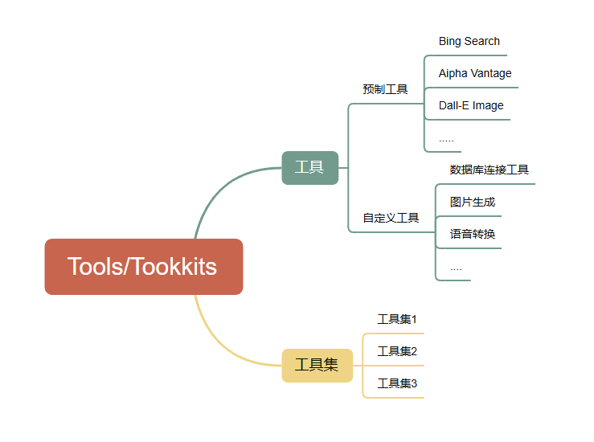

# 聚客AI-Agent

> Lecture：邓澎波


# 一、Agent的介绍

## 1、LLM VS Agent

两者的介绍：

- LLM：大型语言模型是一种基于深度学习的模型，专注于理解和生成自然语言文本。它的主要目的是处理与语言相关的任务，如文本生成、翻译、问答等。
- Agent：人工智能代理是一个更广泛的概念，它指的是能够在特定环境中自主行动以实现目标的程序。AI Agent的目的可以是多样的，包括但不限于语言处理，还包括感知、决策和行动等。


​		LLM是AI Agent可能使用的工具之一，专注于自然语言处理。而AI Agent是一个更全面的概念，它可能包含LLM，但还包括其他组件和能力，以实现在复杂环境中的自主行为。两者在人工智能领域中都有重要的地位，但它们的设计和应用目标不同。


## 2. Agent 是什么?

​	AI 业界对智能体提出了各种定义。个人理解，智能体是一种通用问题解决器。从软件工程的角度看来，智能体是一种基于大语言模型的，具备规划思考能力、记忆能力、使用工具函数的能力，能自主完成给定任务的计算机程序。


对应概念的介绍

- **规划(Planning)**:智能体会把大型任务`分解为子任务`，并规划执行任务的流程；智能体会对任务执行的过程进行`思考和反思`，从而决定是继续执行任务，或判断任务完结并终止运行。
- **记忆（Memory）**: 短期记忆，是指在执行任务的过程中的上下文，会在子任务的执行过程产生和暂存，在任务完结后被清空。长期记忆是长时间保留的信息，一般是指外部知识库，通常用向量数据库来存储和检索。
- **工具使用（Tools）**:为智能体配备工具 API，比如：计算器、搜索工具、代码执行器、数据库查询工具等。有了这些工具 API，智能体就可以是物理世界交互，解决实际的问题。
- **执行（Action）**: 根据规划和记忆来实施具体行动，这可能会涉及到与外部世界的互动或通过工具来完成任务。


## 3. Agent决策流程

### 3.1 决策流转

​	Agent的决策流程是和这几个步骤精密关联的。


案例场景: 假设我们有一个智能家居系统，它的任务是根据家庭成员的需求调节室内环境，比如温度和灯光。


### 3.2 规划(Planning)

规划，可以为理解**观察和思考**。如果用人类来类比，当我们接到一个任务，我们的思维模式可能会像下面这样:

- 首先会思考怎么完成这个任务。
- 然后会审视手头上所拥有的工具，以及如何使用这些工具高效地达成目的。
- 再会把任务拆分成子任务。(就像咱们做思维导图一样。)
- 在执行任务的时候，我们会对执行过程进行反思和完善，吸取教训以完善未来的步骤。
- 执行过程中思考任务何时可以终止。


​	这是**人类的规划能力**，我们希望智能体也拥有这样的思维模式，因此可以通过 LLM 提示工程，为智能体赋予这样的思维模式。在智能体中，最重要的是让 LLM 具备这以下两个能力：

- 子任务分解:  通过LLM使得智能体可以把大型任务分解为更小的、更可控的子任务，从而能够有效完成复杂的任务。
- 思维链: 思维链已经是一种比较标准的提示技术.


思维链：已经是一种比较标准的提示技术，能显著提升 LLM 完成复杂任务的效果。当我们对 LLM 这样要求「think step by step」，会发现 LLM 会把问题分解成多个步骤，一步一步思考和解决，能使得输出的结果更加准确。这是一种线性的思维方式。

思维树：对 CoT 的进一步扩展，在思维链的每一步，推理出多个分支，拓扑展开成一棵思维树。使用启发式方法评估每个推理分支对问题解决的贡献。选择搜索算法，使用广度优先搜索（BFS）或深度优先搜索（DFS）等算法来探索思维树，并进行前瞻和回溯。


### 3.3 记忆(Memory)

生活中的记忆机制：


Agent中的记忆机制:


### 3.4 工具使用(Tools/Toolkits)

​	Agent可以通过学习调用外部API来获取模型权重中所缺少的额外信息，这些信息包括当前信息、代码执行能力和访问专有信息源等。这对于预训练后难以修改的模型权重来说是非常重要的。

​	掌握使用工具是人类最独特和重要的特质之一。我们通过创造、修改和利用外部工具来突破我们身体和认知的限制。同样地，我们也可以为语言模型（LLM）提供外部工具来显著提升其能力。



Langchain工具集链接:https://python.langchain.com/docs/integrations/tools/

使用serpapi 这个工具需要添加对应的key

```txt
SERPAPI_API_KEY='f583fa963f2c6786c8ae89663b66952582fb32eb393b81bb7b307f4b48460abc'
```


第一个案例

```python
from langchain.agents import load_tools
from langchain.agents import initialize_agent
from langchain.agents import AgentType
from langchain_openai import ChatOpenAI
from dotenv import load_dotenv
load_dotenv()


# 初始化大模型:语言模型控制代理
llm = ChatOpenAI(model="gpt-4o", temperature=0)


# 设置工具:加载使用的工具，serpapi:调用Google搜索引擎 llm-math:通过LLM进行数学计算的工具
tools = load_tools(["serpapi"], llm=llm)

# 初始化Agent:使用工具、语言模型和代理类型来初始化代理    ZERO_SHOT_REACT_DESCRIPTION 类型的代理可以在没有预先训练的情况下尝试解决新的问题
agent = initialize_agent(tools, llm, agent=AgentType.ZERO_SHOT_REACT_DESCRIPTION, verbose=True)

# 让代理来回答提出的问题
agent.invoke({"input": "今天的NBA比赛有什么新闻信息呢?用中文回答"})
```


# 二、Function Calling 

## 1. Function Calling 介绍

​	⼤语⾔模型，例如 DeepSeek，拥有强⼤的知识储备和语⾔理解能⼒，能够进⾏流畅的对话、创作精彩的故事，甚⾄编写代码。然⽽，它们也⾯临着⼀些难以克服的困境，就像⼀个空有知识却⽆法⾏动的巨⼈。

- 信息滞后:知识库的更新速度有限，⽆法获取最新的实时信息，例如天⽓、股价等。这意味着它可能告诉你昨天的天⽓，或者⼀个⼩时前的股价，⽽这些信息可能已经过时了。就像⼀本印刷好的百科全书，内容固定，⽆法实时更新。
- 缺乏行动力: 就像被困在虚拟世界中的⼤脑，只能提供信息，⽆法直接与现实世界互动。例如，它可以告诉你如何煮咖啡，但⽆法帮你磨咖啡⾖、煮咖让AI⼤模型连接外部世界啡、甚⾄递给你⼀杯咖啡。 这就好⽐⼀位博学的教授，可以讲解复杂的理论知识，但却⽆法在实验室进⾏实际操作。


大模型的三大缺陷:

- 训练数据不可能涵盖所有信息。垂直、⾮公开数据必有⽋缺。
- 不知道最新信息。⼤模型的训练周期很⻓，且更新⼀次耗资巨⼤。所以它不可能实时训练。GPT-3.5 的知识截⾄ 2022 年 1 ⽉，GPT-4 是 2023 年 4 ⽉。
- 没有「真逻辑」。它表现出的逻辑、推理，是训练⽂本的统计规律，⽽不是真正的逻辑。也就是说，它的结果都是有⼀定不确定性的，这对于需要精确和确定结果的领域，如数学等，是灾难性的，基本是不可⽤的。


​	所以：⼤模型需要连接真实世界，并对接真逻辑系统，以此来控制⼤模型输出的不确定性和幻觉，达到我们想要的结果。于是 OpenAI 在23年6⽉份推出了 Function Calling 功能，让 GPT 模型拥有调⽤外部接⼝的能⼒。

OpenAI Function Calling：

https://platform.openai.com/docs/guides/function-calling


​	Function Calling 完整的流程结构介绍:


**特点介绍:**

​		Function Calling 是⼀种让 Chat Completion 模型调⽤外部函数的能⼒，可以让模型不仅仅根据⾃身的数据库知识进⾏回答，⽽是可以额外挂载⼀个函数库，然后根据⽤户提问去函数库检索，按照实际需求调⽤外部函数并获取函数运⾏结果，再基于函数运⾏结果进⾏回答。

Function Calling 可以被应⽤于各种场景，例如：

- 调⽤天⽓ API 获取实时天⽓信息: 不再局限于提供过时的天⽓预报，⽽是可以告诉你此时此刻的天⽓状况，就像你打开⼿机上的天⽓应⽤⼀样。

- 调⽤订票⽹站 API 预订机票: 不再只是告诉你如何订票，⽽是可以直接帮你完成订票操作，就像⼀个专业的旅⾏代理⼀样。

- 调⽤⽇历 API 安排会议: 不再只是提醒你会议时间，⽽是可以直接帮你安排会议，并发送邀请给参会者，就像⼀个⾼效的私⼈助理⼀样。

- 调⽤数据库查询信息: 可以访问和查询数据库中的信息，例如产品信息、⽤户信息等，就像⼀个专业的数据库管理员⼀样。

- 调⽤代码执⾏程序: 可以执⾏代码来完成各种任务，例如数据分析、图像处理等，就像⼀个经验丰富的程序员⼀样。


## 2. Function Calling 调用本地函数

​	JSON Schema是一个用于描述JSON数据格式和结构的元数据标准。它用于验证、注释以及操控 JSON文档。JSON Schema本身是用JSON格式表示的，提供了一种灵活的方式来校验数据的结构，包括对象属性的类型、数组长度、数字和字符串的值范围等等。

参考⽹址:https://json-schema.org/learn/getting-started-step-by-step

​	定义一个自定义的本地函数，也可以是现有的库中的函数以Python内置的sum函数为例，假设我们想让大模型使用这个函数。我们来看看这个Function Calling怎么来实现。

```python
from openai import OpenAI
import os
import json
from dotenv import load_dotenv
load_dotenv()

client = OpenAI()

# 告诉大模型这个函数的存在
def get_completion(messages, model="gpt-4"):
    response = client.chat.completions.create(
        model=model,
        messages=messages,
        temperature=0,
        max_tokens=1024,
        tools=[
            {  # 用 JSON 描述函数。可以定义多个。由大模型决定调用谁
                "type": "function",
                "function": {
                    "name": "sum_number",
                    "description": "计算一组数的和",
                    "parameters": {
                        "type": "object",
                        "properties": {
                            "numbers": {
                                "type": "array",
                                "items": {
                                    "type": "number"
                                }
                            }
                        }
                    }
                }
            },
        ]
    )
    return response.choices[0].message


# 给一个需要使用该函数的Prompt
prompt = "我今年18岁，我的舅舅今年38岁，我的爷爷今年72岁，我和舅舅一共多少岁了？"
#prompt = "30*8等多少？"

messages = [
    {"role": "system", "content": "你是一个数学家，你可以计算任何算式。"},
    {"role": "user", "content": prompt}
]
response = get_completion(messages)
messages.append(response)  # 注意这一句，必须加入到上下文中，否则报错
print("=====GPT回复=====")
print(response)

# 解析函数名称和参数
# 当大模型返回了需要调用的名称和参数之后，我们可以通过本地代码解析出来，然后再去调用相应函数。
if (response.tool_calls is not None):
    # 是否要调用 sum
    tool_call = response.tool_calls[0]
    if (tool_call.function.name == "sum_number"):
        # 调用 sum
        args = json.loads(tool_call.function.arguments)
        # sum([18, 38])
        result = sum(args["numbers"])
        print("=====函数返回=====")
        print(result)

        # 再次调用大模型获取最终结果
        # 本地函数执行完得到结果后，再将这个结果给大模型，让大模型用自然语言组织起最终答案。
        # 这里需要怎么给大模型呢？需要将函数调用结果，tool_call_id，role，name等一起加入到prompt中
        messages.append(
            {
                "tool_call_id": tool_call.id,  # 用于标识函数调用的 ID
                "role": "tool",
                "name": "sum_number",
                "content": str(result)  # 数值result 必须转成字符串
            }
        )
        # 经测试，tool_call_id和role是必须参数，name可以不要，但最好也加上。
        print("=====messages=====")
        print(messages)
        # 再次调用大模型
        print("=====最终回复=====")
        print(get_completion(messages).content)
```


## 3. 多Function 的调用

这里以一个查询某个地点附近某些信息的需求为例。

定义本地函数

这里我们需要定义自己的本地函数，不再使用Python的库函数了。

下面的代码，我们定义了两个函数。

- get_location_coordinate用于查询某个地点的地理坐标。

- search_nearby_pois用于查询地理坐标附近的某些信息（取决于用户输入的Keyword）


这是用的高德地图的开放接口，在使用本例之前，你需要先去高德地图开放接口的官网申请一个key，免费的。这里就不过多介绍了。

https://console.amap.com/dev/key/app


完整的案例代码

```python
from openai import OpenAI
import os
from dotenv import load_dotenv
load_dotenv()
import requests
import json


client = OpenAI()
amap_key = os.getenv("AMAP_KEY")


def get_location_coordinate(location, city="北京"):
    url = f"https://restapi.amap.com/v5/place/text?key={amap_key}&keywords={location}&region={city}"
    print(url)
    r = requests.get(url)
    result = r.json()
    if "pois" in result and result["pois"]:
        return result["pois"][0]
    return None


def search_nearby_pois(longitude, latitude, keyword):
    url = f"https://restapi.amap.com/v5/place/around?key={amap_key}&keywords={keyword}&location={longitude},{latitude}"
    print(url)
    r = requests.get(url)
    result = r.json()
    ans = ""
    if "pois" in result and result["pois"]:
        for i in range(min(3, len(result["pois"]))):
            name = result["pois"][i]["name"]
            address = result["pois"][i]["address"]
            distance = result["pois"][i]["distance"]
            ans += f"{name}\n{address}\n距离：{distance}米\n\n"
    return ans

def get_completion(messages, model="gpt-4o"):
    response = client.chat.completions.create(
        model=model,
        messages=messages,
        temperature=0,
        max_tokens=1024,
        tools=[{
            "type": "function",
            "function": {
                "name": "get_location_coordinate",
                "description": "根据POI名称，获得POI的经纬度坐标",
                "parameters": {
                    "type": "object",
                    "properties": {
                        "location": {
                            "type": "string",
                            "description": "POI名称，必须是中文",
                        },
                        "city": {
                            "type": "string",
                            "description": "POI所在的城市名，必须是中文",
                        }
                    },
                    "required": ["location", "city"],
                }
            }
        },
        {
            "type": "function",
            "function": {
                "name": "search_nearby_pois",
                "description": "搜索给定坐标附近的poi",
                "parameters": {
                    "type": "object",
                    "properties": {
                        "longitude": {
                            "type": "string",
                            "description": "中心点的经度",
                        },
                        "latitude": {
                            "type": "string",
                            "description": "中心点的纬度",
                        },
                        "keyword": {
                            "type": "string",
                            "description": "目标poi的关键字",
                        }
                    },
                    "required": ["longitude", "latitude", "keyword"],
                }
            }
        }]
    )
    return response.choices[0].message

#prompt = "上海陆家嘴附近的咖啡"
prompt = "北京故宫附近的酒店"

messages = [
    {"role": "system", "content": "你是一个地图通，你可以找到任何地址。"},
    {"role": "user", "content": prompt}
]
response = get_completion(messages)
if (response.content is None):  # 解决 OpenAI 的一个 400 bug
    response.content = ""
messages.append(response)  # 把大模型的回复加入到对话中
print("=====GPT回复=====")
print(response)

# 如果返回的是函数调用结果，则打印出来
while (response.tool_calls is not None):
    # 1106 版新模型支持一次返回多个函数调用请求
    for tool_call in response.tool_calls:
        args = json.loads(tool_call.function.arguments)
        print(args)

        if (tool_call.function.name == "get_location_coordinate"):
            print("Call: get_location_coordinate")
            result = get_location_coordinate(**args)
        elif (tool_call.function.name == "search_nearby_pois"):
            print("Call: search_nearby_pois")
            result = search_nearby_pois(**args)

        print("=====函数返回=====")
        print(result)

        messages.append({
            "tool_call_id": tool_call.id,  # 用于标识函数调用的 ID
            "role": "tool",
            "name": tool_call.function.name,
            "content": str(result)  # 数值result 必须转成字符串
        })

    response = get_completion(messages)
    if (response.content is None):  # 解决 OpenAI 的一个 400 bug
        response.content = ""
    messages.append(response)  # 把大模型的回复加入到对话中

print("=====最终回复=====")
print(response.content)
```

完整的输出结果

```txt
G:\python_virtualenv\langchainenv\Scripts\python.exe H:\workspace\PythonWorkSpace\LangChainExample\AgentDemo3.py 
=====GPT回复=====
ChatCompletionMessage(content='', refusal=None, role='assistant', audio=None, function_call=None, tool_calls=[ChatCompletionMessageToolCall(id='call_t9AJkxKSMJ28AnCNINGIKf2u', function=Function(arguments='{"city":"北京","location":"故宫"}', name='get_location_coordinate', parameters=None), type='function')])
{'city': '北京', 'location': '故宫'}
Call: get_location_coordinate
https://restapi.amap.com/v5/place/text?key=e4dd68db6e2b7905c5b8bf1cde885a89&keywords=故宫&region=北京
=====函数返回=====
{'parent': '', 'address': '景山前街4号', 'distance': '', 'pcode': '110000', 'adcode': '110101', 'pname': '北京市', 'cityname': '北京市', 'type': '风景名胜;风景名胜;世界遗产|科教文化服务;博物馆;博物馆', 'typecode': '110201|140100', 'adname': '东城区', 'citycode': '010', 'name': '故宫博物院', 'location': '116.397029,39.917839', 'id': 'B000A8UIN8'}

```


当然我们也可以通过一个12306的爬虫案例来演示下多Function Calling的效果。

案例涉及到的爬虫网站:https://spidertools.cn/#/curl2Request


完整的案例代码

```python
from openai import OpenAI
import os
import json
import requests
from dotenv import load_dotenv

load_dotenv()
import pandas as pd
from datetime import datetime


client = OpenAI()


def check_tick(date, start, end):
    url = 'https://kyfw.12306.cn/otn/leftTicket/queryG?leftTicketDTO.train_date={}&leftTicketDTO.from_station={}&leftTicketDTO.to_station={}&purpose_codes=ADULT'.format(
        date, start, end)
    headers = {
        "Accept": "*/*",
        "Accept-Language": "zh-CN,zh;q=0.9,en;q=0.8",
        "Cache-Control": "no-cache",
        "Connection": "keep-alive",
        "If-Modified-Since": "0",
        "Pragma": "no-cache",
        "Referer": "https://kyfw.12306.cn/otn/leftTicket/init?linktypeid=dc",
        "Sec-Fetch-Dest": "empty",
        "Sec-Fetch-Mode": "cors",
        "Sec-Fetch-Site": "same-origin",
        "User-Agent": "Mozilla/5.0 (Macintosh; Intel Mac OS X 10_15_7) AppleWebKit/537.36 (KHTML, like Gecko) Chrome/128.0.0.0 Safari/537.36",
        "X-Requested-With": "XMLHttpRequest",
        "sec-ch-ua": "\"Chromium\";v=\"128\", \"Not;A=Brand\";v=\"24\", \"Google Chrome\";v=\"128\"",
        "sec-ch-ua-mobile": "?0",
        "sec-ch-ua-platform": "\"macOS\""
    }
    cookies = {
        "_uab_collina": "",
        "JSESSIONID": "",
        "_jc_save_wfdc_flag": "dc",
        "_jc_save_fromStation": "%%u6C99%",
        "guidesStatus": "off",
        "highContrastMode": "",
        "cursorStatus": "off",
        "BIGipServerotn": "..0000",
        "BIGipServerpassport": "..0000",
        "route": "",
        "_jc_save_toStation": "%u4E0Au6D77%2CSHH",
        "_jc_save_fromDate": "",
        "_jc_save_toDate": ""
    }

    session = requests.session()
    res = session.get(url, headers=headers, cookies=cookies)

    data = res.json()

    # 这是一个列表
    result = data["data"]["result"]

    lis = []
    for index in result:
        index_list = index.replace('有', 'Yes').replace('无', 'No').split('|')
        # print(index_list)
        train_number = index_list[3]  # 车次

        if 'G' in train_number:
            time_1 = index_list[8]  # 出发时间
            time_2 = index_list[9]  # 到达时间
            prince_seat = index_list[25]  # 特等座
            first_class_seat = index_list[31]  # 一等座
            second_class = index_list[30]  # 二等座
            dit = {
                '车次': train_number,
                '出发时间': time_1,
                '到站时间': time_2,
                "是否可以预定": index_list[11],

            }
            lis.append(dit)
        else:
            # print(index_list)
            time_1 = index_list[8]  # 出发时间
            time_2 = index_list[9]  # 到达时间

            dit = {
                '车次': train_number,
                '出发时间': time_1,
                '到站时间': time_2,
                "是否可以预定": index_list[11],

            }
            lis.append(dit)
    # print(lis)
    content = pd.DataFrame(lis)
    # print(content)
    return content


def check_date():
    today = datetime.now().date()
    return today


def get_completion(messages, model="gpt-3.5-turbo"):
    response = client.chat.completions.create(
        model=model,
        messages=messages,
        temperature=0,
        max_tokens=1024,
        tools=[
            {
                "type": "function",
                "function": {
                    "name": "check_tick",
                    "description": "给定日期查询有没有票",
                    "parameters": {
                        "type": "object",
                        "properties": {
                            "date": {
                                "type": "string",
                                "description": "日期",
                            },
                            "start": {
                                "type": "string",
                                "description": "出发站 北京是BJP",
                            },
                            "end": {
                                "type": "string",
                                "description": "终点站 天津是TJP",
                            }

                        },

                    }
                }
            },
            {
                "type": "function",
                "function": {
                    "name": "check_date",
                    "description": "返回当前的日期",
                    "parameters": {
                        "type": "object",
                        "properties": {

                        }
                    }
                }
            }
        ]
    )
    return response.choices[0].message


prompt = "查询后天 北京到上海的票"

messages = [
    {"role": "system", "content": "你是一个地图通，你可以找到任何地址"},
    {"role": "user", "content": prompt}
]
response = get_completion(messages)

if (response.content is None):  # 解决 OpenAI 的一个 400 bug
    response.content = ""
messages.append(response)  # 把大模型的回复加入到对话中
print("=====GPT回复=====")
print(response)

# 如果返回的是函数调用结果，则打印出来
while (response.tool_calls is not None):
    # 1106 版新模型支持一次返回多个函数调用请求
    for tool_call in response.tool_calls:
        args = json.loads(tool_call.function.arguments)
        print("参数：", args)

        if (tool_call.function.name == "check_tick"):
            print("Call: check_tick")
            result = check_tick(**args)
        elif (tool_call.function.name == "check_date"):
            print("Call: check_date")
            result = check_date()

        print("=====函数返回=====")
        print(result)

        messages.append({
            "tool_call_id": tool_call.id,  # 用于标识函数调用的 ID
            "role": "tool",
            "name": tool_call.function.name,
            "content": str(result)  # 数值result 必须转成字符串
        })

    response = get_completion(messages)
    if (response.content is None):  # 解决 OpenAI 的一个 400 bug
        response.content = ""
    print("=====GPT回复2=====")
    print(response)
    messages.append(response)  # 把大模型的回复加入到对话中

print("=====最终回复=====")
print(response.content)
```


完整的输出结果

```txt
=====GPT回复=====
ChatCompletionMessage(content='', refusal=None, role='assistant', audio=None, function_call=None, tool_calls=[ChatCompletionMessageToolCall(id='call_fgWR7GLcIJPI10QkYiKIdiOO', function=Function(arguments='{}', name='check_date'), type='function')], annotations=[])
参数： {}
Call: check_date
=====函数返回=====
2025-03-29
=====GPT回复2=====
ChatCompletionMessage(content='', refusal=None, role='assistant', audio=None, function_call=None, tool_calls=[ChatCompletionMessageToolCall(id='call_ZwNQSUhzXs0FtyKaZw8nUjPs', function=Function(arguments='{"date": "2025-03-31", "start": "BJP", "end": "SHH"}', name='check_tick'), type='function'), ChatCompletionMessageToolCall(id='call_Gq0hv4JgvY4nd6EO5yhNxYqz', function=Function(arguments='{"date": "2025-03-31", "start": "BJP", "end": "SHH"}', name='check_tick'), type='function')], annotations=[])
参数： {'date': '2025-03-31', 'start': 'BJP', 'end': 'SHH'}
Call: check_tick
=====函数返回=====
       车次   出发时间   到站时间 是否可以预定
0    G103  06:20  11:58      Y
1      G1  07:00  11:29      Y
2    G105  07:17  13:03      Y
3    G107  07:25  13:12      Y
4      G3  07:40  12:32      Y
5    G109  07:45  13:49      Y
6      G3  08:00  12:32      Y
7    G111  08:16  14:11      Y
8    G113  08:39  15:01      Y
9      G5  09:00  13:37      Y
10   G115  09:10  14:48      Y
11   G117  09:20  14:55      Y
12   G119  09:24  15:31      Y
13     G7  10:00  14:35      Y
14   G121  10:05  15:42      Y
15   G123  10:14  16:26      Y
16   G125  10:48  16:50      Y
17     G9  11:00  15:37      Y
18   G127  11:05  17:08      Y
19   G129  11:18  17:38      Y
20   G131  11:27  17:22      Y
21   G133  11:50  18:02      Y
22    G11  12:00  16:38      Y
23  G2573  12:08  19:58      Y
24   1461  12:10  06:45      Y
25   G135  12:12  18:21      Y
26   G137  12:47  18:59      Y
27    G13  13:00  17:35      Y
28   G139  13:04  19:06      Y
29   G141  13:34  20:08      Y
30    G15  14:00  18:32      Y
31   G143  14:09  20:07      Y
32   G145  14:14  20:12      Y
33   G147  14:27  20:43      Y
34    G17  15:00  19:34      Y
35   G149  15:08  21:10      Y
36   G151  15:49  22:12      Y
37    G19  16:00  20:28      Y
38   G153  16:30  22:27      Y
39   G157  16:53  23:13      Y
40    G21  17:00  21:18      Y
41   G159  17:19  23:18      Y
42   G161  17:33  23:44      Y
43    G23  18:00  22:43      Y
44    G25  18:04  22:58      Y
45    G27  19:00  23:35      Y
46    D17  19:16  07:31      Y
47   Z281  19:21  08:20      Y
48     D7  19:22  07:25      Y
49     D9  19:36  08:00      Y
50   T109  20:03  11:02      Y
51     D5  21:21  09:27      Y
52    D11  21:22  09:45      Y
参数： {'date': '2025-03-31', 'start': 'BJP', 'end': 'SHH'}
Call: check_tick
=====函数返回=====
       车次   出发时间   到站时间 是否可以预定
0    G103  06:20  11:58      Y
1      G1  07:00  11:29      Y
2    G105  07:17  13:03      Y
3    G107  07:25  13:12      Y
4      G3  07:40  12:32      Y
5    G109  07:45  13:49      Y
6      G3  08:00  12:32      Y
7    G111  08:16  14:11      Y
8    G113  08:39  15:01      Y
9      G5  09:00  13:37      Y
10   G115  09:10  14:48      Y
11   G117  09:20  14:55      Y
12   G119  09:24  15:31      Y
13     G7  10:00  14:35      Y
14   G121  10:05  15:42      Y
15   G123  10:14  16:26      Y
16   G125  10:48  16:50      Y
17     G9  11:00  15:37      Y
18   G127  11:05  17:08      Y
19   G129  11:18  17:38      Y
20   G131  11:27  17:22      Y
21   G133  11:50  18:02      Y
22    G11  12:00  16:38      Y
23  G2573  12:08  19:58      Y
24   1461  12:10  06:45      Y
25   G135  12:12  18:21      Y
26   G137  12:47  18:59      Y
27    G13  13:00  17:35      Y
28   G139  13:04  19:06      Y
29   G141  13:34  20:08      Y
30    G15  14:00  18:32      Y
31   G143  14:09  20:07      Y
32   G145  14:14  20:12      Y
33   G147  14:27  20:43      Y
34    G17  15:00  19:34      Y
35   G149  15:08  21:10      Y
36   G151  15:49  22:12      Y
37    G19  16:00  20:28      Y
38   G153  16:30  22:27      Y
39   G157  16:53  23:13      Y
40    G21  17:00  21:18      Y
41   G159  17:19  23:18      Y
42   G161  17:33  23:44      Y
43    G23  18:00  22:43      Y
44    G25  18:04  22:58      Y
45    G27  19:00  23:35      Y
46    D17  19:16  07:31      Y
47   Z281  19:21  08:20      Y
48     D7  19:22  07:25      Y
49     D9  19:36  08:00      Y
50   T109  20:03  11:02      Y
51     D5  21:21  09:27      Y
52    D11  21:22  09:45      Y
=====GPT回复2=====
ChatCompletionMessage(content='后天（2025年3月31日）北京到上海的火车票如下：\n\n1. G103：06:20出发，11:58到达\n2. G1：07:00出发，11:29到达\n3. G105：07:17出发，13:03到达\n4. G107：07:25出发，13:12到达\n5. G3：07:40出发，12:32到达\n6. G109：07:45出发，13:49到达\n7. G3：08:00出发，12:32到达\n8. G111：08:16出发，14:11到达\n9. G113：08:39出发，15:01到达\n10. G5：09:00出发，13:37到达\n\n共有多个班次可供选择，祝您旅途愉快！', refusal=None, role='assistant', audio=None, function_call=None, tool_calls=None, annotations=[])
=====最终回复=====
后天（2025年3月31日）北京到上海的火车票如下：

1. G103：06:20出发，11:58到达
2. G1：07:00出发，11:29到达
3. G105：07:17出发，13:03到达
4. G107：07:25出发，13:12到达
5. G3：07:40出发，12:32到达
6. G109：07:45出发，13:49到达
7. G3：08:00出发，12:32到达
8. G111：08:16出发，14:11到达
9. G113：08:39出发，15:01到达
10. G5：09:00出发，13:37到达

共有多个班次可供选择，祝您旅途愉快！
```


## 4. 自动生成tools工具描述

​	上面案例中我们在函数仓库中对每个Function定义的时候都需要写比较复杂得 JSON Schema，其实我们也可以通过自定义的方法来快速的生成，比如这个 auto_functions，

```python
from typing import List, Callable
import inspect

def auto_functions(func_list: List[Callable]) -> List[dict]:
    tools_description = []

    for func in func_list:
        # 获取函数的签名信息
        sig = inspect.signature(func)
        func_params = sig.parameters

        # 函数的参数描述
        parameters = {
            'type': 'object',
            'properties': {},
            'required': []
        }

        for param_name, param in func_params.items():
            # 添加参数描述和类型
            parameters['properties'][param_name] = {
                'description': param.annotation.__doc__ if param.annotation is not inspect._empty else "",
                'type': str(param.annotation) if param.annotation != param.empty else 'Any'
            }
            # 如果参数有默认值，那么它不是必须的
            if param.default != param.empty:
                parameters['required'].append(param_name)

        # 函数描述字典
        func_dict = {
            "type": "function",
            "function": {
                "name": func.__name__,
                "description": func.__doc__.strip(),
                "parameters": parameters
            }
        }

        tools_description.append(func_dict)

    return tools_description

def machine_learning_1():
    """
    解释机器学习是什么
    """

    answer = """机器学习是人工智能的一个分支，研究计算机如何自动从数据中学习，提升性能并做出预测。\
    它通过算法让计算机提炼知识，优化任务执行，而无需明确编程。"""

    return answer


def check_tick(date, start, end):
    """
    查询是否可以订票
    :param date: 日期
    :param start: 出发站
    :param end: 终点站
    :return: 可以预定的车次信息
    """
    content = "xxxx"
    return content

functions_list = [machine_learning_1, check_tick]
tools = auto_functions(functions_list)
print(tools)
```

数据的结果为

```json
[{'type': 'function', 'function': {'name': 'machine_learning_1', 'description': '解释机器学习是什么', 'parameters': {'type': 'object', 'properties': {}, 'required': []}}}, {'type': 'function', 'function': {'name': 'check_tick', 'description': '查询是否可以订票\n    :param date: 日期\n    :param start: 出发站\n    :param end: 终点站\n    :return: 可以预定的车次信息', 'parameters': {'type': 'object', 'properties': {'date': {'description': '', 'type': 'Any'}, 'start': {'description': '', 'type': 'Any'}, 'end': {'description': '', 'type': 'Any'}}, 'required': []}}}]

```

通过JSON格式化的工具来查看


```python
from openai import OpenAI
import os

from dotenv import load_dotenv

load_dotenv()


client = OpenAI()


def get_completion(user_input, model="gpt-4", temperature=0):
    examples = """
        {
            "type": "function",
            "function": {
                "name": "get_location_coordinate",
                "description": "根据POI名称，获得POI的经纬度坐标",
                "parameters": {
                    "type": "object",
                    "properties": {
                        "location": {
                            "type": "string",
                            "description": "POI名称，必须是中文",
                        },
                        "city": {
                            "type": "string",
                            "description": "POI所在的城市名，必须是中文",
                        }
                    },
                    "required": ["location", "city"],
                }
            }
        } 
    """
    prompt = f"""
    模仿这个把用户输入的方法改写成JSON schema的形式
    {examples}

    用户输入:
    {user_input}

    """
    messages = [{"role": "user", "content": prompt}]
    response = client.chat.completions.create(
        model=model,
        messages=messages,
        temperature=temperature  # 模型输出的随机性，0 表示随机性最小
    )
    return response.choices[0].message.content


# user_input = """
#     def check_tick(date, start, end):
#         查询是否可以订票
#         :param date: 日期
#         :param start: 出发站
#         :param end: 终点站
#         :return: 可以预定的车次信息

#         content = "xxxx"
#         return content
# """

user_input = """
    def get_location_coordinate(location, city="北京"):
        url = f"https://restapi.amap.com/v5/place/text?key={amap_key}&keywords={location}&region={city}"
        print(url)
        r = requests.get(url)
        result = r.json()
        if "pois" in result and result["pois"]:
            return result["pois"][0]
        return None
"""

result = get_completion(user_input)
print(result)
```

输出的效果如下

```txt
改写后的JSON schema形式如下：

    {
        "type": "function",
        "function": {
            "name": "get_location_coordinate",
            "description": "根据POI名称和城市名，获取POI的经纬度坐标",
            "parameters": {
                "type": "object",
                "properties": {
                    "location": {
                        "type": "string",
                        "description": "POI名称，必须是中文",
                    },
                    "city": {
                        "type": "string",
                        "description": "POI所在的城市名，必须是中文，默认为北京",
                        "default": "北京"
                    }
                },
                "required": ["location"],
            }
        }
    }
```


## 5. Function Calling 连接数据库

​	操作数据库也是一个非常常见的需求，我们来看看通过 Function Calling如何实现数据库的操作

```python
from openai import OpenAI
import os
import pymysql
import json
from dotenv import load_dotenv
from mysql.connector import Error
load_dotenv()


client = OpenAI()

database_schema_string = """
create table goods(
    id int unsigned primary key auto_increment not null,
    name varchar(150) not null,
    cate_name varchar(40) not null,
    brand_name varchar(40) not null,
    price decimal(10,3) not null default 0,
    is_show bit not null default 1,
    is_saleoff bit not null default 0
);
"""

# 插入数据
"""
-- 向goods表中插入数据
insert into goods values(0,'r510vc 15.6英寸笔记本','笔记本','华硕','3399',default,default); 
insert into goods values(0,'y400n 14.0英寸笔记本电脑','笔记本','联想','4999',default,default);
insert into goods values(0,'g150th 15.6英寸游戏本','游戏本','雷神','8499',default,default); 
insert into goods values(0,'x550cc 15.6英寸笔记本','笔记本','华硕','2799',default,default); 
insert into goods values(0,'x240 超极本','超级本','联想','4880',default,default); 
insert into goods values(0,'u330p 13.3英寸超极本','超级本','联想','4299',default,default); 
insert into goods values(0,'svp13226scb 触控超极本','超级本','索尼','7999',default,default); 
insert into goods values(0,'ipad mini 7.9英寸平板电脑','平板电脑','苹果','1998',default,default);
insert into goods values(0,'ipad air 9.7英寸平板电脑','平板电脑','苹果','3388',default,default); 
insert into goods values(0,'ipad mini 配备 retina 显示屏','平板电脑','苹果','2788',default,default); 
insert into goods values(0,'ideacentre c340 20英寸一体电脑 ','台式机','联想','3499',default,default); 
insert into goods values(0,'vostro 3800-r1206 台式电脑','台式机','戴尔','2899',default,default); 
insert into goods values(0,'imac me086ch/a 21.5英寸一体电脑','台式机','苹果','9188',default,default); 
insert into goods values(0,'at7-7414lp 台式电脑 linux ）','台式机','宏碁','3699',default,default); 
insert into goods values(0,'z220sff f4f06pa工作站','服务器/工作站','惠普','4288',default,default); 
insert into goods values(0,'poweredge ii服务器','服务器/工作站','戴尔','5388',default,default); 
insert into goods values(0,'mac pro专业级台式电脑','服务器/工作站','苹果','28888',default,default); 
insert into goods values(0,'hmz-t3w 头戴显示设备','笔记本配件','索尼','6999',default,default); 
insert into goods values(0,'商务双肩背包','笔记本配件','索尼','99',default,default); 
insert into goods values(0,'x3250 m4机架式服务器','服务器/工作站','ibm','6888',default,default); 
insert into goods values(0,'商务双肩背包','笔记本配件','索尼','99',default,default);
"""
try:
    print("数据库开始连接")  # 添加调试打印语句
    connection = pymysql.connect(
        host='127.0.0.1',  # 例如 'localhost'
        port=3320,  # MySQL默认端口号
        user='root',  # MySQL用户名
        password='123456',  # MySQL用户密码
        database='func'  # 要连接的数据库名
    )
    print("数据库连接成功")  # 添加调试打印语句
except Error as err:
    print("连接错误: {}".format(err))
finally:
    print("数据库连接处理")
cursor = connection.cursor()
print(cursor)
def get_sql_completion(messages, model="gpt-4o"):
    response = client.chat.completions.create(
        model=model,
        messages=messages,
        temperature=0,  # 模型输出的随机性，0 表示随机性最小
        tools=[{
            # 摘自 OpenAI 官方示例 https://github.com/openai/openai-cookbook/blob/main/examples/How_to_call_functions_with_chat_models.ipynb
            "type": "function",
            "function": {
                "name": "ask_database",
                "description": "使用这个函数来回答有关业务的用户问题。输出应该是一个完整的SQL查询",
                "parameters": {
                    "type": "object",
                    "properties": {
                        "query": {
                            "type": "string",
                            "description": f"""
                                SQL查询提取信息以回答用户的问题。
                                SQL应该使用这个数据库架构来编写:
                                {database_schema_string}
                                查询应以纯文本形式返回，而不是JSON格式。
                                查询应仅包含MySQL支持的语法.
                            """,
                        }
                    },
                    "required": ["query"],
                }
            }
        }],
    )
    return response.choices[0].message

def ask_database(query):
    # 执行sql语句
    cursor.execute(query)
    # 查询所有的数据
    records = cursor.fetchall()
    return records

prompt = "类型是笔记本的有多少台"
messages = [
    {"role": "system", "content": "基于 goods 表回答用户问题"},
    {"role": "user", "content": prompt}
]
response = get_sql_completion(messages)
print(response)
if response.content is None:
    response.content = ""
messages.append(response)
print("====Function Calling====")
print(response)

if response.tool_calls is not None:
    tool_call = response.tool_calls[0]
    if tool_call.function.name == "ask_database":
        arguments = tool_call.function.arguments
        args = json.loads(arguments)
        print("====SQL====")
        print(args["query"])
        result = ask_database(args["query"])
        print("====数据库查询结果====")
        print(result)

        messages.append({
            "tool_call_id": tool_call.id,
            "role": "tool",
            "name": "ask_database",
            "content": str(result)
        })
        response = get_sql_completion(messages)
        print("====最终回复====")
        print(response.content)

```

输出结果

```txt
<pymysql.cursors.Cursor object at 0x000002124A2F4E50>
ChatCompletionMessage(content=None, refusal=None, role='assistant', audio=None, function_call=None, tool_calls=[ChatCompletionMessageToolCall(id='call_gurapPqrFTm1iCBy3B04uqnJ', function=Function(arguments='{"query":"SELECT COUNT(*) FROM goods WHERE cate_name = \'笔记本\';"}', name='ask_database', parameters=None), type='function')])
====Function Calling====
ChatCompletionMessage(content='', refusal=None, role='assistant', audio=None, function_call=None, tool_calls=[ChatCompletionMessageToolCall(id='call_gurapPqrFTm1iCBy3B04uqnJ', function=Function(arguments='{"query":"SELECT COUNT(*) FROM goods WHERE cate_name = \'笔记本\';"}', name='ask_database', parameters=None), type='function')])
====SQL====
SELECT COUNT(*) FROM goods WHERE cate_name = '笔记本';
====数据库查询结果====
((3,),)
====最终回复====
类型是笔记本的有3台。
```


## 6. 国产大模型


- Function Calling 会成为所有大模型的标配，支持它的越来越多

- 不支持的大模型，某种程度上是不大可用的


### 百度文心大模型


官方文档：https://cloud.baidu.com/doc/WENXINWORKSHOP/index.html

百度文心系列大模型有四个。按发布时间从早到晚是：

- ERNIE-Bot - 支持 Function Calling

- ERNIE-Bot-turbo

- ERNIE-Bot 4.0

- ERNIE-Bot 3.5 - 支持 Function Calling

参数大体和 OpenAI 一致。


### ChatGLM

质谱大模型:官方文档：https://github.com/THUDM/ChatGLM3/tree/main/tools_using_demo

https://open.bigmodel.cn/console/overview

- 最著名的国产开源大模型，生态最好

- 早就使用 tools 而不是 function 来做参数，其它和 OpenAI 1106 版之前完全一样


```python
import json
from zhipuai import ZhipuAI
from dotenv import load_dotenv
load_dotenv()

client = ZhipuAI()

tools = [
    {
        "type": "function",
        "function": {
            "name": "get_flight_number",
            "description": "根据始发地、目的地和日期，查询对应日期的航班号",
            "parameters": {
                "type": "object",
                "properties": {
                    "departure": {
                        "description": "出发地",
                        "type": "string"
                    },
                    "destination": {
                        "description": "目的地",
                        "type": "string"
                    },
                    "date": {
                        "description": "日期",
                        "type": "string",
                    }
                },
                "required": [ "departure", "destination", "date" ]
            },
        }
    },
    {
        "type": "function",
        "function": {
            "name": "get_ticket_price",
            "description": "查询某航班在某日的票价",
            "parameters": {
                "type": "object",
                "properties": {
                    "flight_number": {
                        "description": "航班号",
                        "type": "string"
                    },
                    "date": {
                        "description": "日期",
                        "type": "string",
                    }
                },
                "required": [ "flight_number", "date"]
            },
        }
    },
    {  # 用 JSON 描述函数。可以定义多个。由大模型决定调用谁
        "type": "function",
        "function": {
            "name": "sum_number",
            "description": "计算一组数的和",
            "parameters": {
                "type": "object",
                "properties": {
                    "numbers": {
                        "type": "array",
                        "items": {
                            "type": "number"
                        }
                    }
                }
            }
        }
    }
]

def get_flight_number(date: str, departure: str, destination: str):
    flight_number = {
        "北京": {
            "上海": "1234",
            "广州": "8321",
        },
        "上海": {
            "北京": "1233",
            "广州": "8123",
        }
    }
    return {"flight_number": flight_number[departure][destination]}


def get_ticket_price(date: str, flight_number: str):
    return {"ticket_price": "1000"}


def parse_function_call(model_response,messages):
    # 处理函数调用结果，根据模型返回参数，调用对应的函数。
    # 调用函数返回结果后构造tool message，再次调用模型，将函数结果输入模型
    # 模型会将函数调用结果以自然语言格式返回给用户。
    if model_response.choices[0].message.tool_calls:
        tool_call = model_response.choices[0].message.tool_calls[0]
        args = tool_call.function.arguments
        function_result = {}
        if tool_call.function.name == "get_flight_number":
            function_result = get_flight_number(**json.loads(args))
        if tool_call.function.name == "get_ticket_price":
            function_result = get_ticket_price(**json.loads(args))
        if tool_call.function.name == "sum_number":
            args = json.loads(tool_call.function.arguments)
            function_result = sum(args["numbers"])
            print("函数结果", function_result)
        messages.append({
            "role": "tool",
            "content": f"{json.dumps(function_result)}",
            "tool_call_id":tool_call.id
        })
        response = client.chat.completions.create(
            model="glm-4-flash",  # 填写需要调用的模型名称
            messages=messages,
            tools=tools,
        )
        # print(response.choices[0].message)
        messages.append(response.choices[0].message.model_dump())
        return response.choices[0].message


# 清空对话
messages = []

messages.append({"role": "system", "content": "不要假设或猜测传入函数的参数值。如果用户的描述不明确，请要求用户提供必要信息"})
# messages.append({"role": "user", "content": "我今年18岁，我的舅舅今年38岁，我的爷爷今年72岁，我和舅舅一共多少岁了？"})
messages.append({"role": "user", "content": "帮我查询1月23日，北京到广州的航班？"})
#
response = client.chat.completions.create(
    model="glm-4-flash",  # 填写需要调用的模型名称
    messages=messages,
    tools=tools,
)
# print(response.choices[0].message)
messages.append(response.choices[0].message.model_dump())
print(messages)

result = parse_function_call(response, messages)
print(result)
```


## 7. 多表查询

接下来我们看看如何通过 Function Calling 实现多表查询操作

```python
from openai import OpenAI
import os
import pymysql
import json
from dotenv import load_dotenv
load_dotenv()

client = OpenAI()

database_schema_string = """
-- 创建班级表
CREATE TABLE Classes (
    class_id INT PRIMARY KEY,
    class_name VARCHAR(100) NOT NULL
);

-- 创建学生表
CREATE TABLE Students (
    student_id INT PRIMARY KEY,
    name VARCHAR(100) NOT NULL,
    class_id INT,
    FOREIGN KEY (class_id) REFERENCES Classes(class_id)
);

-- 创建成绩表
CREATE TABLE Scores (
    score_id INT PRIMARY KEY,
    student_id INT,
    subject VARCHAR(100) NOT NULL,
    score FLOAT NOT NULL,
    FOREIGN KEY (student_id) REFERENCES Students(student_id)
);
"""

"""
-- 插入班级表数据
INSERT INTO Classes (class_id, class_name) VALUES
(1, '一班'),
(2, '二班'),
(3, '三班'),
(4, '四班'),
(5, '五班');

-- 插入学生表数据
INSERT INTO Students (student_id, NAME, class_id) VALUES
(1, '张三', 1),
(2, '李四', 1),
(3, '王五', 2),
(4, '赵六', 3),
(5, '钱七', 4);

-- 插入成绩表数据
INSERT INTO Scores (score_id, student_id, SUBJECT, score) VALUES
(1, 1, '数学', 85.5),
(2, 1, '英语', 90.0),
(3, 2, '数学', 78.0),
(4, 3, '英语', 88.5),
(5, 4, '数学', 92.0);
"""

connection = pymysql.connect(
    host='127.0.0.1',  # 例如 'localhost'
    port=3320,  # MySQL默认端口号
    user='root',  # MySQL用户名
    password='123456',  # MySQL用户密码
    database='func'  # 要连接的数据库名
)
cursor = connection.cursor()

def get_sql_completion(messages, model="gpt-3.5-turbo"):
    response = client.chat.completions.create(
        model=model,
        messages=messages,
        temperature=0,  # 模型输出的随机性，0 表示随机性最小
        tools=[{
            # 摘自 OpenAI 官方示例 https://github.com/openai/openai-cookbook/blob/main/examples/How_to_call_functions_with_chat_models.ipynb
            "type": "function",
            "function": {
                "name": "ask_database",
                "description": "使用这个函数来回答有关业务的用户问题。输出应该是一个完整的SQL查询",
                "parameters": {
                    "type": "object",
                    "properties": {
                        "query": {
                            "type": "string",
                            "description": f"""
                            SQL查询提取信息以回答用户的问题。
                            SQL应该使用这个数据库架构来编写:
                            {database_schema_string}
                            查询应以纯文本形式返回，而不是JSON格式。
                            查询应仅包含MySQL支持的语法.
                            """,
                        }
                    },
                    "required": ["query"],
                }
            }
        }],
    )
    return response.choices[0].message

def ask_database(query):
    cursor.execute(query)
    records = cursor.fetchall()
    return records

prompt = "查询一班的学生`数学`成绩是多少？"
messages = [
    {"role": "system", "content": "基于表回答用户问题"},
    {"role": "user", "content": prompt}
]
response = get_sql_completion(messages)
# print(response.tool_calls[0].function.arguments)
# if response.content is None:
#     response.content = ""
messages.append(response)
# print("====Function Calling====")
# print(response)

if response.tool_calls is not None:
    tool_call = response.tool_calls[0]
    if tool_call.function.name == "ask_database":
        arguments = tool_call.function.arguments
        args = json.loads(arguments)
        print("====SQL====")
        print(args["query"])
        result = ask_database(args["query"])
        print("====MySQL数据库查询结果====")
        print(result)
#
        messages.append({
            "tool_call_id": tool_call.id,
            "role": "tool",
            "name": "ask_database",
            "content": str(result)
        })
        response = get_sql_completion(messages)
        print("====最终回复====")
        print(response)
```

完整输出结果

```txt
====SQL====
SELECT s.name, sc.score FROM Students s JOIN Scores sc ON s.student_id = sc.student_id WHERE s.class_id = 1 AND sc.subject = '数学';
====MySQL数据库查询结果====
(('张三', 85.5), ('李四', 78.0))
====最终回复====
ChatCompletionMessage(content='一班的学生`数学`成绩如下：\n- 张三: 85.5\n- 李四: 78.0', refusal=None, role='assistant', audio=None, function_call=None, tool_calls=None, annotations=[])
```


