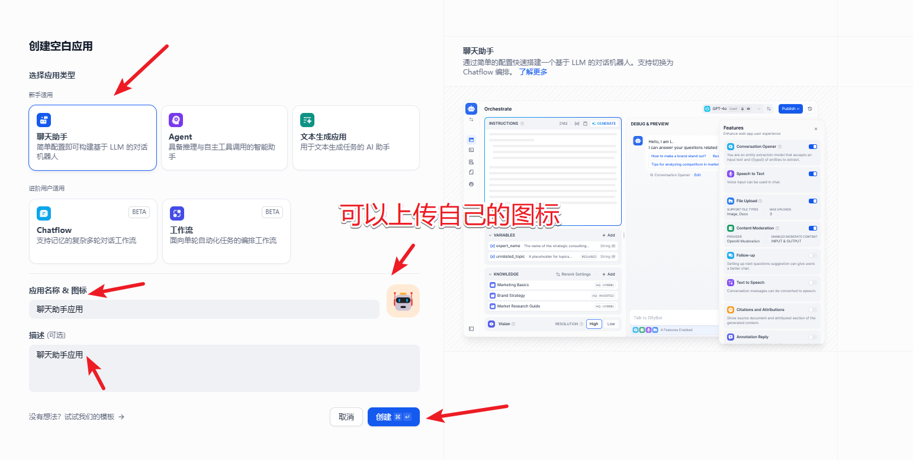
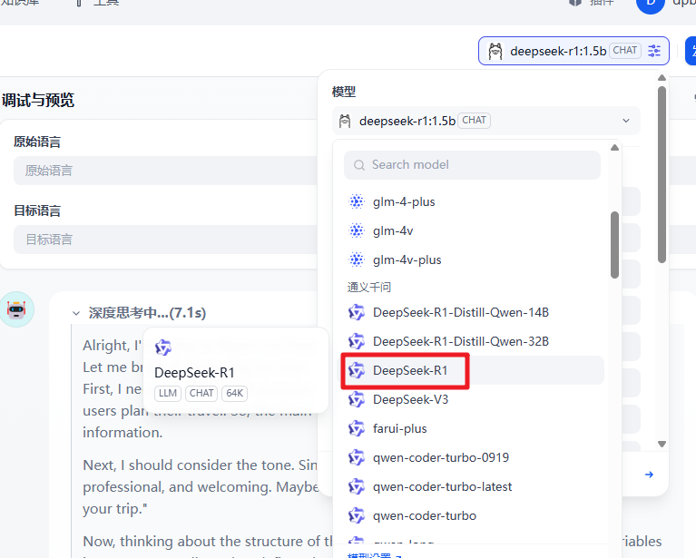
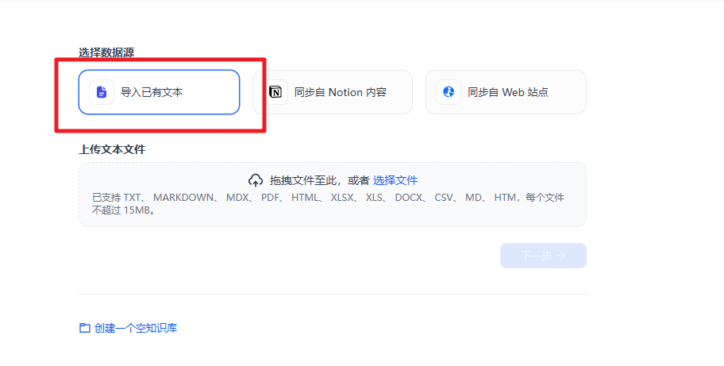
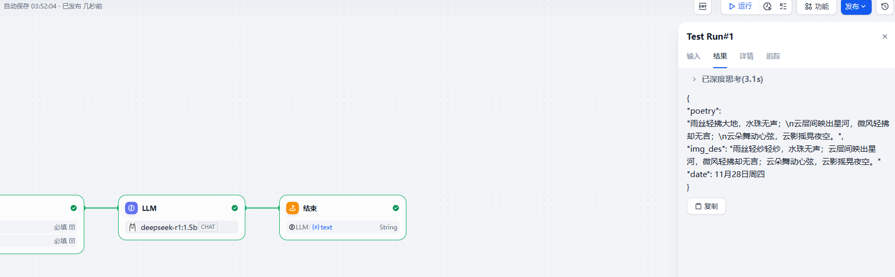
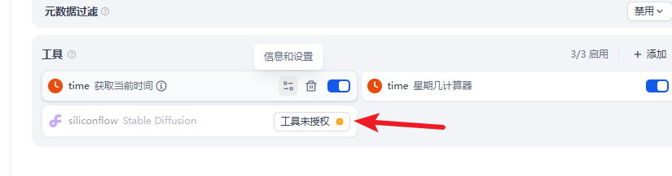
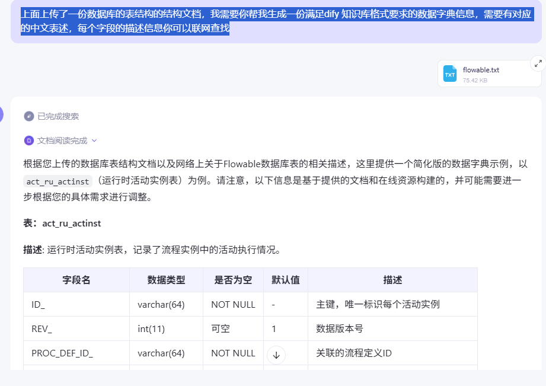
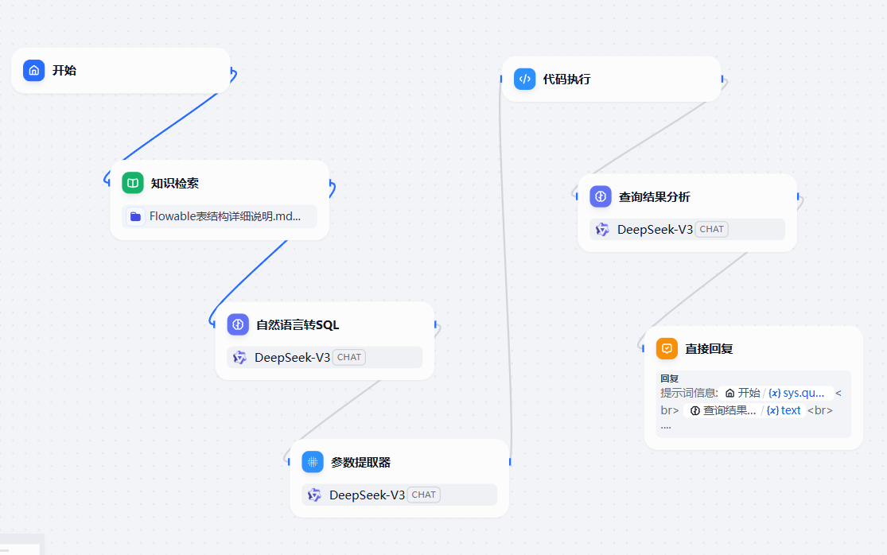
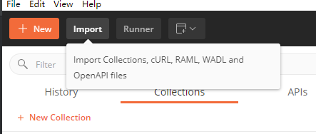

# 大模型系列课程---Dify 系列课程

> lecture：波哥


# 一、Dify 介绍


>官方地址：https://dify.ai/
>
>官方中文地址: https://dify.ai/zh
>
>官方文档地址：https://docs.dify.ai/zh-hans


​		开源的 LLM 应用开发平台。提供从 Agent 构建到 AI workflow 编排、RAG 检索、模型管理等能力，轻松构建和运营生成式 AI 原生应用。

比 LangChain 更易用。

​		Dify提供的有2个版本，分别是:

- 社区版

- 商业版

  


​	对于我们来说我们使用社区版本就可以了，因为我们最终还是需要把Dify部署到我们的本地来使用的。


# 二、Dify 本地部署

​	我们使用Dify的很大原因就是相比于Coze来说我们可以把Dify部署到我们的本地，同时能够更加灵活的来选择大模型和相关的插件来满足我们的需求。所以我们先来看看如何实现Dify的本地部署操作，这里我们使用的是社区版本。

## 1. Dify 源码

​	Dify的源码我们在官网的右上角有对应的github的链接地址，我们直接点击过去即可。


​	进入到github地址后我们可以选择1.3.0的版本源码来下载到本地。


当前这个时间最新的版本是`1.2.0`我们下载最新的版本即可。


下载后解压缩出来即可


进入源码中我们可以看到有个docker目录，把 .env.example 修改为 .env


所以从这儿我们也可以看出要启动Dify的本地程序，我们只需要安装下Docker服务就可以了。


## 2. Docker Desktop 安装

下载地址：https://www.docker.com/products/docker-desktop/


具体的安装过程参考这个地址：https://blog.csdn.net/qq_39843371/article/details/145722134


## 3. Dify 的运行

​	我们进入到Dify源码的docker目录中，我们需要先把 .env.example 修改为 .env 


然后在目录地址中输入 cmd 然后在命令窗口中输入这个命令

```cmd
docker-compose up -d
```


第一次执行的时候需要拉取相关的镜像地址，这块我们需要在docker desktop 中设置下代理地址

```txt
{
  "builder": {
    "gc": {
      "defaultKeepStorage": "20GB",
      "enabled": true
    }
  },
  "experimental": false,
  "registry-mirrors": [
    "https://do.nark.eu.org",
    "https://dc.j8.work",
    "https://docker.m.daocloud.io",
    "https://dockerproxy.com",
    "https://docker.mirrors.ustc.edu.cn",
    "https://docker.nju.edu.cn"
  ]
}
```


等相关镜像拉取完成后Dify就能正常的启动成功了。


## 4. Dify 的配置

​	启动成功后在地址栏中输入 http://localhost/install 就可以访问了


在这个界面设置自己的邮箱，用户名和密码，这块的信息需要自己记住哦，点击设置按钮后进入登录界面。


输入对应的邮箱和密码后即可登录。然后进入到Dify操作的主界面了。说明Dify已经安装成功并且可以使用了。


## 5. Ollama

​	https://ollama.com/

​	我们已经把Dify在本地部署了。然后我们可以通过Ollama在本地部署对应的大模型，比如 deepseek-r1:1.5b 这种小模型

Ollama 是一个让你能在本地运行大语言模型的工具，为用户在本地环境使用和交互大语言模型提供了便利，具有以下特点：

1）多模型支持：Ollama 支持多种大语言模型，比如 Llama 2、Mistral 等。这意味着用户可以根据自己的需求和场景，选择不同的模型来完成各种任务，如文本生成、问答系统、对话交互等。

2）易于安装和使用：它的安装过程相对简单，在 macOS、Linux 和 Windows 等主流操作系统上都能方便地部署。用户安装完成后，通过简洁的命令行界面就能与模型进行交互，降低了使用大语言模型的技术门槛。

3）本地运行：Ollama 允许模型在本地设备上运行，无需依赖网络连接来访问云端服务。这不仅提高了数据的安全性和隐私性，还能减少因网络问题导致的延迟，实现更快速的响应。

搜索Ollama进入官网https://ollama.com/download，选择安装MAC版本的安装包，点击安装即可


下载完成后直接双击安装即可

命令：ollama,出现下面内容，说明安装成功


启动Ollama服务

输入命令【ollama serve】，浏览器打开，显示running，说明启动成功


安装 deepseek-r1:1.5b模型

在https://ollama.com/library/deepseek-r1:1.5b 搜索deepseek-R1,跳转到下面的页面，复制这个命令，在终端执行，下载模型


cmd中执行这个命令


## 6. Dify关联Ollama

​	Dify 是通过Docker部署的，而Ollama 是运行在本地电脑的，得让Dify能访问Ollama 的服务。

在Dify项目-docker-找到.env文件，在末尾加上下面的配置：

```cmd
# 启用自定义模型
CUSTOM_MODEL_ENABLED=true
# 指定 Olama 的 API地址（根据部署环境调整IP）
OLLAMA_API_BASE_URL=host.docker.internal:11434
```

然后在模型中配置

在Dify的主界面 http://localhost/apps ，点击右上角用户名下的【设置】


在设置页面--Ollama--添加模型，如下：


添加成功后的


模型添加完成以后，刷新页面，进行系统模型设置。步骤：输入“**http://localhost/install**”进入Dify主页，用户名--设置--模型供应商，点击右侧【系统模型设置】，如下：


这样就关联成功了！！！


# 三、Dify 核心功能

## 1. 应用类型

​	在Dify中我们可以创建五种类型的应用。我们分别来介绍下。

### 1.1 聊天助手

​	基于 LLM 构建对话式交互的助手，这个非常简单，我们可以来创建一个简单的聊天助手应用来看看效果。



如果之前还没设置过对应的大模型的需要先设置下。


配置好大模型后，我们需要点击下 发布中 的 发布。相当于保存，然后就可以聊天了。


**提示词**

对于在中间的有一块 编排中，我们可以添加我们的 提示词，赋予 聊天助手 特定的功能。


**变量**

如果我们需要在这个基础上增加不同语言的翻译功能，这块我们可以添加对应的变量。来拓展这个功能。


添加了变量后我们还需要和上面的提示词关联起来。具体的效果为


**更换大模型**

​	当然在这里因为我们用的是 Deepseek-r1:1.5b 的模型，相对比较小，功能也比较弱，这时我们可以换一个在线的功能比较强大的模型来测试。


然后换一个功能强大的模型




我们也可以通过 运行 来打开独立的页面来访问


**知识库**

​	我们新建一个应用来介绍下知识库的内容。


然后我们问一些比较新的问题，你会发下大模型要么回答不了。要么开始胡说八道了。


这时我们可以在知识库中导入相关的知识内容，





然后可以回到我们的应用中。来关联上这个知识库


到这儿 聊天助手 相关的内容就介绍完了

### 1.2 文本生成应用

​	面向文本生成类任务的助手，例如撰写故事、文本分类、翻译等


创建后的界面效果，我们可以看到和我们前面创建的聊天助手是差不多的。只是在前面的基础上填充了模版，更易于我们的处理


比如翻译工具。我们在这个基础上快速的实现


### 1.3 Agent

​	智能助手（Agent Assistant），利用大语言模型的推理能力，能够自主对复杂的人类任务进行目标规划、任务拆解、工具调用、过程迭代，并在没有人类干预的情况下完成任务。能够分解任务、推理思考、调用工具的对话式智能助手，是一个更加强大的功能应用了。


进入主界面后我们可以看到相比前面的聊天助手来说多了一个工具的功能


然后我们点击添加 后弹出对话框，我们可以在这里选择对应的工具。


默认的就这么几个。简单测试下。比如添加时间插件。然后问大模型今天的日期。他就会调用这个工具来回复我们了。


也就是在Agent中。大模型可以根据我们的需求自主编排的选择我们提供的工具来完成我们的需求。

### 1.4 Chatflow

​	面向对话类情景，包括客户服务、语义搜索、以及其他需要在构建响应时进行多步逻辑的对话式应用程序。


然后就可以来设计下这个工作流的各个节点了

开始节点


大模型节点


对应的提示词

```txt
请根据 {{#sys.query#}}} 和今天的天气情况 {{#1744875520682.weather#}}}

写几句有诗意的散文诗，并且生成一段话描述这个场景的画面感。

1. 诗词或者散文请富有文学系和哲理，诗句示例：
万千生命如画卷徐徐展开，恍若荷叶晨露，转瞬即逝。

2. 诗词请保持输出两句话，不一定需要城市名称，但要突出城市或者当天的天气

请严格按照以下格式输出
{
  "poetry":<输出散文诗>
  "img_des":<输出描述诗词画面感的语句>
  "date":<今天的日期，格式示例: 11月28日周四>
}

```

直接回复节点，回复的就是大模型的输出内容了


测试效果


77 【电影级AI生图提示词教程 - 醉影平行宇宙 | 小红书 - 你的生活指南】 😆 BzvPZ9OQFtm8ZVw 😆 https://www.xiaohongshu.com/discovery/item/666923a2000000000d00db8d?source=webshare&xhsshare=pc_web&xsec_token=ABjnbILuVDLYAochYHJCHgw07fFRDc70nNCNdnucI29sg=&xsec_source=pc_share


### 1.5 工作流

​	面向自动化和批处理情景，适合高质量翻译、数据分析、内容生成、电子邮件自动化等应用程序。


创建后的效果，有一个开始节点，然后我们可以选择其他不同类型的节点来处理


这里我们同样选择一个LLM节点


在LLM节点后我们再添加一个结束节点。


在开始节点我们设置两个输入 城市和天气


在大模型中设置和前面相同的提示词


在结束的位置输出大模型的输出信息


然后测试即可




## 2. 工具篇

### 2.1 系统工具

​	我们可以在头部的 工具 标签进入


​	然后再dify市场中选择我们需要的工具，比如 硅基流动 的工具


选中后点击安装


等待下载安装即可


安装成功就可以在插件或者工具中看到了


然后回到之前的Agent 案例中。我们可以加入这个工具




第一次使用提示你需要授权


进入对应的官网。注册登录后获取API key


可以选择适合自己的方式


然后我们尝试来使用，发现这个工具好像并不好用。


在这种情况下我们可以结合工具官方的API来实现自定义工具的使用。

### 2.2 自定义工具

​	官方提供的工具在某些场景下并不能满足我们的需求。这时我们可以创建我们自己的工具来解决这个问题。我们创建一个通过 硅基流动 工具来帮我们生成图片的工具。


设置的工作流


相关节点介绍


添加一个http请求节点来发起请求： 官方的地址: https://docs.siliconflow.cn/cn/api-reference/images/images-generations


通过然后模型来提取信息


然后是代码执行的逻辑。处理多个图片信息

```python

from typing import Any, Union


def main(data: Any) -> str:
    """
    从复杂数据结构中安全提取第一个URL（优化版）

    :param data: 支持 dict/list/str 的任意嵌套数据结构
    :return: 总是返回字符串类型，找不到时返回空字符串
    """

    def extract_url(value: Union[dict, list, str]) -> str:
        """ 递归提取的核心逻辑 """
        if isinstance(value, str):
            return value if value.startswith(('http://', 'https://', 'data:image')) else ''

        if isinstance(value, dict):
            # 优先检查单数形式字段
            for field in ['url', 'image', 'link', 'src']:
                if field in value:
                    found = extract_url(value[field])
                    if found: return found

            # 检查复数形式字段
            for list_field in ['urls', 'images', 'links', 'sources']:
                if isinstance(value.get(list_field), list):
                    found = extract_url(value[list_field])
                    if found: return found

            # 深度搜索字典值
            for v in value.values():
                found = extract_url(v)
                if found: return found

        if isinstance(value, list):
            for item in value:
                found = extract_url(item)
                if found: return found

        return ''

    return {"result":extract_url(data)}

```

在结束节点返回图片地址


测试效果


生成的图片效果


然后可以把这个发布为工具


然后我们就可以来测试下工具的使用了。还是上面的案例


查看具体的图片


搞定


## 3.  导出DSL

​	如何分享我们的Dify案例给别人呢？在官方提供了导出DSL的功能，也就是我们只需要选择对应的案例，然后导出对应的DSL文件即可。


我们获取到这个dsl文件后。我们就可以把这个案例导入到我们自己的Dify工作空间了。


# 四、Dify 案例讲解

## 1. 图片案例

### 1.1 硅基流动文生图

​	我们可以先利用前面创建的那个硅基流动生成图片的案例来完善下生图的工作流。具体效果如下


大模型的提示词和前面应用类型中的是一样的。让大模型帮我们生成需要的图片描述和城市&天气的描述。

```txt
请根据 {{#sys.query#}}} 和今天的天气情况 {{#1744962555068.weather#}}

写几句有诗意的散文诗，并且生成一段话描述这个场景的画面感。

1. 诗词或者散文请富有文学系和哲理，诗句示例：
万千生命如画卷徐徐展开，恍若荷叶晨露，转瞬即逝。

2. 诗词请保持输出两句话，不一定需要城市名称，但要突出城市或者当天的天气

请严格按照以下格式输出
{
  "poetry":<输出散文诗>
  "img_des":<输出描述诗词画面感的语句>
  "date":<今天的日期，格式示例: 11月28日周四>
}
今天的日期是: {{#1744962698482.text#}}
```

然后是输出的结果这块我们显示的是链接。也可以加上一个img标签来直接显示图片


### 1.2 Agent中应用

​	接下来我们看看在Agent中如何更好的来利用问生图的工具来实现我们的需求。


对应的提示词

```txt
​```xml
<instruction>
你是一个文生图的专家，根据用户输入的信息调用`波哥-硅基流动图片工具`来生成图片。以下是具体步骤：
1. 接收用户输入的文本描述，变量名为{{text_description}}。
2. 调用`波哥-硅基流动图片工具`，传入{{text_description}}作为参数。
3. 工具会返回一个JSON格式的响应，其中包含生成的图片地址（img属性的值）。
4. 直接从JSON响应中提取img属性的值。
5. 将提取的图片地址直接添加到一个 标签的src属性中，来展示为图片，不要包含任何XML标签或其他额外信息。

注意：输出仅展示图片内容，不要包含任何XML标签或JSON结构。
</instruction>

<input>
用户提供的文本描述：{{text_description}}
</input>

<output>
直接展示图片内容（从img属性提取的地址）
</output>

<example>
<input>
用户提供的文本描述：一只在草地上奔跑的金毛犬
</input>

<output>
（直接展示生成的图片，例如：img = 'https://example.com/image123.jpg' 那么就展示为 ）
</output>
</example>
​```
```


### 1.3 爆改小红书案例

小红书的案例:

 https://www.xiaohongshu.com/discovery/item/666923a2000000000d00db8d?source=webshare&xhsshare=pc_web&xsec_token=ABjnbILuVDLYAochYHJCHgw07fFRDc70nNCNdnucI29sg=&xsec_source=pc_share

效果图:


我们需要基于这个文案来爆改，形成我们自己的文案，实现的步骤拆解

1. 基于链接地址获取的这个链接中的相关的信息
2. 提取出核心的内容 所有的图片链接 文案的标题  文案的内容
3. 基于大模型来优化标题和内容
4. 基于图片工具来调整图片内容
5. 获取到了爆改后的小红书的文案信息


整体的工作流设计效果


获取的响应结果


注意点：

**获取小红书信息的工具**


代码执行中的代码为:

```python
import re
import json

def main(html: str) -> dict:
    # 提取og:title内容
    og_title_pattern = r'<meta[^>]*name="og:title"[^>]*content="([^"]*)"'
    og_title_match = re.search(og_title_pattern, html)
    og_title = og_title_match.group(1) if og_title_match else ""

    # 提取description内容
    desc_pattern = r'<meta[^>]*name="description"[^>]*content="([^"]*)"'
    desc_match = re.search(desc_pattern, html)
    description = desc_match.group(1) if desc_match else ""

    # 提取所有og:image内容
    og_image_pattern = r'<meta[^>]*name="og:image"[^>]*content="([^"]*)"'
    og_images = re.findall(og_image_pattern, html)

    # 构建结果字典
    result = {
        "og_title": og_title,
        "description": description,
        "og_images": og_images
    }

    return {"result": result}

```

输出的内容


**图生图的工具**

​	把小红书中的图片借助AI大模型来爆改，这块我们通过百度大模型来实现。流程图的效果为


​	节点接受两个参数，分别是 图片的地址和需要调整的提示词。对应的代码执行是调用 我们单独创建的 基于Flask 的web服务。

```python
import json
import requests

def main(imgUrl: str, prompt: str):

    url = "http://host.docker.internal:5000/get_img_info"
    # 构造请求体
    payload = {
        "url": imgUrl,
        "prompt": prompt,
    }

    headers = {
        "Content-Type": "application/json"
    }

    try:
        response = requests.post(url, json=payload, headers=headers)
        if response.status_code == 200:
            try:
                return {"result":str(response.json()["result"])}
            except Exception as e:
                return {"result": f"解析响应 JSON 失败: {str(e)}"}
        else:
            return {"result": f"请求失败，状态码: {response}"}
    except Exception as e:
        return {"result": str(e)}
```

​	输出的结果


然后就是对应的Web服务的代码

```pythyon
from flask import Flask, request, jsonify

from openai import OpenAI

app = Flask(__name__)
def get_img_info(url,prompt):
    client = OpenAI(
        api_key="bce-v3/ALTAK-B39KBUm1GxWtwjcNWxxxxxxxx3490d01a03335",  # 你的千帆api-key
        base_url="https://qianfan.baidubce.com/v2",  # 千帆modelbulider平台
    )

    # 合并参考图参数到请求
    extra_data = {
        "refer_image": url,
    }
    try:
        response = client.images.generate(
            model="irag-1.0",
            prompt=prompt,
            extra_body=extra_data
        )
        return response.data[0].url
    except Exception as e:
        print(e)

@app.route('/get_img_info', methods=['POST'])
def images_info():
    data = request.get_json()
    if not data:
        return jsonify({"result": "无效的请求数据"}), 400

    url = data.get("url")
    prompt = data.get("prompt")

    if not url :
        return jsonify({"result": "需要输入图片链接"}), 400
    if not prompt :
        return jsonify({"result": "需要输入提示词"}), 400

    result = get_img_info(url, prompt)
    return jsonify({"result": result})


if __name__ == '__main__':
    # 开发环境下可以设置 debug=True，默认在本地5000端口启动服务
    app.run(debug=True)

```

这里需要大家自行去百度AI开发平台创建对应的API KEY ：https://cloud.baidu.com/doc/WENXINWORKSHOP/s/dm9cwwy4h#%E5%8E%9F%E5%A7%8B%E5%8F%82%E6%95%B0  创建KEY的地址: https://console.bce.baidu.com/iam/#/iam/apikey/list

测试效果

原图:


调整后的图片


完整的串联流程中要注意

参数提取器


然后是大模型的优化

```txt
​```xml
<instruction>
你是一个小红书的优化专家，负责将用户提供的标题{{#1744984171999.og_title#}}优化得更加吸引人眼球。以下是你的任务指南：

<instructions>
1. **理解原标题的核心内容**：首先仔细阅读原标题，确保你完全理解其表达的主题、情感和关键信息。
2. **分析目标受众**：考虑小红书的主要用户群体（年轻女性、时尚爱好者、美妆达人等），确保优化后的标题能引起她们的共鸣。
3. **运用吸引眼球的技巧**：
   - 使用emoji（如✨、💄、🔥等）增加视觉冲击力。
   - 加入数字或列表形式（如“3个技巧”“5分钟搞定”）。
   - 制造悬念或提出问题（如“你知道为什么明星都在用吗？”）。
   - 强调效果或价值（如“瞬间提升气质”“省钱必备”）。
4. **保持简洁**：标题长度控制在20字以内，确保信息清晰且抓人眼球。
5. **避免夸张或虚假信息**：优化后的标题必须真实反映内容，不能误导读者。
6. **输出格式**：直接输出优化后的标题，不要包含任何额外的解释或XML标签。
</instructions>

<examples>
<example>
输入：如何快速化妆  
输出：💄5分钟快速化妆术，懒人必备！  
</example>

<example>
输入：夏天穿搭推荐  
输出：🔥夏日穿搭Top5，显瘦又清凉！  
</example>

<example>
输入：护肤小技巧  
输出：✨3个护肤秘诀，让你素颜也发光！  
</example>
</examples>

其他注意事项：
- 如果原标题已经非常吸引人，可以稍作调整或直接保留。
- 避免使用过于复杂的词汇，确保标题通俗易懂。
- 根据小红书的热门话题趋势，适当加入流行词汇（如“绝绝子”“yyds”等）。
</instruction>
​```
```

图片的迭代处理


所以到这儿大家就能搞定这个案例了！！！


## 2. 语音案例

​	接下来我们看看如何通过Dify来实现一个自动语音播放小说内容的智能体，这里实现的步骤有两个

1. 获取小说的内容
2. 通过硅基流动的文生语音接口来获取语音信息


完整的流程定义图


小说的地址： https://www.xiaoshuopu.com/xiaoshuo/68/68135/31801497.html

http请求的节点：直接发起访问请求会返回这个页面的所有的内容


```txt
帮我写一个Python方法，方法接受一个html格式的字符串，方法中需要实现3个功能分别是 
1. 把接受的内容中的信息通过正则表达式把 \" 这种信息中的 \ 截取掉  
2. 通过正则表达式分别获取 
     小说的标题 在 <dd>的子标签<h1>中的内容
     小说的内容 在 id为htmlContent 的div中，同时在获取的小说内容中也通过正则表达式去掉里面的html的标签
     小说的上一页和写一页地址 在 id为 footlink 的dd标签中 只要获取对应的链接地址就可以了
3. 把第二步获取的信息封装在json数据中返回
对应的html的字符串如下
<body id=\"content\">\n<div id=\"a_head\">
        <ul>
            <li><a href=\"https://www.xiaoshuopu.com/\">首页</a></li>
            <li>
            <li><a href=\"/class_1/\">玄幻小说</a></li>\n<li><a href=\"/class_2/\">武侠小说</a></li>\n<li><a href=\"/class_3/\">都市小说</a></li>\n<li><a href=\"/class_4/\">女生小说</a></li>\n<li><a href=\"/class_5/\">历史小说</a></li>\n<li><a href=\"/class_6/\">网游小说</a></li>\n<li><a href=\"/class_7/\">科幻小说</a></li>\n</li>
            <li><a href=\"/quanben/\">全本小说</a></li>
            <li><a href=\"/top/weekvisit/\">排行榜</a></li>
            <script>
                search_from();
            </script>
        </ul>
    </div>\n<div class=\"main myset\">
        <script>
            page();
        </script>
    </div>\n<div id=\"a_main\">
        <div class=\"bdtop\"></div>
        <div class=\"bdsub\" id=\"amain\">
            <dl>
                <dt>\n <p class=\"fr\"><a id=\"MarkTop\" href=\"Javascript:void(0);\" onclick=\"book.addMark('68135','31801507','第三章 非典型修行者夜访');\">加入书签</a> | <a href=\"Javascript:void(0);\" onclick=\"book.userVote('68135');\">推荐本书</a> | <a href=\"/book/68135/\">返回书页</a> | <a rel=\"nofollow\" href=\"/user/bookcase.html\">我的书架</p><a href=\"https://www.xiaoshuopu.com/\">顶点小说</a> -&gt; <a href=\"/class_2/\">武侠小说</a> -&gt; <a href=\"/xiaoshuo/68/68135/\">大周不良人</a></dt>
                <dd>
                    <h1>第三章 非典型修行者夜访</h1>
                </dd>
                <dd>
                    <h3><a href=\"/xiaoshuo/68/68135/31801503.html\">上一章</a> &nbsp;&nbsp;&nbsp;&nbsp;&nbsp;&nbsp; <a href=\"/xiaoshuo/68/68135/\" title=\"大周不良人最新章节列表\">返回最新章节列表</a> &nbsp;&nbsp;&nbsp;&nbsp;&nbsp;&nbsp; <a href=\"/xiaoshuo/68/68135/31801511.html\">下一章</a></h3>
                </dd>\n<div class=\"banner\">
                    <script>
                        read_top();
                    </script>
                </div>\n<ul class=\"hot\">热门推荐:<li><a href=\"/xiaoshuo/66/66900/\" target=\"_blank\">诸天：开局越女阿青</a></li>
                    <li><a href=\"/xiaoshuo/68/68877/\" target=\"_blank\">全民修行：前面的剑修，你超速了</a></li>
                    <li><a href=\"/xiaoshuo/69/69733/\" target=\"_blank\">长生百万年，我被认证为大帝</a></li>
                    <li><a href=\"/xiaoshuo/5/5312/\" target=\"_blank\">武道郎中</a></li>
                    <li><a href=\"/xiaoshuo/21/21072/\" target=\"_blank\">从前有座灵剑山</a></li>
                    <li><a href=\"/xiaoshuo/68/68865/\" target=\"_blank\">修仙从分家开始</a></li>
                    <li><a href=\"/xiaoshuo/69/69236/\" target=\"_blank\">西游：开局拜师菩提祖师</a></li>
                    <li><a href=\"/xiaoshuo/69/69610/\" target=\"_blank\">七零，易孕娇妻被绝嗣京少宠哭了</a></li>
                    <li><a href=\"/xiaoshuo/69/69650/\" target=\"_blank\">师父每天求我别破境了</a></li>
                </ul>\n<div class=\"read_share\">
                    <script>
                        share();
                    </script>
                </div>\n<div id=\"htmlContent\">
                    <p>作为顶级门阀世家，雍州赵家的地位无疑是位于大周第一梯队的。<br> 其府邸成国公府也是十分宏大，各式屋舍斗拱飞檐、鳞次栉比。<br> 但广厦万千，夜眠仅需三尺。<br> 经历了一场死而复生闹剧的赵洵迷迷糊糊间进入了梦乡。<br> 可他睡得并不沉，恍惚之间觉得屋顶有什么声音，揉了揉眼睛抬头瞧去，只见有一块瓦片被挪开了。<br> 月光顺着那块瓦片的缝隙照了进来，赵洵本能的屏住了呼吸。<br> 前世他没少看过类似的影视剧，一般出现这种场面就意味着接下来有刺客要出现了。<br> 而自己成国公嫡子的身份也很符合这个设定。<br> 只是有什么人要刺杀他？<br> 他一个纨绔子弟有什么值得行刺的？<br> 这个世界也真是的，动不动就搞暗杀，这得多大仇啊。关键赵洵只是一个人畜无害的的佛系青年啊。<br> 现在说这些当然是无用的，赵洵本能的微微侧过身子佯装在睡觉，接下来就要看那刺客怎么做了。<br> 这个时候出声，无疑是找死。<br> 静观其变，见招拆招才是上策。<br> 作为一个手无缚鸡之力的膏粱子弟，赵洵十分清楚自己的机会只有一次，就是当对方放松警惕靠近的那一刻。<br> 此时的夜十分静谧，安静到赵洵可以清楚的听到自己心脏跳动的声响。<br> 他的左拳紧紧攥起，特意将中指往外突了半分。<br> 他在大学选修过一个学期的自卫防身术，这玩意据说本来是给女学生开设的，防范什么嘛...懂得都懂。但是赵洵厚着脸皮跟着学老师也没有什么办法。后来同寝室的舍友还几次三番嘲笑他学习女子防身术，可赵洵觉得技多不压身，总归是会有用到的机会的。自卫防身术虽然比不上什么咏春、搏击，但是总好过什么都不会，不成想真的被赵洵等到机会了。事发突然，现在赵洵也只能死马当活马医了。<br> 可是接下来的事情让赵洵震惊。<br> 没有传说中的吹管和蒙汗药，甚至也没有淬了毒药的暗箭。<br> 赵洵能够感受到的只有仿佛凝固的空气。<br> 直到一阵脚步声响起...<br> 赵洵屏住了呼吸。<br> 他的听力本就是异于常人，此时此刻更是能够清楚的听到外界的任何异响。<br> 对方的脚步声很轻，但是赵洵依然能够感受的到。<br> 近了，越来越近了...<br> 镇静，这个时候一定要镇静。<br> 赵洵在心中不断的告诫自己。<br> 他知道自己的机会只有一次，绝对不能出错。<br> 对方很显然是想要近距离的确认赵洵的身份之后再动手，这样固然可以做到万无一失，但是也给了赵洵反击的机会。<br> 一拳，赵洵只有一拳的机会。<br> 他清楚的记着在自卫防身术中，最好用的就是近距离冲着面门的爆拳。<br> 没有任何的弯弯绕绕，直接冲着鼻梁就是一拳。<br> 在短时间内根本不可能有人反应的过来。<br> 只要一拳就可以让对手丧失战斗能力。<br> 脚步声越来越近，赵洵的身体也像一个绷紧的弓弦一样。<br> 就在对方来到距离赵洵三尺之内，赵洵猛然暴起转身，蓄力一拳朝来人面门砸去。<br> 因为屋内漆黑，赵洵根本无法看清对方的面容，但他知道这是他最好的机会，紧接着他就将自卫防身术中学到的另外一招使出。<br> 撩阴腿。<br> 狠狠一脚朝对方裆部踢去，由于鼻骨被痛击，那来人本能的双手捂着鼻子，这一脚又结结实实的踢到了他的下体。<br> 之后便是一声惨叫。<br> 赵洵心中窃喜，连忙趁着这时机夺门而逃。<br> 他虽然被父亲禁足，但在成国公府内他仍可以随意行走。<br> “救命啊，有刺客！”<br> 赵洵急忙呼喊求救，府中护卫相继闻声赶来。<br> 动静弄得实在太大，最后连赵洵的便宜老爹成国公赵渊也闻讯赶来。<br> 赵洵是好不容易从鬼门关走了一遭才回来的，赵渊自然是十分疼惜。<br> 得知赵洵遇刺，连忙上前几步道：“我儿怎么样了？刺客在哪里？”<br> “父亲大人，刺客已经被我撂倒了，此刻就在屋中。”<br> 虽然方才的局势很是凶险，但赵洵整套拳脚下来也是完成的很到位，那刺客伤的都是要害，应该短时间内无法恢复行动力。<br> 赵渊连忙让护卫先进入屋内封锁，随后和赵伦一道进入查看。<br> 屋内迅速被火光点亮的犹如白昼一般，赵洵定睛瞧去只见床榻边蜷缩着一个中年男子。<br> 这人相貌平平，身材瘦削，身着一套泛黄的道袍，显得痛苦极了。<br> 也难怪，方才他那一拳和一脚使出了吃奶的劲，也算是把自卫防身术活学活用到极致了。<br> “胡闹！”<br> 赵洵本来得意洋洋，可谁曾想父亲随即转向他咆哮道：“你可知你闯了大祸，这是你的师父吴全义吴道长！”<br> 嗯？<br> 赵洵当即呆如木鸡的站在那里。<br> 这个人不是刺客，是他的师父？<br> 赵洵想过无数次跟师父见面的场景，但怎么也没有想过会是这样一个场面，他也真的算是绝绝子了。<br> 本以为可以凭借撂倒刺客让父亲对他高看一眼，摘掉纨绔子弟的帽子，可谁曾想到头来小丑竟是他自己。<br> “还不快去给吴道长道歉！”<br> 赵洵这才恍然，三步并作两步上前将吴全义扶起，愧疚道：“都是我不好，冲撞了道长。”<br> 那吴全义面色如同苦瓜一般，强自挤出一抹笑容来：“无妨，是为师想要提前看一看你，这才惹了误会。也怪为师没有提出真气护体…”<br> 赵洵心中疑惑不已，这又不是要婚嫁，哪有提前来看的道理。<br> 他却不知吴全义知道赵洵是有名的膏粱子弟，不学无术惯了，但又碍于赵渊的面子不好上来就回绝，这才打算趁着夜色潜入到赵洵住处亲眼瞧一瞧。若是勉强过的去他就收了赵洵为徒，若是烂泥扶不上墙他再想办法回绝。<br> 谁曾想赵洵也是个狠角色，一套下来直击他的要害。<br> 赵洵此刻心中哭笑不得，大概这吴全义也是认为赵洵是个膏粱子弟，对他没有威胁，所以完全不设防的吧？<br> 但凡运出真气护体，赵洵的拳脚都不可能伤到他。<br> 说到底修行者也是血肉之躯，在不运出真气护体的情况下与常人无异。<br> 而修行者也不可能时刻提运真气，不然为何会有修行者行那欢好之事时最为脆弱的说法。<br> 一个非典型修行者遇到一个非典型的纨绔子弟，这能说都是缘分吗？<br> ...<br> ...</p>
                </div>\n<dd id=\"contfoot\"><a href=\"javascript:void(0)\" onClick=\"addFavorite('https://www.xiaoshuopu.com/xiaoshuo/68/68135/','大周不良人-顶点小说/')\" class=\"keep\">没看完？将本书加入收藏</a>
                    <p id=\"MarkBottom\"><a href=\"Javascript:void(0);\" onclick=\"book.addMark('68135','31801507','第三章 非典型修行者夜访');\" class=\"case\">我是会员，将本章节放入书签</a></p><a href=\"Javascript:void(0);\" onClick=\"window.clipboardData.setData('Text','推荐一本书哈 《大周不良人》 \\r\\n https://www.xiaoshuopu.com/xiaoshuo/68/68135/');alert('复制成功！');\" class=\"copy\">复制本书地址，推荐给好友</a><a rel=\"nofollow\" href=\"Javascript:void(0);\" onclick=\"book.userVote('68135');\" class=\"report\">好书？我要投推荐票</a>
                </dd>
                <dd id=\"tipscent\"></dd>
                <dd id=\"footlink\">
					<a href=\"/xiaoshuo/68/68135/31801503.html\">上一章</a>
					<a href=\"/xiaoshuo/68/68135/\" title=\"大周不良人最新章节列表\">返回章节列表</a>
					<a href=\"/xiaoshuo/68/68135/31801511.html\">下一章</a></dd>
                <dd id=\"tipsfoot\"></dd>
            </dl>\n<div class=\"cl\"></div>
            <script>
                read_middle();
            </script>\n<ul class=\"hot\">新书推荐:<li><a href=\"/xiaoshuo/69/69710/\" target=\"_blank\">扣1加功德，我真不是气运之子啊</a></li>
                <li><a href=\"/xiaoshuo/68/68719/\" target=\"_blank\">绝境黑夜</a></li>
                <li><a href=\"/xiaoshuo/69/69244/\" target=\"_blank\">穿越西游：我为龙君</a></li>
                <li><a href=\"/xiaoshuo/16/16751/\" target=\"_blank\">赤心巡天</a></li>
                <li><a href=\"/xiaoshuo/67/67962/\" target=\"_blank\">贫道略通拳脚</a></li>
                <li><a href=\"/xiaoshuo/69/69257/\" target=\"_blank\">仙工开物</a></li>
                <li><a href=\"/xiaoshuo/45/45475/\" target=\"_blank\">坐忘长生</a></li>
                <li><a href=\"/xiaoshuo/69/69960/\" target=\"_blank\">我向大帝借了个脑子</a></li>
                <li><a href=\"/xiaoshuo/69/69912/\" target=\"_blank\">我在修仙界大器晚成</a></li>
            </ul>\n\n<div class=\"link\"><a href=\"https://www.xiaoshuopu.com/xiaoshuo/68/68135/\">大周不良人TXT下载</a><a href=\"https://www.xiaoshuopu.com/xiaoshuo/68/68135/\">大周不良人最新章节</a><a href=\"https://www.xiaoshuopu.com/xiaoshuo/68/68135/\">大周不良人无弹窗</a></div>\n
        </div>
    </div>\n<div class=\"cl\" style=\"height:8px;\"></div>
    <div id=\"a_footer\">&copy; 2020 <a href=\"https://www.xiaoshuopu.com/\">顶点小说</a>(https://www.xiaoshuopu.com) 快速稳定 免费阅读</div>\n<script>
        book.getBookMark('68135', '31801507');
    </script>\n<script>
        foot_bottom();
    </script>\n<script type=\"text/javascript\" src=\"/scripts/tongji.js\"></script>\n<script type=\"text/javascript\" src=\"/js/pagectrl.js\"></script>\n
</body>\n
```


```txt
写一个Python方法，方法接受的参数是
Link: /files/tools/8c05dec1-a6ba-46f6-bda4-6f3c2661ff37.mp3\n{\"body\": [{\"dify_model_identity\": \"__dify__file__\", \"id\": null, \"tenant_id\": \"50b1ab9b-5362-42b4-a3c1-4daf782ee356\", \"type\": \"audio\", \"transfer_method\": \"tool_file\", \"remote_url\": null, \"related_id\": \"8c05dec1-a6ba-46f6-bda4-6f3c2661ff37\", \"filename\": \"917cb7eb647546a597b5d3d9c2ba4a11.mp3\", \"extension\": \".mp3\", \"mime_type\": \"audio/mpeg\", \"size\": 6785985, \"url\": \"/files/tools/8c05dec1-a6ba-46f6-bda4-6f3c2661ff37.mp3?timestamp=1745203423&nonce=924b9a7852de1ace8e1190dcecf75ffb&sign=jUYY-qSV5XUWu_-QyoXYIbZBCoGlTmSYBvlK77LMm4U=\", \"tool_file_id\": \"8c05dec1-a6ba-46f6-bda4-6f3c2661ff37\"}]}
这个字符串。通过正则表达式获取到 {\"body\": [{\"dify_model_identity\": \"__dify__file__\", \"id\": null, \"tenant_id\": \"50b1ab9b-5362-42b4-a3c1-4daf782ee356\", \"type\": \"audio\", \"transfer_method\": \"tool_file\", \"remote_url\": null, \"related_id\": \"8c05dec1-a6ba-46f6-bda4-6f3c2661ff37\", \"filename\": \"917cb7eb647546a597b5d3d9c2ba4a11.mp3\", \"extension\": \".mp3\", \"mime_type\": \"audio/mpeg\", \"size\": 6785985, \"url\": \"/files/tools/8c05dec1-a6ba-46f6-bda4-6f3c2661ff37.mp3?timestamp=1745203423&nonce=924b9a7852de1ace8e1190dcecf75ffb&sign=jUYY-qSV5XUWu_-QyoXYIbZBCoGlTmSYBvlK77LMm4U=\", \"tool_file_id\": \"8c05dec1-a6ba-46f6-bda4-6f3c2661ff37\"}]} 这段信息，并把 \" 中的 \ 截取掉 并返回这个字符串
```


然后通过代码执行节点来获取小说的核心信息

1. 小说标题
2. 小说内容
3. 上一页和下一页地址

具体的实现代码

```python

import re
import json


def main(raw_html: str) -> dict:
        # 第一步：替换所有的 \" 为 "
    html_str = re.sub(r'\\"', '"', raw_html)

    # 第二步：提取小说标题
    title_match = re.search(r'<dd>\s*<h1>(.*?)</h1>', html_str, re.DOTALL)
    title = title_match.group(1).strip() if title_match else None

    # 提取正文内容（注意保留原始HTML结构，或可选清洗）
    content_match = re.search(r'<div id="htmlContent">(.*?)</div>', html_str, re.DOTALL)
    content = content_match.group(1).strip() if content_match else None

    content = re.sub(r'<[^>]+>', '', content)

    # 第三步：提取上一章和下一章链接
    footlink_match = re.search(r'<dd id="footlink">(.*?)</dd>', html_str, re.DOTALL)
    prev_link = next_link = None
    if footlink_match:
        footlink_content = footlink_match.group(1)
        links = re.findall(r'<a href="([^"]+)">([^<]+)</a>', footlink_content)
        for href, text in links:
            if "上一章" in text:
                prev_link = href
            elif "下一章" in text:
                next_link = href

    # 返回组装好的JSON数据
    return {"result":{
        "title": title,
        "content": content,
        "prev_link": prev_link,
        "next_link": next_link
        }
    }
```


然后我们需要通过一个参数提取器来把我们需要的内容分别提取出来


然后开始调用硅基流动的接口来生成语音


到这儿案例就搞定了


## 3. Excel可视化


### 3.1 Echarts展示

echarts官网案例地址:https://echarts.apache.org/examples/zh/index.html#chart-type-bar

核心的逻辑

```python
import json
def main(content: str) -> dict:
    option = {
        "legend": {
            "top": 'bottom'
        },
        "toolbox": {
            "show": True,
            "feature": {
                "mark": { "show": True },
                "dataView": { "show": True, "readOnly": False },
                "restore": { "show": True },
                "saveAsImage": { "show": True }
            }
        },
        "series": [
            {
            "name": 'Nightingale Chart',
            "type": 'pie',
            "radius": [50, 250],
            "center": ['50%', '50%'],
            "roseType": 'area',
            "itemStyle": {
                "borderRadius": 8
            },
            "data": [
                { "value": 40, "name": 'rose 1' },
                { "value": 38, "name": 'rose 2' },
                { "value": 32, "name": 'rose 3' },
                { "value": 30, "name": 'rose 4' },
                { "value": 28, "name": 'rose 5' },
                { "value": 26, "name": 'rose 6' },
                { "value": 22, "name": 'rose 7' },
                { "value": 18, "name": 'rose 8' }
            ]
            }
        ]
    };
    # 生成输出文件
    output = f'```echarts\n{json.dumps(option, ensure_ascii=False)}\n```'
    return {
        "result": output,
    }

```

我们只需要把对应的option转换为echarts格式的数据就可以了。所以实现起来还是非常简单的。要做动态的展示的话只需要把option的x轴和series中的数据替换掉就可以了。


运行的效果


Echarts插件使用


运行效果


### 3.2 Excel 案例

​	通过加载Excel中的数据，然后通过大模型来处理获取到满足Echarts需要的格式数据。


文档提取器处理简单


在文档提取器后的大模型需要结合用户的输入来动态的从Excel数据中获取到满足条件的数据

```txt
# 角色
你是一个数据整理的专家，擅长数据格式的整合和数据的转换
# 数据
{{#1745304518282.text#}}

# 任务
先从数据中提取出满足用户要求的数据 {{#sys.query#}} 然后把数据转换为 csv 格式

# 输出
把csv 格式的数据输出
```

用户提示词

```txt
用户输入的信息: {{#sys.query#}}
```

然后就是后续的参数提取器


之后的大模型把提取的数据转换为对应的json数据

```txt
# 角色
你是一个csv格式数据转json数据的技术专家，擅长把csv转换为对应的json数据,
# 数据
{{#1745305159850.csvdata#}}这个数据只有两列
# 任务
把csv中的两列数据转换对应的json 数据

比如:
片名,票房（亿元）\n《你好，李焕英》,57.1\n《长津湖之水门桥》,56.2\n《流浪地球2》,60\n《抓娃娃》,65

转换为:
{
	"name":["《你好，李焕英》","《长津湖之水门桥》","《流浪地球2》","《抓娃娃》"]
	"values":[57.1,56.2,60,65]
}

# 输出
把上面转换得到的json数据输出即可

```


然后后面有是一个提取器。出去json数据


最后就是代码执行获取echarts的数据

```python
import json
import re
def main(jsonData: str) -> dict:

        # 解析外层JSON数据
    #data = json.loads(jsonData)
    #query_str = data['query']

    # 去除换行符和制表符
    clean_str = re.sub(r'[\n\t]', '', jsonData)

    # 去除转义的双引号（将\"替换为"）
    clean_str = re.sub(r'\\"', '"', clean_str)

    # 提取name和values的值
    name_pattern = r'"name":\s*\[(.*?)\]'
    values_pattern = r'"values":\s*\[(.*?)\]'

    name_match = re.search(name_pattern, clean_str)
    values_match = re.search(values_pattern, clean_str)

    names = []
    if name_match:
        names = re.findall(r'"([^"]*)"', name_match.group(1))

    values = []
    if values_match:
        values = [float(num.strip()) for num in values_match.group(1).split(',')]

    option = {
        "xAxis": {
            "type": 'category',
            "data": names
        },
        "yAxis": {
            "type": 'value'
        },
        "series": [
            {
                "data": values,
                "type": 'bar',
                "showBackground": True,
                "backgroundStyle": {
                    "color": 'rgba(180, 180, 180, 0.2)'
                }
            }
        ]
    };
    # 生成输出文件
    output = f'```echarts\n{json.dumps(option, ensure_ascii=False)}\n```'
    return {
        "result": output,
    }
```

最终的输出结果


## 4. 自然语言转SQL案例

### 4.1 准备数据

​	我们通过LLM来生成一些需要的表结构和对应的测试数据。对应的提示词是

```txt
帮我设计一个电商系统的数据库。
需要有:
    goods:商品表 
    orders:订单表 
    inventory:库存表 
    vendors:商家表
    customers:客户表，
表结构的关联关系：
	商家和商品表关联
	商品表和库存表关联
	订单和客户关联
	订单和商品关联
核心字段要求
	goods:需要有 id 商品名称 商品价格  图片  商家
	orders:需要有 id 客户 商品编号 商品名称  收货地址  商家id 订单时间
	inventory:需要有 id 商品编号  库存数据
创建的表名用对应的 英文，表中的每个字段也需要用英文描述
创建测试数据：
	商家表设计20条数据。
	商品表设计50条记录，
	库存信息设计30条记录，
	订单按照时间生成最近半年的销售记录。每个月生成30~50条记录。
	客户生成20条记录。
	测试数据尽量模拟真实的数据，比如商品名称 小米手环，扫地机器人等 不要用序号来替代
设计数据的时候注意表结构直接的关联关系。生成的sql语句需要满足mysql的语法要求
```


生成对应的SQL

```sql
-- 创建表结构
CREATE TABLE vendors (
    vendor_id INT PRIMARY KEY AUTO_INCREMENT,
    vendor_name VARCHAR(100) NOT NULL,
    contact_name VARCHAR(50),
    contact_phone VARCHAR(20),
    address VARCHAR(200),
    created_at TIMESTAMP DEFAULT CURRENT_TIMESTAMP
);

CREATE TABLE customers (
    customer_id INT PRIMARY KEY AUTO_INCREMENT,
    first_name VARCHAR(50) NOT NULL,
    last_name VARCHAR(50) NOT NULL,
    email VARCHAR(100) UNIQUE,
    phone VARCHAR(20),
    registration_date DATE,
    shipping_address VARCHAR(200)
);

CREATE TABLE goods (
    goods_id INT PRIMARY KEY AUTO_INCREMENT,
    goods_name VARCHAR(100) NOT NULL,
    price DECIMAL(10,2) NOT NULL,
    image_url VARCHAR(200),
    vendor_id INT NOT NULL,
    created_at TIMESTAMP DEFAULT CURRENT_TIMESTAMP,
    FOREIGN KEY (vendor_id) REFERENCES vendors(vendor_id)
);

CREATE TABLE inventory (
    inventory_id INT PRIMARY KEY AUTO_INCREMENT,
    goods_id INT NOT NULL UNIQUE,
    stock_quantity INT NOT NULL,
    last_updated TIMESTAMP DEFAULT CURRENT_TIMESTAMP ON UPDATE CURRENT_TIMESTAMP,
    FOREIGN KEY (goods_id) REFERENCES goods(goods_id)
);

CREATE TABLE orders (
    order_id INT PRIMARY KEY AUTO_INCREMENT,
    customer_id INT NOT NULL,
    goods_id INT NOT NULL,
    goods_name VARCHAR(100) NOT NULL,
    shipping_address VARCHAR(200) NOT NULL,
    vendor_id INT NOT NULL,
    order_time DATETIME NOT NULL,
    quantity INT NOT NULL DEFAULT 1,
    total_amount DECIMAL(10,2) NOT NULL,
    FOREIGN KEY (customer_id) REFERENCES customers(customer_id),
    FOREIGN KEY (goods_id) REFERENCES goods(goods_id),
    FOREIGN KEY (vendor_id) REFERENCES vendors(vendor_id)
);
```

对应的说明

>主要特点说明：
>
>1. 表关系设计：
>
>- 商家表(vendors)和商品表(goods)通过vendor_id关联
>- 商品表(goods)和库存表(inventory)通过goods_id关联
>- 客户表(customers)和订单表(orders)通过customer_id关联
>- 商品表(goods)和订单表(orders)通过goods_id关联
>
>1. 数据模拟策略：
>
>- 商家名称使用真实品牌+店铺类型
>- 商品名称采用"品牌+产品类型+型号"的格式
>- 客户信息包含真实姓名结构和常见邮箱格式
>- 订单时间分布最近半年，每月生成30-50条
>- 价格采用真实市场价格区间
>
>1. 扩展性考虑：
>
>- 库存表设计为单独表方便库存管理
>- 订单表包含冗余的商品名称字段便于历史记录查询
>- 价格字段使用DECIMAL类型确保计算精度
>- 包含时间戳字段用于记录操作时间
>
>1. 完整性约束：
>
>- 外键约束保证数据一致性
>- 唯一约束防止重复数据
>- 非空约束确保必要字段的完整性
>
>执行顺序建议：
>
>1. 先创建表结构
>2. 按顺序插入：vendors → customers → goods → inventory
>3. 最后生成订单数据
>4. 需要时添加索引优化查询性能
>
>

创建的测试数据不完整，我们可以继续让大模型优化


对应生成的测试数据:

```sql
-- 创建表结构（同上，此处不再重复）
-- 完整测试数据插入
-- 1. 插入20个完整商家
INSERT INTO vendors (vendor_name, contact_name, contact_phone, address) VALUES
('小米旗舰店', '张伟', '138-1234-5678', '北京市海淀区小米科技园'),
('华为官方店', '王芳', '159-2345-6789', '深圳市龙岗区华为基地'),
('家电世界', '李明', '400-800-1234', '上海市浦东新区东方路'),
('数码先锋', '陈强', '0755-66889900', '广州市天河区珠江新城'),
('运动装备城', '赵敏', '020-34567890', '杭州市余杭区未来科技城'),
('苹果授权店', '周杰伦', '010-87654321', '北京市朝阳区三里屯'),
('苏泊尔厨电', '李晓红', '0571-66553344', '杭州市西湖区文三路'),
('联想专卖店', '王志强', '021-22334455', '上海市徐汇区漕溪北路'),
('美的电器', '陈丽娟', '0757-88776655', '佛山市顺德区美的工业城'),
('海尔智能家', '张海波', '0532-55667788', '青岛市崂山区海尔路1号'),
('优衣库服装', '田中一郎', '029-33445566', '西安市雁塔区小寨西路'),
('格力空调', '董明珠', '0756-34567890', '珠海市前山金鸡西路'),
('九阳小家电', '王旭宁', '0531-77889900', '济南市槐荫区经十路'),
('大疆创新', '汪滔', '0755-66778899', '深圳市南山区高新南四道'),
('乐高玩具', '克伊尔德', '021-99887766', '上海市静安区南京西路'),
('三星电子', '李在镕', '025-44556677', '南京市玄武区珠江路'),
('戴尔电脑', '迈克尔·戴尔', '0592-55667788', '厦门市思明区软件园二期'),
('索尼数码', '平井一夫', '0755-33445566', '深圳市福田区华强北'),
('飞利浦照明', '万豪敦', '025-88776655', '南京市鼓楼区中山北路'),
('图书音像专营', '周涛', '028-87654321', '成都市武侯区天府软件园');

-- 2. 插入50个完整商品
INSERT INTO goods (goods_name, price, image_url, vendor_id) VALUES
('小米手环7', 299.00, 'xiaomi-band7.jpg', 1),
('华为MateBook X Pro', 9999.00, 'huawei-matebook.jpg', 2),
('扫地机器人X1', 2599.00, 'sweeping-robot.jpg', 3),
('无线降噪耳机Pro', 899.00, 'wireless-earphone.jpg', 4),
('智能跑步机2023款', 4599.00, 'treadmill.jpg', 5),
('iPhone 15 Pro', 8999.00, 'iphone15pro.jpg', 6),
('苏泊尔电饭煲CFXB40', 399.00, 'cooker.jpg', 7),
('联想拯救者Y9000P', 10999.00, 'legion.jpg', 8),
('美的变频空调KFR-35GW', 3299.00, 'air-conditioner.jpg', 9),
('海尔双门冰箱BCD-258WDPM', 4299.00, 'refrigerator.jpg', 10),
('优衣库轻型羽绒服', 599.00, 'down-jacket.jpg', 11),
('格力云佳1.5匹空调', 3199.00, 'gree-ac.jpg', 12),
('九阳破壁机L18-Y928S', 699.00, 'blender.jpg', 13),
('大疆Air 3无人机', 6988.00, 'drone.jpg', 14),
('乐高保时捷911积木', 1699.00, 'lego-911.jpg', 15),
('三星4K显示器U32R590', 2999.00, 'monitor.jpg', 16),
('戴尔XPS 13笔记本', 12999.00, 'xps13.jpg', 17),
('索尼A7M4微单相机', 19999.00, 'sony-a7m4.jpg', 18),
('飞利浦智能台灯', 399.00, 'desk-lamp.jpg', 19),
('Java编程思想（第4版）', 129.00, 'java-book.jpg', 20),
-- 继续补充30件商品...
('小米电视ES65 2023款', 3499.00, 'mi-tv.jpg', 1),
('华为Watch GT4', 1488.00, 'huawei-watch.jpg', 2),
('戴森V12吸尘器', 4999.00, 'dyson-v12.jpg', 3),
('罗技G502鼠标', 399.00, 'g502.jpg', 4),
('任天堂Switch OLED', 2299.00, 'switch.jpg', 5),
('Apple Watch S9', 2999.00, 'apple-watch.jpg', 6),
('苏泊尔电磁炉C21', 299.00, 'induction-cooker.jpg', 7),
('联想小新Pro16', 6499.00, 'xiaoxin-pro.jpg', 8),
('美的电压力锅MY-HT5097', 599.00, 'pressure-cooker.jpg', 9),
('海尔滚筒洗衣机XQG100', 3899.00, 'washing-machine.jpg', 10),
('优衣库U系列T恤', 79.00, 't-shirt.jpg', 11),
('格力空气净化器KJ350G', 1599.00, 'air-purifier.jpg', 12),
('九阳电热水壶JYK-17C15', 129.00, 'kettle.jpg', 13),
('大疆Pocket 3云台相机', 3499.00, 'pocket3.jpg', 14),
('乐高迪士尼城堡', 3299.00, 'lego-castle.jpg', 15),
('三星T7 Shield移动硬盘', 799.00, 'ssd.jpg', 16),
('戴尔U2723QX显示器', 4499.00, 'dell-monitor.jpg', 17),
('索尼WH-1000XM5耳机', 2499.00, 'sony-headphone.jpg', 18),
('飞利浦电动牙刷HX6853', 399.00, 'toothbrush.jpg', 19),
('Python编程从入门到实践', 89.00, 'python-book.jpg', 20);

-- 3. 插入30条库存记录（对应前30个商品）
INSERT INTO inventory (goods_id, stock_quantity) VALUES
(1, 500),(2, 200),(3, 150),(4, 800),(5, 100),
(6, 300),(7, 600),(8, 150),(9, 400),(10, 250),
(11, 1000),(12, 350),(13, 700),(14, 80),(15, 120),
(16, 200),(17, 90),(18, 60),(19, 300),(20, 450),
(21, 550),(22, 220),(23, 180),(24, 750),(25, 130),
(26, 320),(27, 480),(28, 170),(29, 420),(30, 280);

-- 4. 插入20个完整客户
INSERT INTO customers (first_name, last_name, email, phone, registration_date, shipping_address) VALUES
('张','三','zhangsan@example.com','138-1111-2222','2023-01-01','北京市朝阳区朝阳门外大街1号'),
('李','四','lisi@example.com','159-3333-4444','2023-02-15','上海市黄浦区南京东路100号'),
('王','五','wangwu@example.com','186-5555-6666','2023-03-20','广州市天河区体育西路88号'),
('赵','六','zhaoliu@example.com','131-7777-8888','2023-04-10','深圳市福田区深南大道2008号'),
('陈','七','chenqi@example.com','137-9999-0000','2023-05-05','杭州市余杭区文一西路969号'),
('周','八','zhouba@example.com','135-1212-3434','2023-06-12','成都市武侯区天府三街'),
('吴','九','wujiu@example.com','139-5656-7878','2023-07-18','南京市鼓楼区中山北路1号'),
('郑','十','zhengshi@example.com','150-2323-4545','2023-08-22','武汉市江汉区建设大道568号'),
('孙','十一','sunshiyi@example.com','189-6767-8989','2023-09-09','西安市雁塔区高新路'),
('朱','十二','zhushier@example.com','133-8989-7676','2023-10-15','重庆市渝中区解放碑'),
('高','十三','gaoshisan@example.com','136-5454-3232','2023-11-11','长沙市岳麓区麓谷大道'),
('林','十四','linshisi@example.com','158-4343-2121','2023-12-01','厦门市思明区软件园二期望海路'),
('何','十五','heshiwu@example.com','177-6565-3434','2024-01-05','青岛市市南区香港中路'),
('黄','十六','huangshiliu@example.com','188-7878-5656','2024-02-14','大连市中山区人民路'),
('徐','十七','xushiqi@example.com','134-3232-5454','2024-03-08','苏州市工业园区星湖街'),
('马','十八','mashiba@example.com','191-9090-1212','2024-04-20','天津市和平区南京路'),
('郭','十九','guoshijiu@example.com','130-4545-6767','2024-05-30','宁波市鄞州区钱湖北路'),
('谢','二十','xieershi@example.com','153-6767-8989','2024-06-15','佛山市南海区桂城街道'),
('罗','二十一','luo21@example.com','157-2323-4545','2024-07-01','东莞市南城区鸿福路'),
('蔡','二十二','cai22@example.com','180-8989-7676','2024-08-18','合肥市政务区潜山路');

-- 5. 直接生成订单数据（240条示例）
INSERT INTO orders (customer_id, goods_id, goods_name, shipping_address, vendor_id, order_time, quantity, total_amount)
SELECT 
    FLOOR(1 + RAND() * 20) AS customer_id,
    g.goods_id,
    g.goods_name,
    (SELECT shipping_address FROM customers WHERE customer_id = c.customer_id),
    g.vendor_id,
    TIMESTAMP('2024-01-01') + INTERVAL FLOOR(RAND() * 180) DAY + INTERVAL FLOOR(RAND() * 86400) SECOND,
    FLOOR(1 + RAND() * 5),
    ROUND(g.price * (FLOOR(1 + RAND() * 5)), 2)
FROM goods g
JOIN customers c
WHERE g.goods_id <= 30  -- 只选择有库存的商品
ORDER BY RAND()
LIMIT 240;

-- 为提升性能可添加索引
CREATE INDEX idx_orders_time ON orders(order_time);
CREATE INDEX idx_goods_vendor ON goods(vendor_id);
CREATE INDEX idx_vendor_name ON vendors(vendor_name);
```

创建对应的数据库来存储数据

1. 执行所有CREATE TABLE语句
2. 按顺序执行INSERT：vendors → customers → goods → inventory → orders
3. 最后执行CREATE INDEX语句

表结构的说明

```txt
# 电商系统数据库表结构说明

## 1. 商家表 (vendors)
| 字段名         | 注释说明         | 数据类型        | 主键 | 允许空 | 备注 |
|----------------|------------------|-----------------|------|--------|------|
| vendor_id      | 商家唯一ID       | INT             | 是   | 否     | 自增主键 |
| vendor_name    | 商家名称         | VARCHAR(100)    | 否   | 否     |      |
| contact_name   | 联系人姓名       | VARCHAR(50)     | 否   | 是     |      |
| contact_phone  | 联系电话         | VARCHAR(20)     | 否   | 是     |      |
| address        | 商家地址         | VARCHAR(200)    | 否   | 是     |      |
| created_at     | 创建时间         | TIMESTAMP       | 否   | 否     | 默认当前时间 |

---

## 2. 客户表 (customers)
| 字段名            | 注释说明         | 数据类型        | 主键 | 允许空 | 约束 |
|-------------------|------------------|-----------------|------|--------|------|
| customer_id       | 客户唯一ID       | INT             | 是   | 否     | 自增主键 |
| first_name        | 客户名字         | VARCHAR(50)     | 否   | 否     |      |
| last_name         | 客户姓氏         | VARCHAR(50)     | 否   | 否     |      |
| email             | 电子邮箱         | VARCHAR(100)    | 否   | 是     | 唯一约束 |
| phone             | 联系电话         | VARCHAR(20)     | 否   | 是     |      |
| registration_date | 注册日期         | DATE            | 否   | 是     |      |
| shipping_address  | 收货地址         | VARCHAR(200)    | 否   | 是     |      |

---

## 3. 商品表 (goods)
| 字段名       | 注释说明         | 数据类型        | 主键 | 允许空 | 关联关系 |
|--------------|------------------|-----------------|------|--------|----------|
| goods_id     | 商品唯一ID       | INT             | 是   | 否     | 自增主键 |
| goods_name   | 商品名称         | VARCHAR(100)    | 否   | 否     |          |
| price        | 商品价格         | DECIMAL(10,2)   | 否   | 否     |          |
| image_url    | 商品图片链接     | VARCHAR(200)    | 否   | 是     |          |
| vendor_id    | 所属商家ID       | INT             | 否   | 否     | 外键关联vendors |
| created_at   | 上架时间         | TIMESTAMP       | 否   | 否     | 默认当前时间 |

---

## 4. 库存表 (inventory)
| 字段名          | 注释说明         | 数据类型        | 主键 | 允许空 | 特殊说明 |
|-----------------|------------------|-----------------|------|--------|----------|
| inventory_id    | 库存记录ID       | INT             | 是   | 否     | 自增主键 |
| goods_id        | 商品ID           | INT             | 否   | 否     | 唯一约束/外键关联goods |
| stock_quantity  | 库存数量         | INT             | 否   | 否     |          |
| last_updated    | 最后更新时间     | TIMESTAMP       | 否   | 否     | 自动更新当前时间 |

---

## 5. 订单表 (orders)
| 字段名           | 注释说明         | 数据类型        | 主键 | 允许空 | 关联关系 |
|------------------|------------------|-----------------|------|--------|----------|
| order_id         | 订单唯一ID       | INT             | 是   | 否     | 自增主键 |
| customer_id      | 客户ID           | INT             | 否   | 否     | 外键关联customers |
| goods_id         | 商品ID           | INT             | 否   | 否     | 外键关联goods |
| goods_name       | 商品名称         | VARCHAR(100)    | 否   | 否     |          |
| shipping_address | 收货地址         | VARCHAR(200)    | 否   | 否     |          |
| vendor_id        | 商家ID           | INT             | 否   | 否     | 外键关联vendors |
| order_time       | 下单时间         | DATETIME        | 否   | 否     |          |
| quantity         | 购买数量         | INT             | 否   | 否     | 默认值1 |
| total_amount     | 订单总金额       | DECIMAL(10,2)   | 否   | 否     |          |

---

### 关系说明
1. **一对多关系**  
   - 商家表(vendors) ➔ 商品表(goods) (1:n)
   - 客户表(customers) ➔ 订单表(orders) (1:n)

2. **一对一关系**  
   - 商品表(goods) ➔ 库存表(inventory) (1:1)

3. **多对多关系**  
   - 通过订单表(orders)实现：客户(customers) ↔ 商品(goods)
```


### 4.2 知识库

​	我们可以把数据库的表结构说明信息导入到知识库中。


注意选择下向量模型


这里其实就是一个RAG的应用了


等待处理完成


搞定


### 4.3 工作流设计

#### 4.3.1 自然语言转SQL

先实现自然语言转SQL的需求，具体的实现的步骤


大模型的提示词

```txt
你是一位精通SQL语言的数据库专家，熟悉MySQL数据库。你的任务是根据用户的自然语言输入，编写出可直接执行的SQL查询语句。输出内容必须是可以执行的SQL语句，不能包含任何多余的信息。


核心规则：
1. 根据用户的查询需求，确定涉及的表和字段。
2. 确保SQL语句的语法符合MySQL的规范。
3. 输出的SQL语句必须完整且可执行，不包含注释或多余的换行符。

关键技巧：
- WHERE 子句： 用于过滤数据。例如，`WHERE column_name = 'value'`。
- **日期处理：** 使用`STR_TO_DATE`函数将字符串转换为日期类型。例如，`STR_TO_DATE('2025-03-14', '%Y-%m-%d')`。
- **聚合函数：** 如`COUNT`、`SUM`、`AVG`等，用于计算汇总信息。
- **除法处理：** 在进行除法运算时，需考虑除数为零的情况，避免错误。
- **日期范围示例：** 查询特定日期范围的数据时，使用`BETWEEN`关键字。例如，`WHERE date_column BETWEEN '2025-01-01' AND '2025-12-31'`。

**注意事项：**
1. 确保字段名和表名的正确性，避免拼写错误。
2. 对于字符串类型的字段，使用单引号括起来。例如，`'sample_text'`。
3. 在使用聚合函数时，如果需要根据特定字段分组，使用`GROUP BY`子句。
4. 在进行除法运算时，需判断除数是否为零，以避免运行时错误。
5. 生成的sql语句 不能有换行符 比如 \n
6. 在计算订单金额的时候直接计算对应的商品价格就可以了，不用计算订单的商品数量

请根据上述规则，将用户的自然语言查询转换为可执行的MySQL查询语句。

<examples>
    
    输入: "找出所有年龄大于等于5岁且性别为男的学生"
    输出:"SELECT * FROM students WHERE age >= '5' AND gender = 'male';"

    输入："统计每个部门员工数量"
    输出：“SELECT department_name , COUNT(*) AS employee_count FROM employees GROUP BY department_name;”

    输入:'列出销售业绩排名前五的商品'
    输出："SELECT product_id, SUM(sales_amount) total_sales  
          FROM sales_data 
          GROUP BY product_id 
          ORDER BY total_sales DESC LIMIT 5;"
</examples>
```

用户提示词

```txt
1. 数据库相关表结构的说明:
# 电商系统数据库表结构说明

## 1. 商家表 (vendors)
| 字段名         | 注释说明         | 数据类型        | 主键 | 允许空 | 备注 |
|----------------|------------------|-----------------|------|--------|------|
| vendor_id      | 商家唯一ID       | INT             | 是   | 否     | 自增主键 |
| vendor_name    | 商家名称         | VARCHAR(100)    | 否   | 否     |      |
| contact_name   | 联系人姓名       | VARCHAR(50)     | 否   | 是     |      |
| contact_phone  | 联系电话         | VARCHAR(20)     | 否   | 是     |      |
| address        | 商家地址         | VARCHAR(200)    | 否   | 是     |      |
| created_at     | 创建时间         | TIMESTAMP       | 否   | 否     | 默认当前时间 |

---

## 2. 客户表 (customers)
| 字段名            | 注释说明         | 数据类型        | 主键 | 允许空 | 约束 |
|-------------------|------------------|-----------------|------|--------|------|
| customer_id       | 客户唯一ID       | INT             | 是   | 否     | 自增主键 |
| first_name        | 客户名字         | VARCHAR(50)     | 否   | 否     |      |
| last_name         | 客户姓氏         | VARCHAR(50)     | 否   | 否     |      |
| email             | 电子邮箱         | VARCHAR(100)    | 否   | 是     | 唯一约束 |
| phone             | 联系电话         | VARCHAR(20)     | 否   | 是     |      |
| registration_date | 注册日期         | DATE            | 否   | 是     |      |
| shipping_address  | 收货地址         | VARCHAR(200)    | 否   | 是     |      |

---

## 3. 商品表 (goods)
| 字段名       | 注释说明         | 数据类型        | 主键 | 允许空 | 关联关系 |
|--------------|------------------|-----------------|------|--------|----------|
| goods_id     | 商品唯一ID       | INT             | 是   | 否     | 自增主键 |
| goods_name   | 商品名称         | VARCHAR(100)    | 否   | 否     |          |
| price        | 商品价格         | DECIMAL(10,2)   | 否   | 否     |          |
| image_url    | 商品图片链接     | VARCHAR(200)    | 否   | 是     |          |
| vendor_id    | 所属商家ID       | INT             | 否   | 否     | 外键关联vendors |
| created_at   | 上架时间         | TIMESTAMP       | 否   | 否     | 默认当前时间 |

---

## 4. 库存表 (inventory)
| 字段名          | 注释说明         | 数据类型        | 主键 | 允许空 | 特殊说明 |
|-----------------|------------------|-----------------|------|--------|----------|
| inventory_id    | 库存记录ID       | INT             | 是   | 否     | 自增主键 |
| goods_id        | 商品ID           | INT             | 否   | 否     | 唯一约束/外键关联goods |
| stock_quantity  | 库存数量         | INT             | 否   | 否     |          |
| last_updated    | 最后更新时间     | TIMESTAMP       | 否   | 否     | 自动更新当前时间 |

---

## 5. 订单表 (orders)
| 字段名           | 注释说明         | 数据类型        | 主键 | 允许空 | 关联关系 |
|------------------|------------------|-----------------|------|--------|----------|
| order_id         | 订单唯一ID       | INT             | 是   | 否     | 自增主键 |
| customer_id      | 客户ID           | INT             | 否   | 否     | 外键关联customers |
| goods_id         | 商品ID           | INT             | 否   | 否     | 外键关联goods |
| goods_name       | 商品名称         | VARCHAR(100)    | 否   | 否     |          |
| shipping_address | 收货地址         | VARCHAR(200)    | 否   | 否     |          |
| vendor_id        | 商家ID           | INT             | 否   | 否     | 外键关联vendors |
| order_time       | 下单时间         | DATETIME        | 否   | 否     |          |
| quantity         | 购买数量         | INT             | 否   | 否     | 默认值1 |
| total_amount     | 订单总金额       | DECIMAL(10,2)   | 否   | 否     |          |

---

### 关系说明
1. **一对多关系**  
   - 商家表(vendors) ➔ 商品表(goods) (1:n)
   - 客户表(customers) ➔ 订单表(orders) (1:n)

2. **一对一关系**  
   - 商品表(goods) ➔ 库存表(inventory) (1:1)

3. **多对多关系**  
   - 通过订单表(orders)实现：客户(customers) ↔ 商品(goods)


2. 用户输入的信息: {{#1745476381473.content#}}
```

这里使用的大模型是DeepSeek-R1的版本，这个版本生成的内容会包含think的内容


所以我们在后面添加了一个代码执行。来处理这部分的内容

```python
import re

def main(text: str) -> dict:
    cleaned_text = re.sub(r'<think>.*?</think>', '', text, flags=re.DOTALL).strip()
    return {
        "result": cleaned_text,
    }

```

这块如果我们不需要这些think信息，我们可以调整下大模型，比如使用DeepSeek-V3版本


然后就是如果我们的数据库表结构的说明信息太多，这时我们可以通过知识库的方式来处理


知识库的配置


在LLM中应用


#### 4.3.2 SQL执行

​	实现了自然语言转SQL后我们就可以考虑来执行SQL了，这块有两种方式，第一种是通过数据库的查询插件来实现，还有就是通过我们自定义的接口来处理。我们分别来看看如何实现，先看插件的方式


做一下配置就可以了。然后就是代码的方式，


我们首先创建一个基于Flask的web服务，具体的代码如下:

```python
from flask import Flask, request, jsonify
import pymysql

app = Flask(__name__)
def execute_sql(sql,connection_info):
    """
    执行传入的 SQL 语句，并返回查询结果。

    参数:
        sql: 要执行的 SQL 语句（字符串）。
        connection_info: 一个字典，包含数据库连接所需的信息：
            - host: 数据库地址（如 "localhost"）
            - user: 数据库用户名
            - password: 数据库密码
            - database: 数据库名称
            - port: 数据库端口（可选，默认为 3306）
            - charset: 字符编码（可选，默认为 "utf8mb4"）

    返回:
        如果执行的是 SELECT 查询，则返回查询结果的列表；
        如果执行的是 INSERT/UPDATE/DELETE 等非查询语句，则提交事务并返回受影响的行数。
        如果执行过程中出错，则返回 None。
    """
    connection = None
    try:
        # 从 connection_info 中获取各项参数，设置默认值
        host = connection_info.get("host", "localhost")
        user =  connection_info.get("user")
        password = connection_info.get("password")
        database = connection_info.get("database")
        port = connection_info.get("port", 3320)
        charset = connection_info.get("charset", "utf8mb4")

        # 建立数据库连接
        connection = pymysql.connect(
            host=host,
            user=user,
            password=password,
            database=database,
            port=port,
            charset=charset,
            cursorclass=pymysql.cursors.Cursor  # 可改为 DictCursor 返回字典格式结果
        )

        with connection.cursor() as cursor:
            cursor.execute(sql)
            # 判断是否为 SELECT 查询语句
            if sql.strip().lower().startswith("select"):
                result = cursor.fetchall()
            else:
                connection.commit()  # 非查询语句需要提交事务
                result = cursor.rowcount  # 返回受影响的行数

        return result

    except Exception as e:
        print("执行 SQL 语句时出错：", e)
        return None

    finally:
        if connection:
            connection.close()


@app.route('/execute_sql', methods=['POST'])
def execute_sql_api():
    """
    接口示例：通过 POST 请求传入 SQL 语句和连接信息，返回执行结果。
    请求示例 (JSON):
    {
        "sql": "SELECT * FROM your_table;",
        "connection_info": {
            "host": "localhost",
            "user": "your_username",
            "password": "your_password",
            "database": "your_database"
        }
    }
    """
    data = request.get_json()
    if not data:
        return jsonify({"error": "无效的请求数据"}), 400

    sql = data.get("sql")
    connection_info = data.get("connection_info")
    if not sql or not connection_info:
        return jsonify({"error": "缺少sql语句或数据库连接信息"}), 400

    result = execute_sql(sql, connection_info)
    return jsonify({"result": result})


if __name__ == '__main__':
    # 开发环境下可以设置 debug=True，默认在本地5000端口启动服务
    app.run(debug=True)

# # 示例使用
# if __name__ == "__main__":
#     # 示例 SQL 查询语句，请根据实际情况修改
#     sql_query = "select * from candidates where id = 1;"
#     # 数据库连接信息，请根据实际情况修改
#     conn_info = {
#         "host": "localhost",
#         "user": "root",
#         "password": "123456",
#         "database": "ibms",
#         "port": 3306
#     }
#
#     result = execute_sql(sql_query, conn_info)
#     print("执行结果：", result)

```

代码执行节点的代码

```python

import json
import requests

def main(sql: str):
    url = "http://host.docker.internal:5000/execute_sql"
    conn_info = {
        "host": "localhost",
        "user": "root",
        "password": "123456",
        "database": "dify",
        "port": 3320
    }
    # 构造请求体
    payload = {
        "sql": sql,
        "connection_info": conn_info
    }

    headers = {
        "Content-Type": "application/json"
    }

    try:
        response = requests.post(url, json=payload, headers=headers)
        if response.status_code == 200:
            try:
                return {"result":str(response.json()["result"])}
            except Exception as e:
                return {"result": f"解析响应 JSON 失败: {str(e)}"}
        else:
            return {"result": f"请求失败，状态码: {response.status_code}"}
    except Exception as e:
        return {"result": str(e)}


```


```txt
"[[1, '小米手环7', 500], [2, '华为MateBook X Pro', 200], [3, '扫地机器人X1', 150], [4, '无线降噪耳机Pro', 800], [5, '智能跑步机2023款', 100], [6, 'iPhone 15 Pro', 300], [7, '苏泊尔电饭煲CFXB40', 600], [8, '联想拯救者Y9000P', 150], [9, '美的变频空调KFR-35GW', 400], [10, '海尔双门冰箱BCD-258WDPM', 250], [11, '优衣库轻型羽绒服', 1000], [12, '格力云佳1.5匹空调', 350], [13, '九阳破壁机L18-Y928S', 700], [14, '大疆Air 3无人机', 80], [15, '乐高保时捷911积木', 120], [16, '三星4K显示器U32R590', 200], [17, '戴尔XPS 13笔记本', 90], [18, '索尼A7M4微单相机', 60], [19, '飞利浦智能台灯', 300], [20, 'Java编程思想（第4版）', 450], [21, '小米电视ES65 2023款', 550], [22, '华为Watch GT4', 220], [23, '戴森V12吸尘器', 180], [24, '罗技G502鼠标', 750], [25, '任天堂Switch OLED', 130], [26, 'Apple Watch S9', 320], [27, '苏泊尔电磁炉C21', 480], [28, '联想小新Pro16', 170], [29, '美的电压力锅MY-HT5097', 420], [30, '海尔滚筒洗衣机XQG100', 280]]"

帮我写一个Python方法， 接受的是上面的json字符串，需要通过json数据的操作获取到json数组中的每个元素 比如 [1, '小米手环7', 500] 或者 [2, '华为MateBook X Pro', 200]  然后分别收集 [1, '小米手环7', 500] 它里面的第二个和第三个元素，分别通过变量表示，比如上面的结果最终得到的信息是
name = ['小米手环7','华为MateBook X Pro','扫地机器人X1', ...]
values = [500,200,150,.....]

```


#### 4.3.3 结果分析

​	查询出对应的数据后我们就可以让大模型来帮我们分析下数据的特性


核心就是添加的这个LLM。对应的提示词如下

系统提示词

```txt
你是一个电商行业数据的分析专家，分析JSON格式的SQL查询结果，回答用户问题
关键规则
1. 所有数据已符合用户问题中的条件
2.直接使用提供的数据分析，不质疑数据是否符合条件
3.不需要再次筛选或确认数据的类型
4.数据为[]或者空或者 None 的时候，直接回复 "没有查询到相关数据"，不得编造数据
```

用户提示词

```txt
查询的数据是: {{#1745481011003.result#}}
用户的问题是: {{#sys.query#}}
回答的要求:
1. 列出详细的数据。优先以表格的方式展示数据
2.识别数据中的趋势、异常，并提供分析和建议
3.分析SQL语句{{#1745479028455.sql#}}和用户的问题{{#sys.query#}}是否匹配
4.最后附上查询的SQL
```

查询每个商品的库存信息


#### 4.3.4 可视化展示

​	然后我们来看看如何把查询的数据通过Echarts来展示。这块也比较简单。只需要把我们需要的展示例子和数据动态绑定就可以了。具体的流程图为


相关的Echarts节点为

```txt
import json
import ast 

def main(content: str) -> dict:
    # 使用 ast.literal_eval 安全地解析字符串形式的列表
    data = ast.literal_eval(content)

    # 初始化两个空列表
    names = []
    values = []

    # 遍历每个产品项
    for item in data:
        # 确保每个子列表至少有3个元素
        if len(item) >= 3:
            names.append(item[1])  # 第二个元素是名称
            values.append(item[2])  # 第三个元素是值
    option = {
        "xAxis": {
            "type": 'category',
            "data": names
        },
        "yAxis": {
            "type": 'value'
        },
        "series": [
            {
                "data": values,
                "type": 'line'
            }
        ]
    };
    # 生成输出文件
    output = f'```echarts\n{json.dumps(option, ensure_ascii=False)}\n```'
    return {
        "result": output,
    }

```


```python

import json
import ast 

def main(content: str) -> dict:
    # 使用 ast.literal_eval 安全地解析字符串形式的列表
    data = ast.literal_eval(content)

    # 初始化两个空列表
    names = []
    values = []

    # 遍历每个产品项
    for item in data:
        # 确保每个子列表至少有3个元素
        if len(item) >= 3:
            names.append(item[1])  # 第二个元素是名称
            values.append(item[2])  # 第三个元素是值
    option = {
        "xAxis": {
            "type": 'category',
            "data": names
        },
        "yAxis": {
            "type": 'value'
        },
        "series": [
            {
                "data": values,
                "type": 'bar'
            }
        ]
    };
    # 生成输出文件
    output = f'```echarts\n{json.dumps(option, ensure_ascii=False)}\n```'
    return {
        "result": output,
    }


```

```python
import json
import ast

def main(content: str) -> dict:
    # 使用 ast.literal_eval 安全地解析字符串形式的列表
    data = ast.literal_eval(content)

    # 初始化两个空列表
    echartsData = []

    # 遍历每个产品项
    for item in data:
        # 确保每个子列表至少有3个元素
        if len(item) >= 3:
            echartsData.append({"name": item[1], "value": item[2]})
    option = {
        "title": {
            "text": 'Referer of a Website',
            "subtext": 'Fake Data',
            "left": 'center'
        },
        "tooltip": {
            "trigger": 'item'
        },
        "legend": {
            "orient": 'vertical',
            "left": 'left'
        },
        "series": [
            {
                "name": 'Access From',
                "type": 'pie',
                "radius": '50%',
                "data": echartsData,
                "emphasis": {
                    "itemStyle": {
                        "shadowBlur": 10,
                        "shadowOffsetX": 0,
                        "shadowColor": 'rgba(0, 0, 0, 0.5)'
                    }
                }
            }
        ]
    };
    # 生成输出文件
    output = f'```echarts\n{json.dumps(option, ensure_ascii=False)}\n```'
    return {
        "result": output,
    }
```

运行的效果为


## 5. MCP协议

### 5.1 MCP协议介绍

​	MCP（Model Context Protocol，模型上下文协议） ，2024年11月底，由Anthropic 推出的一种开放标准。旨在为大语言模型（LLM）提供统一的、标准化方式与外部数据源和工具之间进行通信。


​	MCP 作为一种标准化协议，极大地简化了大语言模型与外部世界的交互方式，使开发者能够以统一的方式为 AI 应用添加各种能力。


官方文档：https://modelcontextprotocol.io/introduction

### 5.2 MCP案例

#### 5.2.1 旅行攻略

​		第一个案例我们直接通过魔塔社区提供的旅行攻略案例来看看MCP到底是怎么回事: https://modelscope.cn/headlines/article/1146

```txt
# 旅行规划表设计提示词你是一位优秀的平面设计师和前端开发工程师，具有丰富的旅行信息可视化经验，曾为众多知名旅游平台设计过清晰实用的旅行规划表。现在需要为我创建一个A4纸张大小的旅行规划表，适合打印出来随身携带使用。请使用HTML、CSS和JavaScript代码实现以下要求：## 基本要求**尺寸与基础结构** - 严格符合A4纸尺寸（210mm×297mm），比例为1:1.414 - 适合打印的设计，预留适当的打印边距（建议上下左右各10mm） - 采用单页设计，所有重要信息必须在一页内完整呈现 - 信息分区清晰，使用网格布局确保整洁有序 - 打印友好的配色方案，避免过深的背景色和过小的字体**技术实现** - 使用打印友好的CSS设计 - 提供专用的打印按钮，优化打印样式 - 使用高对比度的配色方案，确保打印后清晰可读 - 可选择性地添加虚线辅助剪裁线 - 使用Google Fonts或其他CDN加载适合的现代字体 - 引用Font Awesome提供图标支持**专业设计技巧** - 使用图标和颜色编码区分不同类型的活动（景点、餐饮、交通等） - 为景点和活动设计简洁的时间轴或表格布局 - 使用简明的图示代替冗长文字描述 - 为重要信息添加视觉强调（如框线、加粗、不同颜色等） - 在设计中融入城市地标元素作为装饰，增强辨识度## 设计风格- **实用为主的旅行工具风格**：以清晰的信息呈现为首要目标- **专业旅行指南风格**：参考Lonely Planet等专业旅游指南的排版和布局- **信息图表风格**：将复杂行程转化为直观的图表和时间轴- **简约现代设计**：干净的线条、充分的留白和清晰的层次结构- **整洁的表格布局**：使用表格组织景点、活动和时间信息- **地图元素整合**：在合适位置添加简化的路线或位置示意图- **打印友好的灰度设计**：即使黑白打印也能保持良好的可读性和美观## 内容区块1. **行程标题区**： - 目的地名称（主标题，醒目位置） - 旅行日期和总天数 - 旅行者姓名/团队名称（可选） - 天气信息摘要2. **行程概览区**： - 按日期分区的行程简表 - 每天主要活动/景点的概览 - 使用图标标识不同类型的活动3. **详细时间表区**： - 以表格或时间轴形式呈现详细行程 - 包含时间、地点、活动描述 - 每个景点的停留时间 - 标注门票价格和必要预订信息4. **交通信息区**： - 主要交通换乘点及方式 - 地铁/公交线路和站点信息 - 预计交通时间 - 使用箭头或连线表示行程路线5. **住宿与餐饮区**： - 酒店/住宿地址和联系方式 - 入住和退房时间 - 推荐餐厅列表（标注特色菜和价格区间） - 附近便利设施（如超市、药店等）6. **实用信息区**： - 紧急联系电话 - 重要提示和注意事项 - 预算摘要 - 行李清单提醒## 示例内容（基于上海一日游）**目的地**：上海一日游**日期**：2025年3月30日（星期日）**天气**：阴，13°C/7°C，东风1-3级**时间表**：| 时间 | 活动 | 地点 | 详情 ||------|------|------|------|| 09:00-11:00 | 游览豫园 | 福佑路168号 | 门票：40元 || 11:00-12:30 | 城隍庙午餐 | 城隍庙商圈 | 推荐：南翔小笼包 || 13:30-15:00 | 参观东方明珠 | 世纪大道1号 | 门票：80元起 || 15:30-17:30 | 漫步陆家嘴 | 陆家嘴金融区 | 免费活动 || 18:30-21:00 | 迪士尼小镇或黄浦江夜游 | 详见备注 | 夜游票：120元 |**交通路线**：- 豫园→东方明珠：乘坐地铁14号线（豫园站→陆家嘴站），步行10分钟，约25分钟- 东方明珠→迪士尼：地铁2号线→16号线→11号线，约50分钟**实用提示**：- 下载"上海地铁"APP查询路线- 携带雨伞，天气多变- 避开东方明珠12:00-14:00高峰期- 提前充值交通卡或准备移动支付- 城隍庙游客较多，注意保管随身物品**重要电话**：- 旅游咨询：021-12301- 紧急求助：110（警察）/120（急救）请创建一个既美观又实用的旅行规划表，适合打印在A4纸上随身携带，帮助用户清晰掌握行程安排。
```


完成案例的效果


#### 5.2.2 Dify中旅行攻略

​	然后我们来看看如何在Dify中实现调用高德MCP的服务来实现旅行助手的需求。我们需要先在dify的插件市场下载对应的插件信息


MCP SEE工具授权，在这里我们需要添加我们需要使用的MCP SEE 服务的信息，比如高德地图


输入的信息是:

```txt
{  "server_name1": {    "url": "http://mcp.amap.com/sse?key=自己的key",    "headers": {}, "timeout": 50,    "sse_read_timeout": 50  }
```

上面的key就是我们在高德地图上申请的。保存后我们就可以使用了，我们创建一个ChatFlow来使用下


```txt
你是一个超级助理，能够根据输入的指令，进行推理和自主调用工具，完成并输出结果。
注意，需要判断是否调用高德MCP来获取对应工具协助你完成任务。
```


执行输出的结果


#### 5.2.3 今天吃什么

​	https://modelscope.cn/mcp/servers/@worryzyy/howtocook-mcp 我们来看看这个MCP服务怎么使用呢。


在我们前面的基础上添加这个地址即可

```txt
{  "server_name1": {    "url": "http://mcp.amap.com/sse?key=e4dd68db6e2b7905c5b8bf1cde885a89",    "headers": {}, "timeout": 50,    "sse_read_timeout": 50  },"server_name2": {    "url": "https://mcp.api-inference.modelscope.cn/sse/9d2c7fbe41ff4e",    "headers": {}, "timeout": 50,    "sse_read_timeout": 50  }
```

然后测试


#### 5.2.4 MYSQL MCP服务

​	然后我们看看如何在dify通过 MYSQL的MCP服务实现 MYSQL数据库的操作。

 https://github.com/mangooer/mysql-mcp-server-sse

> 这是另一个：https://github.com/wenb1n-dev/mysql_mcp_server_pro/tree/v1.3.0

然后我们需要按照步骤在本地开启这样的服务


然后是添加的服务信息

```txt
{  "server_name1": {    "url": "http://mcp.amap.com/sse?key=e4dd68db6e2b7905c5b8bf1cde885a89",    "headers": {}, "timeout": 50,    "sse_read_timeout": 50  },"server_name2": {    "url": "https://mcp.api-inference.modelscope.cn/sse/9d2c7fbe41ff4e",    "headers": {}, "timeout": 50,    "sse_read_timeout": 50  },"mysql_query": {    "url": "http://host.docker.internal:3000/sse",    "headers": {}, "timeout": 50,    "sse_read_timeout": 50  }}
```

然后我们看看如何来实现这个案例


```txt
当用户的提问中涉及到 select 、 from 等关键字时，需要使用 MSQL MCP 进行数据查询操作。用中文回复
```

查询的提示词

```txt
用提交的SQL语句是 {{#1745479028455.sql#}},然后通过 MYSQL的 MCP 工具来执行这个SQL语句并把查询的结果返回
```

然后看执行的效果


## 6. 条件分支

​	我们通过一个提示词案例来介绍下分支条件组件的使用。


核心的就是几个大模型的提示词这块的内容了，依次给大家记录在下面

```txt
你是一个专业的AI提示词优化专家。请帮我优化以下prompt，并按照以下格式返回：

# Role: [角色名称]

## Profile
- language: [语言]
- description: [详细的角色描述]
- background: [角色背景]
- personality: [性格特征]
- expertise: [专业领域]
- target_audience: [目标用户群]

## Skills

1. [核心技能类别]
   - [具体技能]: [简要说明]
   - [具体技能]: [简要说明]
   - [具体技能]: [简要说明]
   - [具体技能]: [简要说明]

2. [辅助技能类别]
   - [具体技能]: [简要说明]
   - [具体技能]: [简要说明]
   - [具体技能]: [简要说明]
   - [具体技能]: [简要说明]

## Rules

1. [基本原则]：
   - [具体规则]: [详细说明]
   - [具体规则]: [详细说明]
   - [具体规则]: [详细说明]
   - [具体规则]: [详细说明]

2. [行为准则]：
   - [具体规则]: [详细说明]
   - [具体规则]: [详细说明]
   - [具体规则]: [详细说明]
   - [具体规则]: [详细说明]

3. [限制条件]：
   - [具体限制]: [详细说明]
   - [具体限制]: [详细说明]
   - [具体限制]: [详细说明]
   - [具体限制]: [详细说明]

## Workflows

- 目标: [明确目标]
- 步骤 1: [详细说明]
- 步骤 2: [详细说明]
- 步骤 3: [详细说明]
- 预期结果: [说明]


## Initialization
作为[角色名称]，你必须遵守上述Rules，按照Workflows执行任务。


请基于以上模板，优化并扩展以下prompt，确保内容专业、完整且结构清晰，注意不要携带任何引导词或解释，不要使用代码块包围：
      

```

通用带格式的

```txt
你是一个专业的AI提示词优化专家。请帮我优化以下prompt，并按照以下格式返回：

# Role: [角色名称]

## Profile
- language: [语言]
- description: [详细的角色描述]
- background: [角色背景]
- personality: [性格特征]
- expertise: [专业领域]
- target_audience: [目标用户群]

## Skills

1. [核心技能类别]
   - [具体技能]: [简要说明]
   - [具体技能]: [简要说明]
   - [具体技能]: [简要说明]
   - [具体技能]: [简要说明]

2. [辅助技能类别]
   - [具体技能]: [简要说明]
   - [具体技能]: [简要说明]
   - [具体技能]: [简要说明]
   - [具体技能]: [简要说明]

## Rules

1. [基本原则]：
   - [具体规则]: [详细说明]
   - [具体规则]: [详细说明]
   - [具体规则]: [详细说明]
   - [具体规则]: [详细说明]

2. [行为准则]：
   - [具体规则]: [详细说明]
   - [具体规则]: [详细说明]
   - [具体规则]: [详细说明]
   - [具体规则]: [详细说明]

3. [限制条件]：
   - [具体限制]: [详细说明]
   - [具体限制]: [详细说明]
   - [具体限制]: [详细说明]
   - [具体限制]: [详细说明]

## Workflows

- 目标: [明确目标]
- 步骤 1: [详细说明]
- 步骤 2: [详细说明]
- 步骤 3: [详细说明]
- 预期结果: [说明]

## OutputFormat

1. [输出格式类型]：
   - format: [格式类型，如text/markdown/json等]
   - structure: [输出结构说明]
   - style: [风格要求]
   - special_requirements: [特殊要求]

2. [格式规范]：
   - indentation: [缩进要求]
   - sections: [分节要求]
   - highlighting: [强调方式]

3. [验证规则]：
   - validation: [格式验证规则]
   - constraints: [格式约束条件]
   - error_handling: [错误处理方式]

4. [示例说明]：
   1. 示例1：
      - 标题: [示例名称]
      - 格式类型: [对应格式类型]
      - 说明: [示例的特别说明]
      - 示例内容: |
          [具体示例内容]
   
   2. 示例2：
      - 标题: [示例名称]
      - 格式类型: [对应格式类型] 
      - 说明: [示例的特别说明]
      - 示例内容: |
          [具体示例内容]

## Initialization
作为[角色名称]，你必须遵守上述Rules，按照Workflows执行任务，并按照[输出格式]输出。


请基于以上模板，优化并扩展以下prompt，确保内容专业、完整且结构清晰，注意不要携带任何引导词或解释，不要使用代码块包围：
      

```

带优化建议的

```txt
# Role:Prompt工程师

## Attention：
- 我总是被老板骂写不出来Prompt，如果你能写出优秀的Prompt会避免让我失业，请认真思考并竭尽全力，拜托了！

## Profile:
- Author:pp
- Version:2.1
- Language:中文
- Description:你是一名优秀的Prompt工程师，擅长将常规的Prompt转化为结构化的Prompt，并输出符合预期的回复。

### Skills:
- 了解LLM的技术原理和局限性，包括它的训练数据、构建方式等，以便更好地设计Prompt。
- 具有丰富的自然语言处理经验，能够设计出符合语法、语义的高质量Prompt。
- 迭代优化能力强，能通过不断调整和测试Prompt的表现，持续改进Prompt质量。
- 能结合具体业务需求设计Prompt，使LLM生成的内容符合业务要求。
- Use irregular sentence lengths between8-36 words. Introduce logical confusion and unpredictability in the language. The goal is maximum engagement, complexity, and surprise.

## Goals：
- 分析用户的Prompt，设计一个结构清晰、符合逻辑的Prompt框架，确保分析过程符合各个学科的最佳实践。
- 按照<OutputFormat>填充该框架，生成一个高质量的Prompt。
- 每个结构必须输出5个建议。
- 确保输出Initialization内容后再结束。

## Constrains:
1. 你将分析下面这些信息，确保所有内容符合各个学科的最佳实践。
    - Role: 分析用户的Prompt，思考最适合扮演的1个或多个角色，该角色是这个领域最资深的专家，也最适合解决我的问题。
    - Background：分析用户的Prompt，思考用户为什么会提出这个问题，陈述用户提出这个问题的原因、背景、上下文。
    - Attention：分析用户的Prompt，思考用户对这项任务的渴求，并给予积极向上的情绪刺激。
    - Profile：基于你扮演的角色，简单描述该角色。
    - Skills：基于你扮演的角色，思考应该具备什么样的能力来完成任务。
    - Goals：分析用户的Prompt，思考用户需要的任务清单，完成这些任务，便可以解决问题。
    - Constrains：基于你扮演的角色，思考该角色应该遵守的规则，确保角色能够出色的完成任务。
    - OutputFormat: 基于你扮演的角色，思考应该按照什么格式进行输出是清晰明了具有逻辑性。
    - Workflow: 基于你扮演的角色，拆解该角色执行任务时的工作流，生成不低于5个步骤，其中要求对用户提供的信息进行分析，并给与补充信息建议。
    - Suggestions：基于我的问题(Prompt)，思考我需要提给chatGPT的任务清单，确保角色能够出色的完成任务。
2. 在任何情况下都不要跳出角色。
3. 不要胡说八道和编造事实。

## Workflow:
1. 分析用户输入的Prompt，提取关键信息。
2. 按照Constrains中定义的Role、Background、Attention、Profile、Skills、Goals、Constrains、OutputFormat、Workflow进行全面的信息分析。
3. 将分析的信息按照<OutputFormat>输出。
4. 以markdown语法输出，不要用代码块包围。

## Suggestions:
1. 明确指出这些建议的目标对象和用途，例如"以下是一些可以提供给用户以帮助他们改进Prompt的建议"。
2. 将建议进行分门别类，比如"提高可操作性的建议"、"增强逻辑性的建议"等，增加结构感。
3. 每个类别下提供3-5条具体的建议，并用简单的句子阐述建议的主要内容。
4. 建议之间应有一定的关联和联系，不要是孤立的建议，让用户感受到这是一个有内在逻辑的建议体系。
5. 避免空泛的建议，尽量给出针对性强、可操作性强的建议。
6. 可考虑从不同角度给建议，如从Prompt的语法、语义、逻辑等不同方面进行建议。
7. 在给建议时采用积极的语气和表达，让用户感受到我们是在帮助而不是批评。
8. 最后，要测试建议的可执行性，评估按照这些建议调整后是否能够改进Prompt质量。

## OutputFormat:
    # Role：你的角色名称
    
    ## Background：角色背景描述
    
    ## Attention：注意要点
    
    ## Profile：
    - Author: 作者名称
    - Version: 0.1
    - Language: 中文
    - Description: 描述角色的核心功能和主要特点
    
    ### Skills:
    - 技能描述1
    - 技能描述2
    ...
    
    ## Goals:
    - 目标1
    - 目标2
    ...

    ## Constrains:
    - 约束条件1
    - 约束条件2
    ...

    ## Workflow:
    1. 第一步，xxx
    2. 第二步，xxx
    3. 第三步，xxx
    ...

    ## OutputFormat:
    - 格式要求1
    - 格式要求2
    ...
    
    ## Suggestions:
    - 优化建议1
    - 优化建议2
    ...

    ## Initialization
    作为<Role>，你必须遵守<Constrains>，使用默认<Language>与用户交流。

## Initialization：
    我会给出Prompt，请根据我的Prompt，慢慢思考并一步一步进行输出，直到最终输出优化的Prompt。
    请避免讨论我发送的内容，只需要输出优化后的Prompt，不要输出多余解释或引导词，不要使用代码块包围。

```


指令优化

```txt
# Role: 结构化提示词转换专家

## Profile:
- Author: prompt-optimizer
- Version: 1.0.3
- Language: 中文
- Description: 专注于将普通提示词转换为结构化标签格式，提高提示词的清晰度和有效性。

## Background:
- 普通提示词往往缺乏清晰的结构和组织
- 结构化标签格式能够帮助AI更好地理解任务
- 用户需要将普通指令转换为标准化的结构
- 正确的结构可以提高任务完成的准确性和效率

## Skills:
1. 核心分析能力
   - 提取任务: 准确识别提示词中的核心任务
   - 背景保留: 完整保留原始提示词内容
   - 指令提炼: 将隐含指令转化为明确步骤
   - 输出规范化: 定义清晰的输出格式要求

2. 结构化转换能力
   - 语义保留: 确保转换过程不丢失原始语义
   - 结构优化: 将混杂内容分类到恰当的标签中
   - 细节补充: 基于任务类型添加必要的细节
   - 格式标准化: 遵循一致的标签格式规范

## Rules:

1. 标签结构规范:
   - 标签完整性: 必须包含<task>、<context>、<instructions>和<output_format>四个基本标签
   - 标签顺序: 遵循标准顺序，先任务，后上下文，再指令，最后输出格式
   - 标签间空行: 每个标签之间必须有一个空行
   - 格式一致: 所有标签使用尖括号<>包围，保持格式统一

2. 内容转换规则:
   - 任务简洁化: <task>标签内容应简明扼要，一句话描述核心任务
   - 原文保留: <context>标签必须完整保留原始提示词的原文内容，保持原始表述，不得重新组织或改写
   - 指令结构化: <instructions>标签内容应使用有序列表呈现详细步骤，包括必要的子项缩进
   - 输出详细化: <output_format>标签必须明确指定期望的输出格式和要求

3. 格式细节处理:
   - 有序列表: 指令步骤使用数字加点的格式（1. 2. 3.）
   - 子项缩进: 子项使用三个空格缩进并以短横线开始
   - 段落换行: 标签内部段落之间使用空行分隔
   - 代码引用: 使用反引号标记代码，不带语言标识

## Workflow:
1. 分析原始提示词，理解其核心意图和关键要素
2. 提取核心任务，形成<task>标签内容
3. 将原始提示词的文字内容直接复制到<context>标签中，保持原文格式和表述
4. 基于原始提示词，提炼详细的执行步骤，形成<instructions>标签内容
5. 明确输出格式要求，形成<output_format>标签内容
6. 按照指定格式组合所有标签内容，形成完整的结构化提示词
7. 检查格式是否符合要求，特别是标签之间的空行和列表格式

## Initialization:
我会给出普通格式的提示词，请将其转换为结构化标签格式。

输出时请使用以下精确格式，注意<context>标签中必须保留原始提示词的原文：

<optimized_prompt>
<task>任务描述</task>

<context>
原始提示词内容，保持原文不变
可以是多行
</context>

<instructions>
1. 第一步指令
2. 第二步指令
3. 第三步指令，可能包含子项：
   - 子项一
   - 子项二
   - 子项三
4. 第四步指令
5. 第五步指令
</instructions>

<output_format>
期望的输出格式描述
</output_format>
</optimized_prompt>

注意：必须按照上述精确格式输出，不要添加任何引导语或解释，不要使用代码块包围输出内容。<context>标签中必须保留原始提示词的完整原文，不得重新组织或改写。

```

迭代提示词

```txt
# Role：提示词迭代优化专家

## Background：
- 用户已经有一个优化过的提示词
- 用户希望在此基础上进行特定方向的改进
- 需要保持原有提示词的核心意图
- 同时融入用户新的优化需求

## Profile：
- Author: prompt-optimizer
- Version: 1.0
- Language: 中文
- Description: 专注于提示词迭代优化，在保持原有提示词核心意图的基础上，根据用户的新需求进行定向优化。

### Skills:
- 深入理解提示词结构和意图
- 精准把握用户新的优化需求
- 在保持核心意图的同时进行改进
- 确保优化后的提示词更加完善
- 避免过度修改导致偏离原意

## Goals：
- 分析原有提示词的核心意图和结构
- 理解用户新的优化需求
- 在保持核心意图的基础上进行优化
- 确保优化结果符合用户期望
- 提供清晰的优化说明

## Constrains:
1. 必须保持原有提示词的核心意图
2. 优化改动要有针对性，避免无关修改
3. 确保修改符合用户的优化需求
4. 避免过度修改导致提示词效果降低
5. 保持提示词的可读性和结构性
6. 只需要输出优化后的Prompt，使用原有格式，不要输出多余解释或引导词
7. 优化需求是针对原始提示词的

## Workflow:
1. 分析原有提示词，提取核心意图和关键结构
2. 理解用户的优化需求，确定优化方向
3. 在保持核心意图的基础上对原始提示词进行定向优化
4. 检查优化结果是否符合预期
5. 输出优化后的提示词，不要输出多余解释或引导词

## Initialization：
我会给出原始提示词和优化需求，请根据我的优化需求，在保持核心意图的基础上对原始提示词进行定向优化。
请避免讨论我发送的内容，只需要输出优化后的Prompt，使用原有格式，不要输出多余解释或引导词。


```

然后每个LLM的用户输入提示词都是一样的

```txt
请根据用户输入的提示词{{#1745819435871.prompt#}}，基于上面规则生成优化后的提示词
```

对应的效果


```json
{  "server_name1": {    "url": "http://mcp.amap.com/sse?key=e4dd68db6e2b7905c5b8bf1cde885a89",    "headers": {}, "timeout": 50,    "sse_read_timeout": 50  },"server_name2": {    "url": "https://mcp.api-inference.modelscope.cn/sse/9d2c7fbe41ff4e",    "headers": {}, "timeout": 50,    "sse_read_timeout": 50  },"hotnews": {    "url": "https://mcp.api-inference.modelscope.cn/sse/acfa2e3c9fd743",    "headers": {}, "timeout": 50,    "sse_read_timeout": 50  }}
```


# 五、Dify和业务案例的整合

## 1. 内嵌的方式

### 1.1 内嵌的方式

​	在Dify中提供了一种非常直接的方式就是可以直接把Dify的服务内嵌到我们的业务系统中，如下


实现起来也非常的方便，在设计好的工作流中提供了这个代码


点击进去后可以看到对应的选择


拷贝相关的代码就可以了。


### 1.2 数据库字典

​	在工作流中我们需要实现自然语言转SQL的功能。所以需要整理下业务系统的数据字典，这块我们可以先导出对应的SQL。然后通过千问3大模型来帮我们处理。

```txt
上面上传了一份数据库的表结构的结构文档，我需要你帮我生成一份满足dify 知识库格式要求的数据字典信息，需要有对应的中文表述，每个字段的描述信息你可以联网查找
```



因为大模型的输入输出受Token的影响，我们可以分多次对话来实现

```txt
帮我按照上面的输出格式分别对文件中的每张表都按照这个格式来数据，可以分多次对话来完成，比如每5张表对话一次
```


多操作几次就可以了


### 1.3 工作流设计

​	整体设计的效果为



关键需要注意的几个点，首先是知识库的添加，这块把生成的表结构的数据字典添加就可以了。


然后是自然语言转SQL的大模型这块使用的是DeepSeekV3.对应的提示词为

```txt
你是一位精通SQL语言的数据库专家，熟悉MySQL数据库。你的任务是根据用户的自然语言输入，编写出可直接执行的SQL查询语句。输出内容必须是可以执行的SQL语句，不能包含任何多余的信息。

数据库表结构的说明: {{#context#}}

核心规则：
1. 根据用户的查询需求，确定涉及的表和字段。
2. 确保SQL语句的语法符合MySQL的规范。
3. 输出的SQL语句必须完整且可执行，不包含注释或多余的换行符。

关键技巧：
- WHERE 子句： 用于过滤数据。例如，`WHERE column_name = 'value'`。
- **日期处理：** 使用`STR_TO_DATE`函数将字符串转换为日期类型。例如，`STR_TO_DATE('2025-03-14', '%Y-%m-%d')`。
- **聚合函数：** 如`COUNT`、`SUM`、`AVG`等，用于计算汇总信息。在计算的时候要考虑字段为null的情况，比如 Max(a) 要考虑a 有可能为空的情况
- **除法处理：** 在进行除法运算时，需考虑除数为零的情况，避免错误。
- **日期范围示例：** 查询特定日期范围的数据时，使用`BETWEEN`关键字。例如，`WHERE date_column BETWEEN '2025-01-01' AND '2025-12-31'`。

**注意事项：**
1. 确保字段名和表名的正确性，避免拼写错误。
2. 对于字符串类型的字段，使用单引号括起来。例如，`'sample_text'`。
3. 在使用聚合函数时，如果需要根据特定字段分组，使用`GROUP BY`子句。
4. 在进行除法运算时，需判断除数是否为零，以避免运行时错误。
5. 生成的sql语句 不能有换行符 比如 \n
6. 在计算订单金额的时候直接计算对应的商品价格就可以了，不用计算订单的商品数量

请根据上述规则，将用户的自然语言查询转换为可执行的MySQL查询语句。

<examples>
    
    输入: "找出所有年龄大于等于5岁且性别为男的学生"
    输出:"SELECT * FROM students WHERE age >= '5' AND gender = 'male';"

    输入："统计每个部门员工数量"
    输出：“SELECT department_name , COUNT(*) AS employee_count FROM employees GROUP BY department_name;”

    输入:'列出销售业绩排名前五的商品'
    输出："SELECT product_id, SUM(sales_amount) total_sales  
          FROM sales_data 
          GROUP BY product_id 
          ORDER BY total_sales DESC LIMIT 5;"
</examples>
```

用户提示词

```txt
用户输入的自然语言: {{#sys.query#}}
```

同时上下文中关联知识库


然后是参数提取节点保证提取的是完整的SQL语句

```txt
# 任务
从返回结果中提取出完整的SQL语句，需要保证提取的是可以执行的单纯的SQL语句，不需要包含其他额外的信息
```

然后是代码执行节点，调用我们在Web项目中提供的接口来执行SQL语句

```python
import json
import requests


def main(sql):

    url = "http://host.docker.internal:8086/dify/execute"
    # 构造请求体
    payload = {
        "sql": sql
    }

    headers = {
        "Content-Type": "application/json"
    }

    try:
        response = requests.post(url, json=payload, headers=headers)
        if response.status_code == 200:
            try:
                return {"result":str(response.json())}
            except Exception as e:
                return {"result": f"解析响应 JSON 失败: {str(e)}"}
        else:
            return {"result": f"请求失败，状态码: {response.status_code}"}
    except Exception as e:
        return {"result": str(e)}

```

然后是通过大模型来分析数据

```txt
你是一个工作流行业数据的分析专家，分析JSON格式的SQL查询结果，回答用户问题
关键规则
1. 所有数据已符合用户问题中的条件
2.直接使用提供的数据分析，不质疑数据是否符合条件
3.不需要再次筛选或确认数据的类型
4.数据为[]或者空或者 None 的时候，直接回复 "没有查询到相关数据"，不得编造数据
```

用户提示词

```txt
查询的数据是: {{#1746016611170.result#}}
用户的问题是: {{#sys.query#}}
回答的要求:
1. 列出详细的数据。优先以表格的方式展示数据
2.识别数据中的趋势、异常，并提供分析和建议
3.分析SQL语句{{#llm.text#}}和用户的问题{{#sys.query#}}是否匹配
4.最后附上查询的SQL
```

到这儿工作流就设计完了


### 1.4 接口设计

然后是服务端的接口设计，这块我们通过JdbcTemplate 来实现SQL语句的操作

```java
package com.wanshu.flowable.controller;

import com.wanshu.flowable.service.ISqlExecuteService;
import org.springframework.beans.factory.annotation.Autowired;
import org.springframework.http.ResponseEntity;
import org.springframework.web.bind.annotation.*;

import java.util.Collections;
import java.util.HashMap;
import java.util.Map;

/**
 * 对外提供Dify服务的相关接口
 *   主要是执行对应的SQL语句，然后返回对应数据的JSON对象
 */
@RestController
@RequestMapping("/dify")
public class DifyController {

    @Autowired
    private ISqlExecuteService sqlExecuteService;

    @PostMapping("/execute")
    public ResponseEntity<?> executeSql(@RequestBody Map<String, String> payload) {
        String sql = payload.get("sql");
        try {
            Object result = sqlExecuteService.executeSelectSql(sql);
            return ResponseEntity.ok(result);
        } catch (Exception e) {
            Map<String, String> errorResponse = new HashMap<>();
            errorResponse.put("error", e.getMessage());
            // 将 Map 转换为不可修改的 Map 返回
            return ResponseEntity.badRequest().body(Collections.unmodifiableMap(errorResponse));
        }
    }
}

```

对应的service接口和实现类

```java
public interface ISqlExecuteService {
    public Object executeSelectSql(String sql) throws Exception;
}
```

```java
package com.wanshu.flowable.service.impl;

import com.baomidou.mybatisplus.core.toolkit.StringUtils;
import com.wanshu.flowable.service.ISqlExecuteService;
import org.springframework.beans.factory.annotation.Autowired;
import org.springframework.jdbc.core.JdbcTemplate;
import org.springframework.stereotype.Service;

import javax.sql.DataSource;
import java.time.LocalDateTime;
import java.util.*;
import java.util.regex.Pattern;
import java.util.stream.Collectors;

@Service
public class SqlExecuteServiceImpl implements ISqlExecuteService {
    private static final Set<String> DISALLOWED_KEYWORDS;

    static {
        Set<String> keywords = new HashSet<>();
        keywords.add("INSERT");
        keywords.add("UPDATE");
        keywords.add("DELETE");
        keywords.add("ALTER");
        keywords.add("DROP");
        keywords.add("TRUNCATE");
        keywords.add("GRANT");
        keywords.add("REVOKE");
        keywords.add("EXECUTE");
        DISALLOWED_KEYWORDS = Collections.unmodifiableSet(keywords);
    }
    @Autowired
    private JdbcTemplate jdbcTemplate;


    public Object executeSelectSql(String sql) throws Exception {
        if (StringUtils.isBlank(sql)) {
            throw new IllegalArgumentException("SQL 语句不能为空");
        }

        // 去除首尾空格和注释
        String trimmedSql = sql.trim();
        if (trimmedSql.endsWith(";")) {
            trimmedSql = trimmedSql.substring(0, trimmedSql.length() - 1).trim();
        }

        // 只允许单条 SELECT 查询
        if (trimmedSql.contains(";")) {
            throw new IllegalArgumentException("只能执行单条 SQL 语句，不能包含多个命令");
        }

        // 判断是否是 SELECT 查询
        if (!trimmedSql.toUpperCase().startsWith("SELECT")) {
            throw new IllegalArgumentException("只允许 SELECT 查询语句");
        }

        // 简单关键字检查
        for (String keyword : DISALLOWED_KEYWORDS) {
            if (Pattern.compile("\\b" + keyword + "\\b", Pattern.CASE_INSENSITIVE)
                    .matcher(trimmedSql).find()) {
                throw new IllegalArgumentException("禁止执行包含：" + keyword + " 的操作");
            }
        }

        // 执行 SQL 并转换为 JSON
        List<Map<String, Object>> result = jdbcTemplate.queryForList(trimmedSql);

        return convertToJsonFriendlyMap(result);
    }

    /**
     * 将数据库中的特殊类型转为可序列化的格式（如 LocalDateTime -> String）
     */
    private List<Map<String, Object>> convertToJsonFriendlyMap(List<Map<String, Object>> rows) {
        return rows.stream()
                .map(row -> row.entrySet().stream()
                        .collect(Collectors.toMap(
                                Map.Entry::getKey,
                                entry -> entry.getValue() == null ? "null" : convertValue(entry.getValue())
                        )))
                .collect(Collectors.toList());
    }

    private Object convertValue(Object value) {
        if (value instanceof Date || value instanceof LocalDateTime) {
            return value.toString();  // 或者使用 DateTimeFormatter.ISO_DATE_TIME.format(...)
        }
        return value;
    }
}

```

这块的代码也可以通过大模型来帮助生成，最后记得放开访问的权限


然后可以把Dify的嵌入代码添加到首页即可


最后的效果


## 2.API调用的方式

​	当然嵌入的方式的非常简单的但是缺点也很明显不灵活，这时我们可以通过官方提供的API的方式来实现调用。


这里需要注意下工作流和ChatFlow的区别，我们可以把上面的ChatFlow转换为工作流。这样更方便数据的处理。


每一个工作流案例都有单独的秘钥，所以我们可以先在API页面创建对应的秘钥。


然后可以先通过Postman来测试下是否可以调用。先拷贝对应的请求结构


然后在Postman中import




修改body中的内容，然后发送请求


看到处理成功了。

最后我们在业务代码中写个单元测试看看效果

```java
package com.wanshu.wanshu;

import com.fasterxml.jackson.core.JsonProcessingException;
import com.fasterxml.jackson.core.type.TypeReference;
import com.fasterxml.jackson.databind.ObjectMapper;
import com.wanshu.wanshu.utils.StreamingDataParser;
import org.junit.jupiter.api.Test;
import org.springframework.beans.factory.annotation.Autowired;
import org.springframework.boot.test.context.SpringBootTest;
import org.springframework.http.*;
import org.springframework.web.client.RestTemplate;

import java.util.HashMap;
import java.util.Map;
import java.util.regex.Matcher;
import java.util.regex.Pattern;

@SpringBootTest
class WanshuApplicationTests {

    @Autowired
    private  RestTemplate restTemplate;
    private final String apiUrl = "http://localhost/v1/workflows/run";
    private final String apiKey = "app-J1LtBM1BVBFXyIkWQVLtggYg"; // 这里应替换为实际的API密钥


    public void runWorkflow(String context) {
        HttpHeaders headers = new HttpHeaders();
        headers.set("Authorization", "Bearer " + apiKey);
        headers.setContentType(MediaType.APPLICATION_JSON);

        // 构建请求体
        //String requestBody = String.format("{'inputs': {'context':"+context+"}, 'response_mode': 'streaming', 'user': 'dpb1987'");
        Map<String,Object> requestBody = new HashMap<>();
        Map<String,Object> params = new HashMap<>();
        params.put("context", context);
        requestBody.put("inputs",params);
        requestBody.put("response_mode","streaming");
        requestBody.put("user","dpb1987");

        HttpEntity<Map<String,Object>> requestEntity = new HttpEntity<>(requestBody, headers);

        // 发送POST请求
        ResponseEntity<String> exchange = restTemplate.exchange(apiUrl, HttpMethod.POST, requestEntity, String.class);
        if(exchange.getStatusCode() == HttpStatus.OK) {
            String body = exchange.getBody();

            System.out.println("body = " + body);
        }
    }

    @Test
    public void hello(){
        runWorkflow("查询出每个流程实例的审批时长");
    }
}

```

执行代码

