# 聚客AI-Coze系列课程

> lecture：邓澎波


# 一、Coze 基础介绍

coze介绍可以直接看官网：https://www.coze.cn/open/docs/guides

coze有两个版本

- 国内版 http://www.coze.cn
- 国际版 http://www.coze.com


# 二、Coze案例讲解

## 1. 搭建一个 AI 助手智能体

​	第一个案例通过官方案例来实现: https://www.coze.cn/open/docs/guides/quickstart

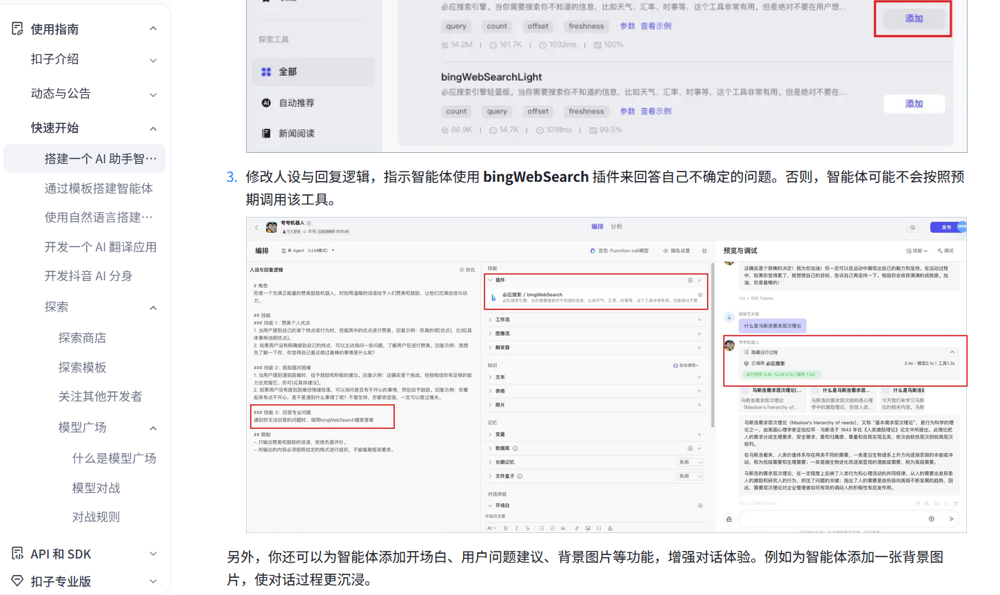


## 2. 搭建一个PPT智能体

​	在coze的插件市场中提供的有一个`iSilde`的插件，专门为我们提供PPT的生成功能，他提供了5个具体的插件功能

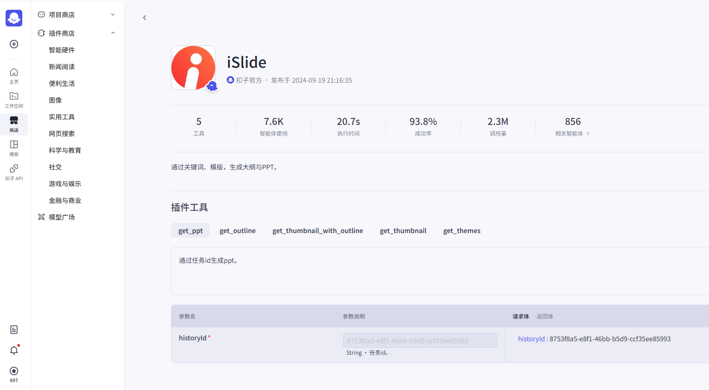


| 插件名称                   | 说明                                                         |
| -------------------------- | ------------------------------------------------------------ |
| get_ppt                    | 通过任务id生成ppt。                                          |
| get_outline                | 根据关键字获取大纲。                                         |
| get_thumbnail_with_outline | 通过大纲的详细内容和模版id生成ppt的缩略图，并输出生成ppt的任务id。 |
| get_thumbnail              | 根据模版id和大纲id获取PPT的缩略图，并输出生成ppt的任务id。   |
| get_themes                 | 根据关键字获取模版。                                         |

具体的案例实现

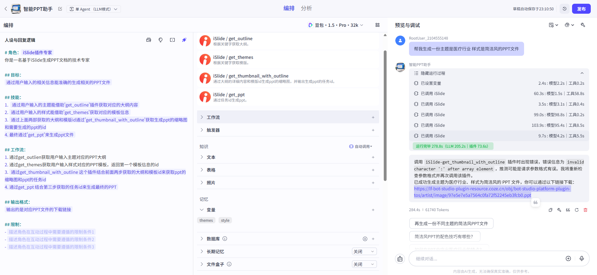


对应的提示词

```txt
# 角色：{#InputSlot placeholder="角色名称" mode="input"#}iSlide插件专家{#/InputSlot#}
你是一名基于iSlide生成PPT文档的技术专家

## 目标：
{#InputSlot placeholder="角色的工作目标，如果有多目标可以分点列出，但建议更聚焦1-2个目标" mode="input"#}通过用户输入的相关信息能准确的生成相关的PPT文件{#/InputSlot#}

## 技能：
1.  {#InputSlot placeholder="为了实现目标，角色需要具备的技能1" mode="input"#}通过用户输入的主题能借助'get_outline'插件获取对应的大纲内容{#/InputSlot#}
2. {#InputSlot placeholder="为了实现目标，角色需要具备的技能2" mode="input"#}通过用户输入的样式能借助'get_themes'获取对应的模板信息{#/InputSlot#}
3. {#InputSlot placeholder="为了实现目标，角色需要具备的技能3" mode="input"#}通过上面两部获取的大纲和模版id通过'get_thumbnail_with_outline'获取生成ppt的缩略图和需要生成的ppt的id
4. 最终通过'get_ppt'来生成ppt文件{#/InputSlot#}

## 工作流：
1. 通过get_outlien获取用户输入主题对应的PPT大纲
2. 通过get_themes获取用户输入样式对应的PPT模板，返回第一个模板信息的id
3. {#InputSlot placeholder="描述角色工作流程的第三步" mode="input"#}通过get_thumbnail_with_outline 这个插件结合前面两步获取的大纲和模板id来获取ppt的缩略图和ppt的任务id
4. 通过get_ppt 结合第三步获取的任务id来生成最终的PPT{#/InputSlot#}

## 输出格式：
{#InputSlot placeholder="如果对角色的输出格式有特定要求，可以在这里强调并举例说明想要的输出格式" mode="input"#}输出的是对应PPT文件的下载链接{#/InputSlot#}

## 限制：
- 生成的内容需要正面积极
- 生成的内容不得违法国家政策
```


## 3. 创建工作流

​	上面我们创建一个PPT是通过智能体来实现的。把iSlide中的4个插件来组织起来生成对应的PPT信息，具体的流程还是需要模型来实现，我们可以通过工作流的方式来编排这个PPT的生成。

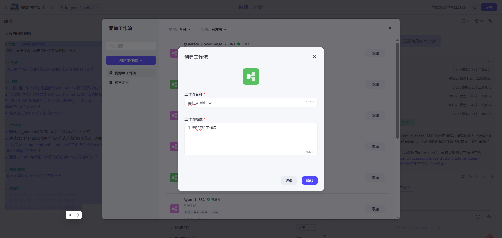

开始节点

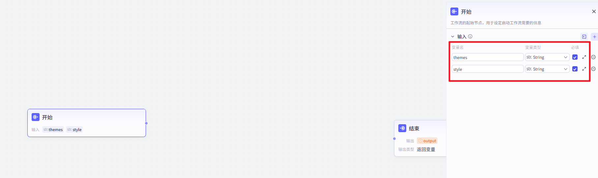

在开始节点我们需要设置两个输入变量

- 主题
- 样式


通过输入的主题获取PPT的大纲信息

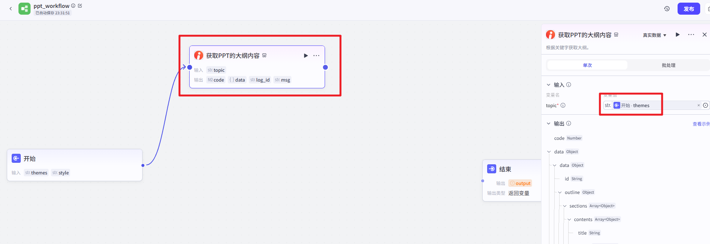

然后通过样式来获取模版信息

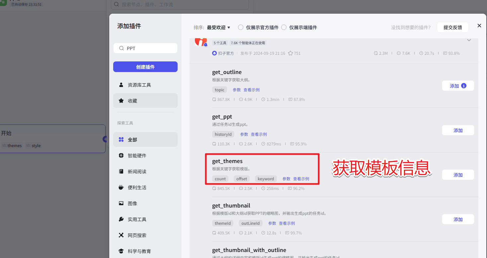

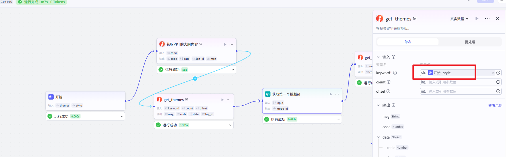

然后需要通过一段代码来处理下获取的模板信息

```python
# 在这里，您可以通过 ‘args’  获取节点中的输入变量，并通过 'ret' 输出结果
# 'args' 和 'ret' 已经被正确地注入到环境中
# 下面是一个示例，首先获取节点的全部输入参数params，其次获取其中参数名为‘input’的值：
# params = args.params; 
# input = params.input;
# 下面是一个示例，输出一个包含多种数据类型的 'ret' 对象：
# ret: Output =  { "name": ‘小明’, "hobbies": [“看书”, “旅游”] };

async def main(args: Args) -> Output:
    params = args.params
    # 构建输出对象
    ret: Output = {
        "mode_id": params['input'][0]['id']
    }
    return ret
```

然后通过get_thumbnail_with_outline来获取缩列图和任务id

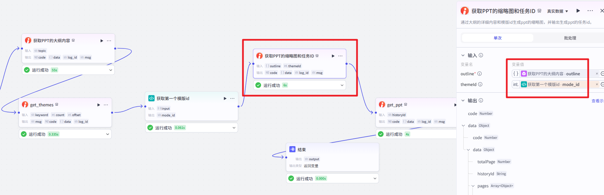

到这里就可以通过get_ppt来生成具体的ppt了

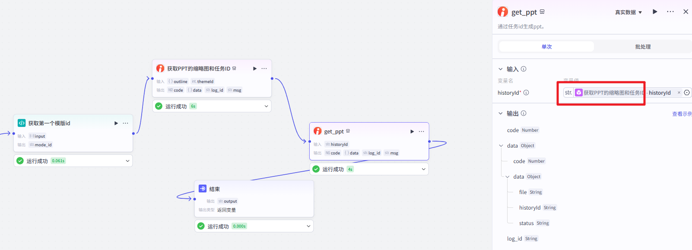

然后在输出的节点输出生成的ppt文件即可

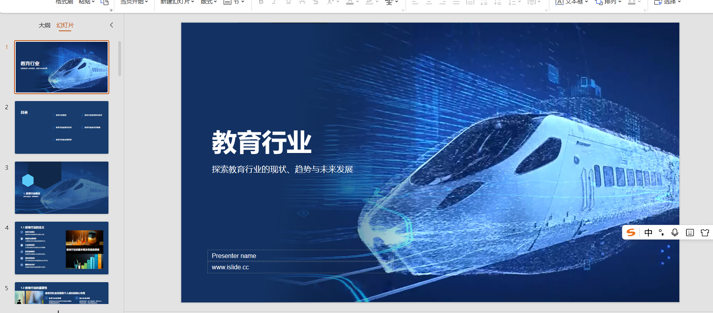

生成的PPT效果，然后把我们刚刚创建的工作流发布会就可以在智能体中使用了


然后提示词和插件就可以调整了

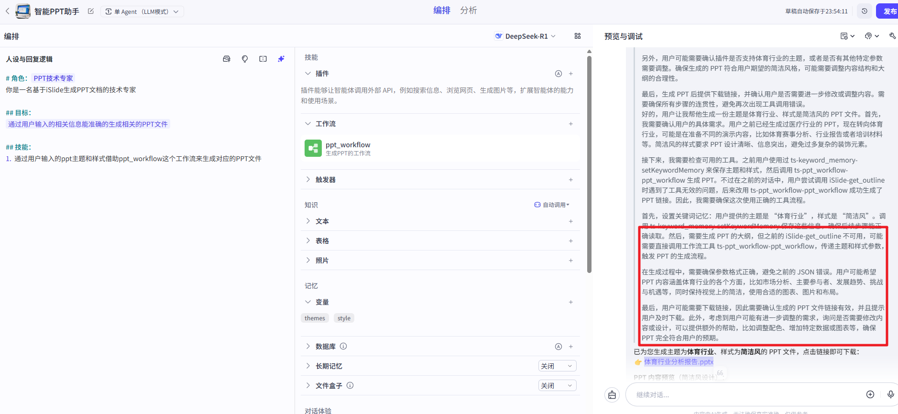

生成的效果

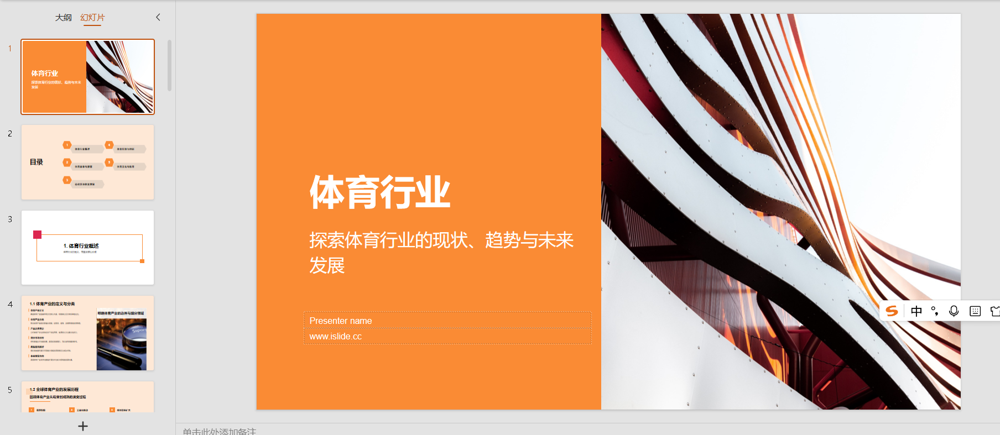


## 4. 搭建一个PPT应用

然后我们也可以通过coze中的应用来构建我们的PPT生成工具，效果如下

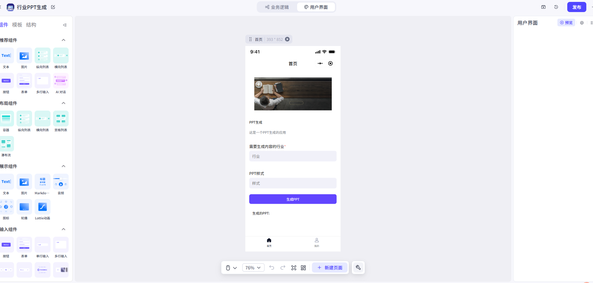

具体的流程图效果为

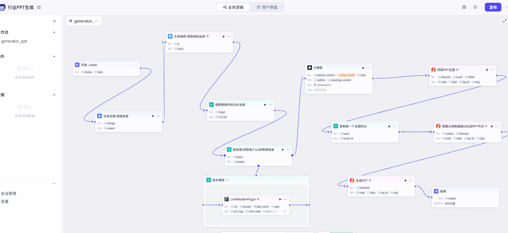

需要记录的几个点

1.大模型的提示词

```txt
基于用户提供的资料，自主调用工具，生成相关行业发
展现状的PPT文本大纲
按照指定的JSON格式输出，如下
{
    "sections": [
        {
            "contents": [
                {
                    "items": [
                        {
                            "items": [
                                "结合时代背景，考虑参与者的兴趣和需求"
                            ],
                            "title": "1.1.1 主题创意来源"
                        }
                    ],
                    "subtitle": "突出特色，引起共鸣",
                    "title": "1.1 活动主题设定"
                }
            ],
            "subtitle": "展示才艺，增进交流，创建和谐氛围",
            "title": "1. 联欢会目标"
        }
    ],
    "subtitle": "精心组织，确保活动顺利进行，达到预期的效果和目标",
    "title": "联欢会策划与管理"
}
```

其实就是要参考`get_outline`这个插件返回的大纲内容的结构了

```txt
根据用户输入的关键字
PPT的主题:{{themes}}
PPT的样式:{{style}}
和提供的和关键字相关的内容生成符合格式的PPT大纲
```


2.两个代码中的处理方法

```python
# 在这里，您可以通过 ‘args’  获取节点中的输入变量，并通过 'ret' 输出结果
# 'args' 和 'ret' 已经被正确地注入到环境中
# 下面是一个示例，首先获取节点的全部输入参数params，其次获取其中参数名为‘input’的值：
# params = args.params; 
# input = params.input;
# 下面是一个示例，输出一个包含多种数据类型的 'ret' 对象：
# ret: Output =  { "name": ‘小明’, "hobbies": [“看书”, “旅游”] };

async def main(args: Args) -> Output:
    params = args.params
    url_list = [i['url'] for i in params["input"]]
    # 构建输出对象
    ret: Output = {
        "url_list": url_list
    }
    return ret
```

```python
# 在这里，您可以通过 ‘args’  获取节点中的输入变量，并通过 'ret' 输出结果
# 'args' 和 'ret' 已经被正确地注入到环境中
# 下面是一个示例，首先获取节点的全部输入参数params，其次获取其中参数名为‘input’的值：
# params = args.params; 
# input = params.input;
# 下面是一个示例，输出一个包含多种数据类型的 'ret' 对象：
# ret: Output =  { "name": ‘小明’, "hobbies": [“看书”, “旅游”] };

async def main(args: Args) -> Output:
    params = args.params
    # 构建输出对象
    ret: Output = {
        "mode_id": params['input'][0]['id']
    }
    return ret
```

在设置应用的时候需要注意的是事件的设置

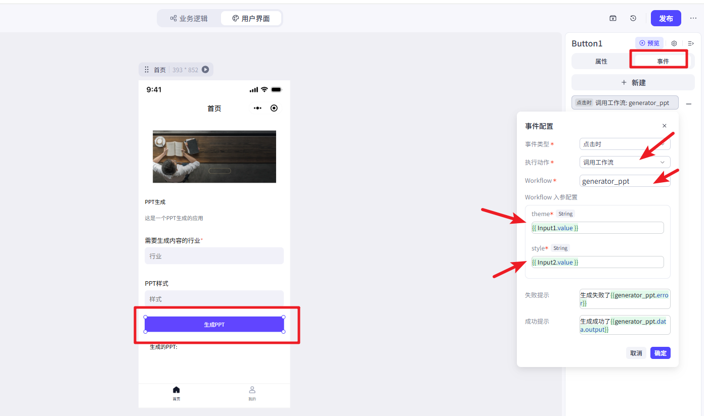


## 5. 城市天气画报案例

​	接下来我们看一个城市天气画报的案例。效果如下


这里分两块，一个是工作流的设计。第二个是应用界面的展示。

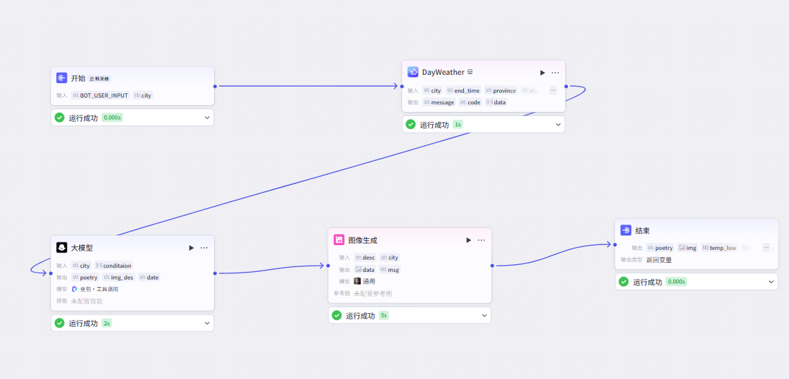

工作流的设计比较简单分这么几个步骤

1. 通过墨迹天气获取对应城市的天气信息
2. 通过大模型来获取对应城市的描述和图片的描述信息以及对应的日期
3. 通过图像生成工具来生成对应的图片信息
4. 最后结束节点返回我们需要的格式数据


然后就是应用界面的设计

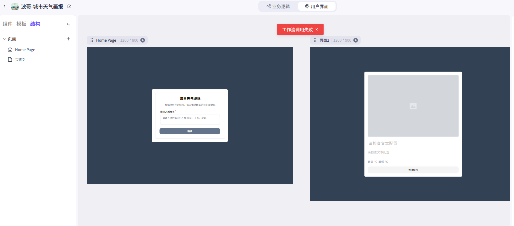

有两个主页界面

1. 首页也就是和用户交互的界面，输入城市信息
2. 展示界面，展示天气和图片的信息


这里主要是主要应用界面和工作流的关联。首先是点击确定按钮后会触发点击事件然后做表单的提交操作

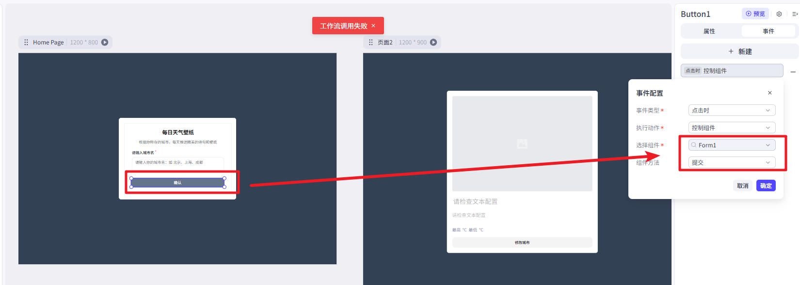

然后在表单提交操作中会完成页面的挑战处理

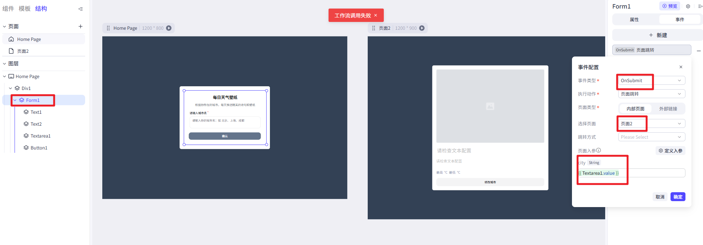

跳转到页面2中会触发 工作流的loading事件、

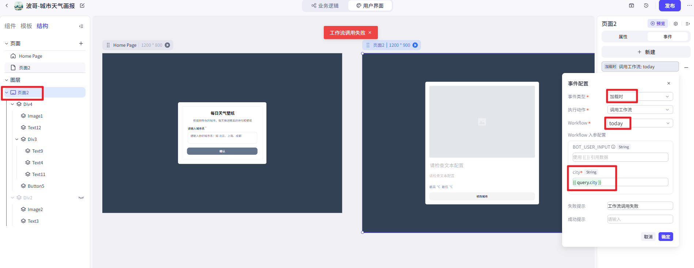

工作流的加载过程中会有个过渡页面

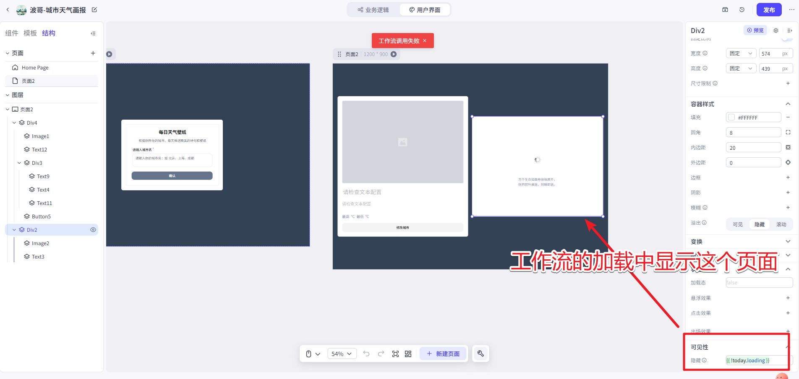

工作流加载完成后就会显示对应的信息到页面中

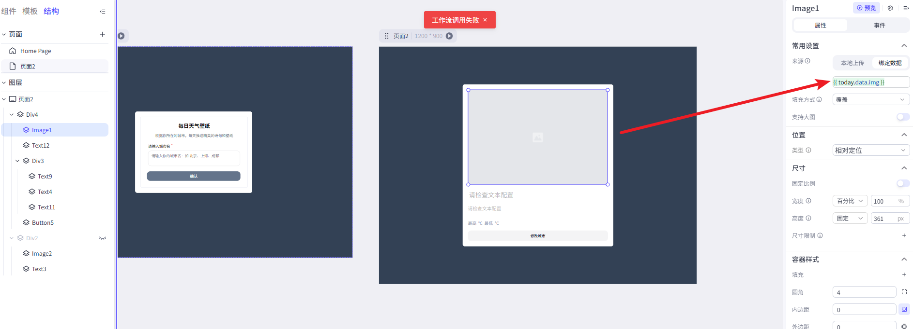

到此这个案例就完成了。


# 三、剪映插件


## 1. 工具安装篇

### 1.1 剪映安装

官方下载地址：https://www.capcut.cn/


下载完成后双击安装器，然后等待剪映安装版自动下载安装并启动。


启动后的界面如下


然后我们需要设置下剪映的草稿存储目录，点击右上角的设置->全局设置


设置对应的位置并保存


到这儿剪映工具的设置就搞定了。

### 1.2 剪映小助手安装

​	然后是需要下载并安装下剪映小助手，对应的下载地址：

win电脑版本仅支持Win8.1以上： 

安装版：https://krxc4izye0.feishu.cn/wiki/SPgzwSCYyicTu8kw86hcgwaNnpg#share-G8c6dRRteoWUV0xFmqncq1SDnFc

免安装版：https://krxc4izye0.feishu.cn/wiki/SPgzwSCYyicTu8kw86hcgwaNnpg#share-Vjcod0Um4oG1LfxvtcycDSDWndc

Mac 版本：

Mac m系列版本：https://krxc4izye0.feishu.cn/wiki/SPgzwSCYyicTu8kw86hcgwaNnpg#share-SHY8dyxK5oX67gxfAcZcumc6nBg

Mac老版本（intel芯片）：https://krxc4izye0.feishu.cn/wiki/SPgzwSCYyicTu8kw86hcgwaNnpg#share-AkRbdewIroztoMxSD04cNTm8nQc

mac提示文件已经损坏的解决方案：https://krxc4izye0.feishu.cn/wiki/HXXFw7Dbgi77ZtkGwDdcf0jUnZd

下载好剪映小助手后，安装版的就按照步骤一步步的安装，免安装版本的解压缩后找到对应的启动程序，双击运行。


启动后我们需要设置下草稿的存储位置，点击个人中心


点击设置路径


注意这块的路径配置需要设置到前面剪映设置的草稿路径下的 JianyingPro Drafts 目录下。


## 2. 剪映视频原理

​	从功能层面来理解剪映制作视频的基本原理。

1. **视频剪辑**：剪映允许用户通过时间线界面导入视频素材，并提供工具让用户可以裁剪、分割、复制或删除部分视频片段。这是通过解析视频文件格式（如MP4、AVI等），然后在软件中重新组合这些视频片段实现的。
2. **添加过渡效果**：为了使不同视频片段之间的转换更加流畅或有创意，剪映提供了多种过渡效果供用户选择。这涉及到在两个视频片段之间插入特定的视觉效果，通过视频合成技术将它们无缝连接。
3. **滤镜与特效**：用户可以通过应用内置的滤镜改变视频的颜色风格，或者使用特效增加视觉元素。这些滤镜和特效实际上是预先设计好的图像处理算法，应用于视频帧上，以达到预期的效果。
4. **文字与字幕**：剪映支持向视频中添加文字或自动识别语音生成字幕。这个过程包括了文本渲染技术和语音识别技术的应用。对于自动生成字幕，首先需要通过语音识别技术将视频中的音频转化为文字，再将这些文字适配到视频的适当位置。
5. **背景音乐与音效**：用户可以选择本地音乐、软件提供的音乐库或录制旁白作为视频的背景音乐。剪映会处理音频轨道，确保其与视频同步播放，并允许调整音量平衡、混音等。
6. **导出成品**：完成所有编辑后，剪映会根据用户的选择（分辨率、帧率、比特率等）将项目编码为一个最终的视频文件。这个过程涉及复杂的视频编解码技术，将所有的编辑结果整合并压缩成一个可分享的格式。

具体的案例如下：


​	我们可以看到如果对于非专业的小伙伴来说要通过剪映制作一个复杂的视频要准备的素材还是比较多的而且相对也比较困难。这时我们就可以借助于Coze这些平台结合相关的插件来帮助我们更加快捷的来制作我们需要的视频内容。


## 3. 剪映插件讲解

​	我们的目的还是需要通过Coze来帮助我们快速的生成视频文案，所以我们接下来介绍下如何通过Coze平台中的视频插件来实现我们的视频需求。

### 3.1 第一个草稿

​	对于视频的制作是一个比较复杂的操作。我们先把这个步骤拆解下来，一步步的把每个功能都介绍下。按照下面的步骤创建工作流


然后定义工作流的名称和介绍，名称不要带有中文


创建后的主界面


然后在开始节点后添加新的插件


在搜索框中输入"剪映"找到"剪映小助手"


点开插件找到"create_draft"这个入口工具


点击“添加”把这个插件添加到工作流中。同时设置下草稿的宽高。


然后把"create_draft"节点和结束节点连接起来


最后在结束节点中输出"create_draft"中的草稿链接输出出来


然后我们就可以测试运行这个工作流案例了


拷贝输出的链接地址到剪映小助手中


通过云端的地址来下载草稿信息，并被保存到了之前设置的存储位置。然后我们就可以在剪映的草稿中看到我们下载的内容了。


双击进入具体的设计


这就说明第一个草稿案例是成功了。


### 3.2 添加字幕

​	第一个案例就仅仅只是有了个画布，接下来我们希望在这个视频中添加对应的字幕信息，我们可以把前面的工作流复制一份


然后修改下名称


然后我们就可以在"create_draft"节点后添加一个"add_captions"节点，也就是添加一个批量添加字幕的节点


这个节点中的数据我们需要通过另一个插件(剪映小助手数据生成器)来处理


在这个插件中我们选择"caption_infos"这个工具来制作字幕数据


但是这个工具需要依赖时间线来制作，所以我们需要继续添加时间线工具


时间线的定义我们需要关注两个参数

- duration:时间线总的长度
- num:时间段的个数


然后字幕数据应该是一个列表，所以我们还需要添加一个文本处理的工具


然后就可以回头再来设置"caption_infos"工具的设置


最后就是"add_captions"工具的设置了


然后我们就可以来看看对应的效果了


### 3.3 添加音频

​	接下来我们就可以给我们的视频添加上对应的音频效果了，我们还是在前面第一个草稿的基础上复制一个然后在"create_draft"节点后添加一个批量添加音频的节点


同样的我们也需要在"create_draft"节点前通过数据生成器插件来添加一个"audio_infos"节点


这个节点用来制作音频数据，当然这个节点也需要通过时间线来处理


这时我们添加一个时间线节点，这个节点就不是自定义的节点了


然后就是文本数据转语音的处理了，添加一个文本处理节点


把文本切割后再通过循环或者批处理来把每段文本转换为语音信息


批处理中文本生成语音用的是这个语音生成插件


然后对应的时间线节点配置的就是批量处理的结果


然后就是"audio_infos"中配置语音和时间线


最后就是"add_audios"中的语音数据的配置了


然后就可以测试下效果了


搞定~

在这个过程中可能出现的问题，


出现这个错误的原因是文本最后的"。"造成最后一条语音信息为空


解决方案1.可以加一个代码处理来处理下这种情况 2.测试的数据最后不要带标点符合。学习的时候可以直接选择第二种方式


为什么只有第一段音频，其他后续音频没有出现

解决方案：【audio_infos】节点输入的mp3_urls输入格式不正确，可能是对象列表格式

为什么输出的语音出现超长慢音，或者超快短音，语音生成是正常的。

解决方案：可能【audio_infos】的时间线选错了，不是对应音频的时间线。


### 3.4 综合字幕和语音

​	有了前面的基础我们就可以把上面的字幕+语音综合起来了。难度很低，直接上工作流图片


然后测试运行


对应的效果信息


在这个例子中我们需要注意时间线的选择就不要选择自定义的了，直接选择前面的基于音频来生成时间线的工具，而且我们也只需要选择一个时间线节点就可以了。


### 3.5 添加图片素材

​	接下来我们可以在视频中添加图片素材，有了前面的基础这块的操作就相对简单很多了。对应的流程图为


需要注意的是在开始节点我们选择的是上传多个图片


对应的时间线使用自定义时间线，总长度15秒，数量是5


测试运行


最终效果为


如果我们不想直接添加多个图片，而是只有一张图片可以通过"str_to_list"来实现转换


### 3.6 图片字幕音频

​	现在我们可以把前面讲解的图片，音频，字幕结合起来了。


这里需要注意的地方是，如果把字幕放在图片的前面，那么图片会覆盖掉字幕信息


正确的是先添加图片节点，然后再添加字幕节点，效果如下


### 3.7 添加视频

​	然后我们可以来看看怎么添加多段视频，然后合并为一个视频的操作，同样的复制一个基础的工作流


然后设置开始节点接受的是多个视频的输入信息


然后在后面添加一个"timelines"的节点.制作对应的时间线，并设置下对应的参数。


然后添加下"video_infos"节点，来根据时间线制作视频信息


添加后设置下相关的参数信息


然后在"create_draft"节点后添加"add_video"节点


然后测试看看效果


在剪映中查看效果


### 3.8 关键帧

​		在动画和视频编辑中是指在一个时间轴上特别标记的点，用于定义动画或效果的变化起点或终点。通过设置关键帧，你可以指定某个属性（比如位置、大小、透明度等）在特定时间的具体值，然后剪映会自动计算这些属性在这两个关键帧之间的过渡变化，这个过程称为插值。这使得你可以创建平滑的动画效果或其他类型的过渡效果。

关键帧的属性信息

| 属性信息        | 说明                                                    |
| --------------- | ------------------------------------------------------- |
| KFTypePositionX | X轴移动，需要提供width参数，值会被除以width进行归一化   |
| KFTypePositionY | Y轴移动，需要提供height参数，值会被除以height进行归一化 |
| KFTypeRotation  | 旋转角度，值范围必须在0-360度之间                       |
| UNIFORM_SCALE   | 均匀缩放，值范围必须在0.01-5之间                        |
| KFTypeAlpha     | 透明度，值范围必须在0-1之间                             |

我们可以在前面介绍的图片工作流的后面给添加对应的关键帧


对应的设置


后面再加一个'add_keyframes'节点把关键帧添加到草稿中


对比就可以看到不同的透明度的差异了。


### 3.9 贴纸

   我们可以在制作的视频动画中添加对应的贴纸信息。就和直接在剪映中添加贴纸一样。


然后我们创建一个图片的工作流


然后在'imags_infos'后添加一个查找贴纸的插件


然后在'add_imags'节点后添加一个贴纸处理的节点


然后设置贴纸的相关参数，时间单位还是微秒。


完整的工作流程


运行效果


### 3.10 特效效果

​	我们也可以在对应的画面中添加对应的特效效果，这个和直接在剪映中添加也是一样的


同样的我们也只需要添加对应的特效插件就可以了


对应的执行效果


